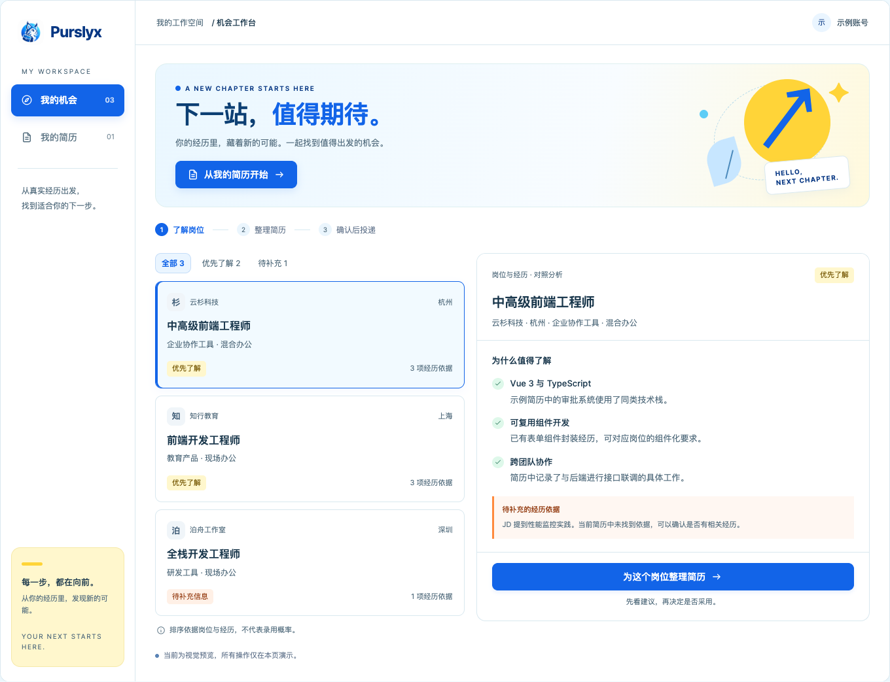

# Purslyx 视觉方案 · A「晴空蓝与阳光黄」

**当前采用 A 版，已于 2026-09-11 确定。** 后续 Web 端与浏览器侧界面沿用本方案的配色和视觉规则。Purslyx 的定位是陪伴用户完成求职下一步的 **AI career companion**。保留「下一站，值得期待」和「明亮一点，向前一步」，通过清楚的路径与真实的反馈传达希望。

> **蓝色负责行动，黄色负责机会，绿色负责肯定，橙色负责提醒。**
> **彩色表达情绪，墨蓝与留白维持专业。**

[打开首版高保真产品稿](../prototypes/高保真产品稿.html) · [打开篡改猴高保真产品稿](../prototypes/篡改猴高保真产品稿.html) · [查看篡改猴效果图](../prototypes/篡改猴高保真产品稿.png) · [查看桌面效果图](../prototypes/高保真产品稿.png) · [查看手机效果图](../prototypes/高保真产品稿-手机.png) · [查看早期视觉预览](视觉预览.html)

重点页面效果：[多岗位期望](../prototypes/高保真产品稿-期望.png) · [匹配池完整报告](../prototypes/高保真产品稿-匹配报告.png) · [事实改写与编辑](../prototypes/高保真产品稿-改写.png) · [岗位版简历编辑](../prototypes/高保真产品稿-简历编辑.png) · [管理端角色权限](../prototypes/高保真产品稿-管理权限.png) · [管理端日志](../prototypes/高保真产品稿-管理日志.png)。

品牌蓝 `#1264E8` 与机会黄 `#FFD438` 已确定。B、C 未采用，保留作对照：[三版配色对比](视觉对比.html) · [选择记录与自评](视觉方案对比.md)。

## 品牌主次与视觉比例

**唯一品牌主色是晴空蓝 `#1264E8`。** 黄、绿、橙属于语义色，必须对应机会、肯定或提醒。白色与浅背景承载空间，深墨蓝承载标题和正文。

视觉权重以浅背景约 **70%**、深色文字约 **15%**、品牌蓝约 **10%**、黄绿橙合计 **≤ 5%** 为参考。用于约束整体主次，不机械按截图像素配额分配；首屏图形与状态色也应纳入整体判断。

品牌规范展示应先突出蓝色，再以较小的色点、标签说明语义色，避免四个彩色大色块并列成为四个品牌主色。主要操作保持蓝色；长内容面板使用白底，语义色主要落在标签、图标、细线和局部提示中。

## 颜色分工

| 层级 | 色值 | 固定含义 | 典型用法 |
| --- | --- | --- | --- |
| Brand · 晴空蓝 | `#1264E8` | 行动、交互、品牌识别 | 主 CTA、选中导航、筛选选中态、链接、执行中的操作 |
| Opportunity · 阳光黄 | `#FFD438` | 机会、推荐、正常待确认 | 值得了解、高潜机会、有依据的高匹配、等待本人确认 |
| Success · 新芽绿 | `#39CEA0` | 优势、通过、完成 | 优势匹配、已完善、已采用、成功反馈 |
| Attention · 活力橙 | `#FF8A3D` | 提醒、缺失、风险、紧急 | 信息缺失、需处理的平台提示、临近截止、异常输入 |
| Surface · 明亮白 | `#FFFFFF` | 空间、清爽 | 主背景、导航底色、正文面板 |

黄色「待确认」指信息基本齐备、等待选择或确认的正常流程；橙色「信息缺失」指已经发现缺口或需要处理的问题。例如，等待用户确认打开原岗位使用黄色，简历缺少岗位要求的经历依据使用橙色。

信息不足提示采用更轻的层级：「待补充的经历依据」使用 `#FFF7F2` 底色、`#FF8A3D` 左侧竖线与 `#964016` 深橙色标题。它表达可以补充的信息，避免整块强橙色造成出错感。

颜色必须配合文字或图标。推荐与优势分别表达：整个岗位可以是黄色「优先了解」，其中有证据支持的匹配点使用绿色，尚缺依据的部分使用橙色。匹配颜色不代表录用概率。

## 可读性与实现约定

高明度的黄、绿、橙使用深色文字与浅色背景变体，正文不直接使用亮黄或亮橙。预览中以语义名称定义 CSS 变量，后续各端沿用相同名称和含义。

| 语义变量 | 强调色 | 浅背景 | 文字色 |
| --- | --- | --- | --- |
| `--brand` | `#1264E8` | `#EAF5FF` | 强按钮白字，浅底使用品牌蓝 |
| `--opportunity` | `#FFD438` | `#FFF7CD` | `#735500` |
| `--success` | `#39CEA0` | `#DEF8EA` | `#176A4C` |
| `--attention` | `#FF8A3D` | `#FFF0E6` | `#964016` |

语义色对应 `--角色-bg` 与 `--角色-ink` 变体。正文使用深墨蓝 `#18364B`，辅助文字使用 `#526C7D`，边框使用 `#D9E8EF`。Logo 保留原始形状与颜色。

头像、公司图标和普通说明不承载成功或风险含义，使用中性或品牌色。Hero 保留黄色机会图形与蓝色上升箭头，绿色和橙色留给真实状态。侧栏黄色卡片用于鼓励发现机会。

字体使用系统无衬线，中文优先苹方、微软雅黑。主标题桌面约 38 px、手机约 30 px；面板标题 18–20 px；主要阅读内容 14–16 px，依据说明约 13 px。间距以 8 px 为基准，面板内边距 20–24 px，圆角约 10–14 px，按钮圆角约 9 px。

## 各流程的状态用法

| 场景 | 正常或待确认 | 肯定或完成 | 需要处理 |
| --- | --- | --- | --- |
| 岗位分析 | 黄色：推荐、优先了解 | 绿色：有依据的优势匹配 | 橙色：岗位要求缺少对应经历依据 |
| 简历建议 | 中性或蓝色：建议草稿、正在编辑 | 绿色：已采用、已完善 | 橙色：必要内容为空或缺失 |
| 浏览器获取 | 黄色：等待登录或入池确认；蓝色：同步登录、识别页面、获取字段与上传草稿 | 绿色：岗位信息获取完成，已成为待确认草稿 | 橙色：页面不支持、字段缺失、登录或获取失败 |
| 去投递 | 黄色：原岗位链接待本人确认；蓝色：正在记录点击并发起跳转 | 绿色：已记录点击并发起跳转，明确不代表已投递 | 橙色：链接失效、记录失败或需用户处理 |
| 面试 | 黄色：等待确认安排 | 绿色：预约确认、练习完成 | 橙色：临近截止或准备材料缺失 |

建议草稿不提前显示完成。用户采用后显示绿色反馈，再次编辑即撤回已采用状态。颜色变化由实际状态触发，保持按钮本身的蓝色交互身份。

## 本版自评与预览

保留第四版的情绪方向，同时修正了推荐用绿、信息缺失用黄，以及装饰性绿色头像等不一致用法。配色区改为「一个主品牌色 + 三个语义色」，避免并列的大面积彩色色块。需要持续守住的重点是：颜色有含义、主操作只有一个视觉重心、长内容不靠彩色铺底。

用浏览器打开 `../prototypes/高保真产品稿.html` 即可查看 Web 端，打开 `../prototypes/篡改猴高保真产品稿.html` 可查看浏览器侧，无需安装依赖。Web 稿顶部评审工具栏可以查看注册、求职端、招聘端、管理端以及空内容、执行中、失败和完成状态；浏览器侧稿可切换 BOSS／猎聘，以及未登录、同步中、抓取中、完成、不支持和失败状态，并可连续演示自动获取和进入 Purslyx 确认入池。工具栏只服务评审，不属于正式产品。所有操作仅在当前页面演示，刷新后恢复初始状态。

预览中的公司、岗位和经历均为虚构示例；前端岗位仅用于展示布局，不代表产品只面向这一职业。页面没有连接招聘平台或模型服务。
