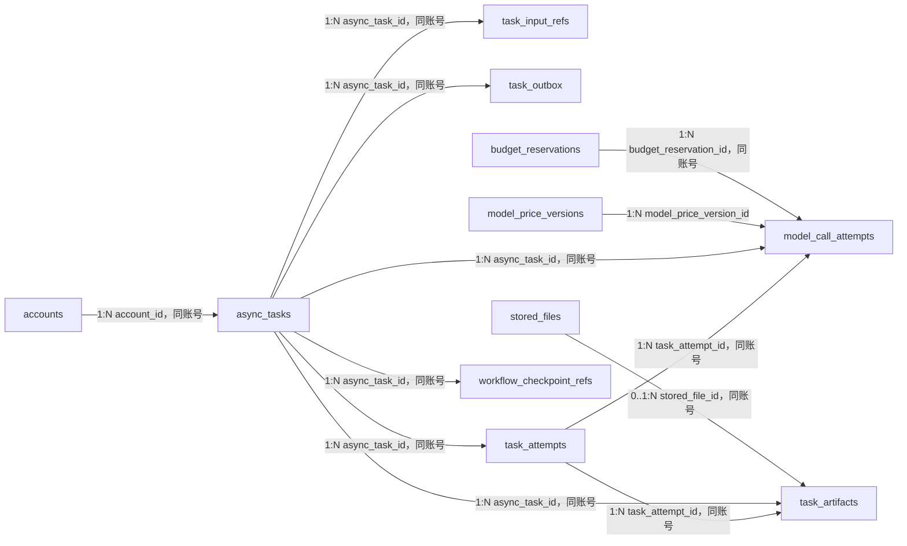

# Purslyx 任务数据库设计

| 项 | 内容 |
| --- | --- |
| 模块 | 任务 |
| 版本 | v0.1 |
| 更新日期 | 2026-09-14 |
| 状态 | 待评审；模型与迁移尚未实现 |
| 范围 | 统一异步任务、冻结输入、队列 outbox、执行租约与尝试、模型调用成本、步骤产物和 LangGraph 检查点映射 |
| 依赖模块 | 用户、用量；业务模块按任务类型提供输入并接收结果 |
| 需求/架构依据 | [需求说明 F09、F10 与 AC06、AC12—AC14](../../01-product/specs/需求说明.md)、[技术架构第 5 章](../技术架构.md)、[数据库设计规范](数据库设计规范.md) |

## 1. 设计目标与边界

- `async_tasks` 统一覆盖 AI 分析/改写/面试、文件解析、PDF 导出、内容清理、日志导出与引用巡检；Redis/Celery 只传任务标识，不是业务事实来源。
- 创建任务、适用的功能次数预留和 `task_outbox` 在同一事务提交。Dispatcher 可从数据库补投未发布事件，避免已预留但消息丢失。
- Worker 通过状态、租约、执行代次和条件更新认领。每次执行与外部模型调用分别记行；失租只表示结果未知，不代表供应商未执行或成本为零。
- 输入只保存提交时冻结的资源/版本引用与摘要；队列消息、运行日志和成本台账不复制简历、JD、回答、Cookie、令牌或文件正文。
- 步骤产物与检查点绑定执行代次。旧代次、已删除来源或已取消任务的迟到结果不得覆盖结果、恢复内容或结算次数。

## 2. 实体关系

`model_price_versions`、`budget_reservations` 属于用量模块，`stored_files` 属于简历模块。全部连线均为逻辑引用，不创建数据库外键。

## 3. 表结构

### async_tasks

| 字段名 | 数据类型 | 可空 | 默认值 | 约束/索引 | 说明 |
| --- | --- | --- | --- | --- | --- |
| id | BIGINT | 否 | GENERATED ALWAYS AS IDENTITY | PK | 统一异步任务内部 ID |
| public_id | UUID | 否 | gen_random_uuid() | UK | API 查询状态的随机标识 |
| account_id | BIGINT | 否 | — | Index | 所属账号 ID |
| registration_role_snapshot | SMALLINT | 否 | — | CK: `registration_role_snapshot IN (1,2)` | 创建时固定的求职/招聘身份 |
| task_type | SMALLINT | 否 | — | CK: `task_type BETWEEN 1 AND 10` | 具体异步任务类型 |
| metered_feature | SMALLINT | 是 | — | CK: `metered_feature IN (1,2,3)` | 分析、改写、面试；免费任务为空 |
| action_key | VARCHAR(64) | 否 | — | — | API 动作稳定键 |
| idempotency_key | UUID | 否 | — | UK | 同账号同动作请求幂等键 |
| request_digest | BYTEA | 否 | — | — | 规范化请求摘要；同键不同摘要拒绝 |
| status | SMALLINT | 否 | 1 | CK: `status IN (1,2,3,4,5,6,7)` | 排队、运行、重试等待、待输入、成功、失败或取消 |
| queue_name | VARCHAR(64) | 否 | — | — | 受控队列名 |
| priority | SMALLINT | 否 | 0 | CK: `priority BETWEEN -10 AND 10` | 队列优先级 |
| execution_generation | BIGINT | 否 | 0 | CK: `execution_generation >= 0` | 每次有效认领递增的执行代次 |
| attempt_count | INTEGER | 否 | 0 | CK: `attempt_count >= 0` | 已创建执行尝试数 |
| progress | JSONB | 是 | — | — | `task-progress-v1` 校验后的非正文进度 |
| progress_schema_version | VARCHAR(32) | 是 | — | — | 与进度 JSONB 同时出现 |
| scheduled_at | TIMESTAMPTZ | 否 | now() | Index | 最早可认领时间点 |
| lease_owner | VARCHAR(128) | 是 | — | — | 当前 Worker 实例键 |
| lease_token_digest | BYTEA | 是 | — | — | 当前租约令牌摘要 |
| lease_expires_at | TIMESTAMPTZ | 是 | — | Index | 当前租约到期时间点 |
| needs_input_code | VARCHAR(64) | 是 | — | — | 待用户补充的稳定原因码 |
| failure_code | VARCHAR(64) | 是 | — | — | 稳定失败码，不保存堆栈或正文 |
| cancel_requested_at | TIMESTAMPTZ | 是 | — | — | 主动取消或来源删除时间点 |
| content_access_revoked_at | TIMESTAMPTZ | 是 | — | — | 来源删除后阻断正文与产物访问 |
| started_at | TIMESTAMPTZ | 是 | — | — | 首次运行时间点 |
| finished_at | TIMESTAMPTZ | 是 | — | — | 终态时间点 |
| created_at | TIMESTAMPTZ | 否 | now() | Index | 创建时间点 |
| updated_at | TIMESTAMPTZ | 否 | now() | — | 状态更新时间点 |

### task_input_refs

| 字段名 | 数据类型 | 可空 | 默认值 | 约束/索引 | 说明 |
| --- | --- | --- | --- | --- | --- |
| id | BIGINT | 否 | GENERATED ALWAYS AS IDENTITY | PK | 冻结输入引用 ID |
| account_id | BIGINT | 否 | — | Index | 所属账号 ID |
| async_task_id | BIGINT | 否 | — | Index | 引用 `async_tasks.id` |
| input_role | SMALLINT | 否 | — | CK: `input_role BETWEEN 1 AND 8` | 简历、JD、期望、报告、回答、岗位版、文件或业务父资源 |
| resource_type | VARCHAR(64) | 否 | — | — | 受控资源类型，决定目标表和校验器 |
| resource_id | BIGINT | 否 | — | Index | 目标业务父资源内部 ID |
| resource_version_id | BIGINT | 是 | — | Index | 目标不可变版本 ID；有版本的输入必须填写 |
| ordinal | SMALLINT | 否 | 1 | CK: `ordinal >= 1` | 同一输入角色的顺序 |
| input_digest | BYTEA | 否 | — | — | 冻结输入摘要 |
| created_at | TIMESTAMPTZ | 否 | now() | — | 引用创建时间点 |

### task_outbox

| 字段名 | 数据类型 | 可空 | 默认值 | 约束/索引 | 说明 |
| --- | --- | --- | --- | --- | --- |
| id | BIGINT | 否 | GENERATED ALWAYS AS IDENTITY | PK | 队列出站事件 ID |
| event_id | UUID | 否 | gen_random_uuid() | UK | 消息幂等标识 |
| account_id | BIGINT | 否 | — | Index | 所属账号 ID |
| async_task_id | BIGINT | 否 | — | Index | 引用 `async_tasks.id` |
| execution_generation | BIGINT | 否 | — | CK: `execution_generation >= 0` | 消息允许认领的任务代次 |
| queue_name | VARCHAR(64) | 否 | — | — | 目标 Celery 队列 |
| message_payload | JSONB | 否 | — | — | `task-message-v1`；只含任务标识、事件 ID 与代次 |
| payload_schema_version | VARCHAR(32) | 否 | — | — | 消息 Schema 版本 |
| status | SMALLINT | 否 | 1 | CK: `status IN (1,2,3,4)` | 待发布、发布中、已发布或作废 |
| publish_attempt_count | INTEGER | 否 | 0 | CK: `publish_attempt_count >= 0` | Dispatcher 发布次数 |
| next_attempt_at | TIMESTAMPTZ | 否 | now() | Index | 下一次可发布时间点 |
| lease_owner | VARCHAR(128) | 是 | — | — | 当前 Dispatcher 实例键 |
| lease_expires_at | TIMESTAMPTZ | 是 | — | Index | 发布租约到期时间点 |
| published_at | TIMESTAMPTZ | 是 | — | — | 队列确认接收时间点 |
| created_at | TIMESTAMPTZ | 否 | now() | — | 事件创建时间点 |

### task_attempts

| 字段名 | 数据类型 | 可空 | 默认值 | 约束/索引 | 说明 |
| --- | --- | --- | --- | --- | --- |
| id | BIGINT | 否 | GENERATED ALWAYS AS IDENTITY | PK | 一次 Worker 执行尝试 ID |
| account_id | BIGINT | 否 | — | Index | 所属账号 ID |
| async_task_id | BIGINT | 否 | — | Index | 引用 `async_tasks.id` |
| execution_generation | BIGINT | 否 | — | CK: `execution_generation >= 1` | 本尝试所属代次 |
| attempt_no | INTEGER | 否 | — | CK: `attempt_no >= 1` | 任务内尝试序号 |
| worker_instance_key | VARCHAR(128) | 否 | — | — | Worker 实例标识 |
| status | SMALLINT | 否 | 1 | CK: `status IN (1,2,3,4,5)` | 运行、成功、可重试失败、最终失败或失租 |
| retry_source | SMALLINT | 是 | — | CK: `retry_source IN (1,2,3)` | 自动、手动或租约恢复 |
| failure_code | VARCHAR(64) | 是 | — | — | 稳定失败码 |
| started_at | TIMESTAMPTZ | 否 | now() | Index | 尝试开始时间点 |
| heartbeat_at | TIMESTAMPTZ | 否 | now() | Index | 最近心跳时间点 |
| finished_at | TIMESTAMPTZ | 是 | — | — | 尝试结束时间点 |

### model_call_attempts

| 字段名 | 数据类型 | 可空 | 默认值 | 约束/索引 | 说明 |
| --- | --- | --- | --- | --- | --- |
| id | BIGINT | 否 | GENERATED ALWAYS AS IDENTITY | PK | 一次真实外部模型调用 ID |
| public_id | UUID | 否 | gen_random_uuid() | UK | 管理端复核标识 |
| account_id | BIGINT | 否 | — | Index | 所属账号 ID |
| async_task_id | BIGINT | 否 | — | Index | 引用 `async_tasks.id` |
| task_attempt_id | BIGINT | 否 | — | Index | 引用 `task_attempts.id` |
| model_price_version_id | BIGINT | 否 | — | Index | 引用用量模块 `model_price_versions.id` |
| budget_reservation_id | BIGINT | 否 | — | Index | 引用 `budget_reservations.id` |
| workflow_step | VARCHAR(96) | 否 | — | — | 稳定步骤键 |
| call_no | INTEGER | 否 | — | CK: `call_no >= 1` | 同任务步骤调用序号 |
| provider | VARCHAR(64) | 否 | — | — | 实际供应商键 |
| model | VARCHAR(128) | 否 | — | — | 实际模型键 |
| reasoning_setting | VARCHAR(32) | 是 | — | — | 实际思考设置 |
| max_output_tokens | INTEGER | 否 | — | CK: `max_output_tokens > 0` | 调用输出上限 |
| status | SMALLINT | 否 | 1 | CK: `status IN (1,2,3,4,5)` | 调用中、成功、失败、结果未知或待结构修复 |
| retry_source | SMALLINT | 否 | 1 | CK: `retry_source IN (1,2,3,4)` | 首次、短暂故障重试、结构修复或人工重试 |
| input_tokens | BIGINT | 是 | — | CK: `input_tokens >= 0` | 已知输入 token |
| cached_input_tokens | BIGINT | 是 | — | CK: `cached_input_tokens >= 0` | 输入中的缓存 token |
| output_tokens | BIGINT | 是 | — | CK: `output_tokens >= 0` | 已知总输出 token |
| reasoning_tokens | BIGINT | 是 | — | CK: `reasoning_tokens >= 0` | 输出 token 子集，不重复相加 |
| estimated_cost | NUMERIC(20,8) | 是 | — | CK: `estimated_cost >= 0` | 实际用量估算费用；未知为空 |
| currency | CHAR(3) | 否 | 'USD' | — | 成本币种 |
| cost_status | SMALLINT | 否 | 1 | CK: `cost_status IN (1,2,3)` | 预留估算、已知或待核实 |
| provider_request_id_digest | BYTEA | 是 | — | Index | 供应商请求 ID 摘要 |
| started_at | TIMESTAMPTZ | 否 | now() | Index | 调用开始时间点 |
| completed_at | TIMESTAMPTZ | 是 | — | — | 调用结束或判为未知时间点 |
| latency_ms | BIGINT | 是 | — | CK: `latency_ms >= 0` | 可取得的调用耗时 |

### task_artifacts

| 字段名 | 数据类型 | 可空 | 默认值 | 约束/索引 | 说明 |
| --- | --- | --- | --- | --- | --- |
| id | BIGINT | 否 | GENERATED ALWAYS AS IDENTITY | PK | 可恢复步骤产物 ID |
| account_id | BIGINT | 否 | — | Index | 所属账号 ID |
| async_task_id | BIGINT | 否 | — | Index | 引用 `async_tasks.id` |
| task_attempt_id | BIGINT | 否 | — | Index | 引用产生该产物的尝试 |
| stored_file_id | BIGINT | 是 | — | Index | 文件型产物引用 `stored_files.id` |
| execution_generation | BIGINT | 否 | — | CK: `execution_generation >= 1` | 产物所属代次 |
| workflow_step | VARCHAR(96) | 否 | — | — | 稳定步骤键 |
| artifact_type | SMALLINT | 否 | — | CK: `artifact_type IN (1,2,3)` | 结构化 JSON、文本片段或私有文件 |
| artifact_content | JSONB | 是 | — | — | 版本化 Schema 校验后的受限产物 |
| schema_version | VARCHAR(32) | 是 | — | — | JSONB 产物 Schema 版本 |
| content_digest | BYTEA | 否 | — | — | 完整性与恢复去重摘要 |
| status | SMALLINT | 否 | 1 | CK: `status IN (1,2,3,4)` | 有效、被新代次取代、待清理或已清理 |
| created_at | TIMESTAMPTZ | 否 | now() | — | 保存时间点 |
| cleanup_requested_at | TIMESTAMPTZ | 是 | — | — | 删除来源后请求清理时间点 |
| cleaned_at | TIMESTAMPTZ | 是 | — | — | 内嵌正文或关联文件确认清理时间点 |

### workflow_checkpoint_refs

| 字段名 | 数据类型 | 可空 | 默认值 | 约束/索引 | 说明 |
| --- | --- | --- | --- | --- | --- |
| id | BIGINT | 否 | GENERATED ALWAYS AS IDENTITY | PK | LangGraph 检查点映射 ID |
| account_id | BIGINT | 否 | — | Index | 所属账号 ID |
| async_task_id | BIGINT | 否 | — | Index | 引用 `async_tasks.id` |
| business_resource_type | VARCHAR(64) | 否 | — | — | 面试会话等受控业务资源类型 |
| business_resource_id | BIGINT | 否 | — | Index | 对应业务资源内部 ID |
| thread_id | UUID | 否 | — | UK | 随机 LangGraph thread ID，不接受客户端自定 |
| checkpoint_namespace | VARCHAR(96) | 否 | — | — | 受控命名空间 |
| latest_checkpoint_key | VARCHAR(255) | 是 | — | — | 当前可恢复检查点键 |
| execution_generation | BIGINT | 否 | — | CK: `execution_generation >= 0` | 可读取检查点的任务代次 |
| cleanup_status | SMALLINT | 否 | 1 | CK: `cleanup_status IN (1,2,3)` | 保留、待清理或已清理 |
| created_at | TIMESTAMPTZ | 否 | now() | — | 创建时间点 |
| updated_at | TIMESTAMPTZ | 否 | now() | — | 检查点或清理状态更新时间点 |

## 4. 索引清单

| 表名 | 索引名 | 字段或表达式 | 类型 | 条件与用途 |
| --- | --- | --- | --- | --- |
| async_tasks | pk_async_tasks | `id` | Primary | 主键 |
| async_tasks | uq_async_tasks_public_id | `public_id` | Unique | API 状态查询 |
| async_tasks | uq_async_tasks_idempotency | `account_id, action_key, idempotency_key` | Unique | 请求幂等并覆盖账号引用 |
| async_tasks | idx_async_tasks_account_created | `account_id, created_at DESC` | B-tree | 用户任务历史、管理查询与账号巡检 |
| async_tasks | idx_async_tasks_dispatch | `queue_name, priority DESC, scheduled_at, id` | B-tree partial | `status IN (1,3)`；到期排队/重试任务 |
| async_tasks | idx_async_tasks_lease_expiry | `lease_expires_at` | B-tree partial | `status = 2`；失租扫描 |
| async_tasks | idx_async_tasks_terminal | `finished_at` | B-tree partial | `status IN (5,6,7)`；归档扫描 |
| task_input_refs | pk_task_input_refs | `id` | Primary | 主键 |
| task_input_refs | uq_task_input_refs_role | `async_task_id, input_role, ordinal` | Unique | 输入位置唯一并覆盖任务引用 |
| task_input_refs | idx_task_input_refs_account_task | `account_id, async_task_id, input_role` | B-tree | 账号限定读取与巡检 |
| task_input_refs | idx_task_input_refs_resource | `account_id, resource_type, resource_id` | B-tree | 父资源删除时查任务及引用巡检 |
| task_input_refs | idx_task_input_refs_version | `account_id, resource_type, resource_version_id` | B-tree partial | `resource_version_id IS NOT NULL`；版本巡检 |
| task_outbox | pk_task_outbox | `id` | Primary | 主键 |
| task_outbox | uq_task_outbox_event_id | `event_id` | Unique | 消息幂等 |
| task_outbox | uq_task_outbox_task_generation | `async_task_id, execution_generation` | Unique | 每任务代次一个发布事件 |
| task_outbox | idx_task_outbox_account_task | `account_id, async_task_id` | B-tree | 账号和任务引用巡检 |
| task_outbox | idx_task_outbox_publish | `status, next_attempt_at, id` | B-tree partial | `status IN (1,2)`；认领与补投 |
| task_outbox | idx_task_outbox_lease | `lease_expires_at` | B-tree partial | `status = 2`；发布租约恢复 |
| task_attempts | pk_task_attempts | `id` | Primary | 主键 |
| task_attempts | uq_task_attempts_number | `async_task_id, attempt_no` | Unique | 尝试序号唯一并覆盖任务引用 |
| task_attempts | uq_task_attempts_generation | `async_task_id, execution_generation` | Unique | 每个执行代次一条尝试 |
| task_attempts | idx_task_attempts_account_task | `account_id, async_task_id, attempt_no DESC` | B-tree | 任务运行日志与巡检 |
| task_attempts | idx_task_attempts_running | `heartbeat_at` | B-tree partial | `status = 1`；Worker 健康检查 |
| model_call_attempts | pk_model_call_attempts | `id` | Primary | 主键 |
| model_call_attempts | uq_model_call_attempts_public_id | `public_id` | Unique | 管理复核定位 |
| model_call_attempts | uq_model_call_attempts_step | `async_task_id, workflow_step, call_no` | Unique | 调用序号唯一并覆盖任务引用 |
| model_call_attempts | idx_model_calls_task_attempt | `account_id, task_attempt_id, started_at` | B-tree | 执行尝试调用明细 |
| model_call_attempts | idx_model_calls_price | `model_price_version_id, started_at` | B-tree | 价格版本引用与成本复核 |
| model_call_attempts | idx_model_calls_budget | `account_id, budget_reservation_id` | B-tree | 预算预留引用巡检 |
| model_call_attempts | idx_model_calls_account_started | `account_id, started_at DESC` | B-tree | 账号成本历史 |
| model_call_attempts | idx_model_calls_provider_request | `provider_request_id_digest` | B-tree partial | `provider_request_id_digest IS NOT NULL`；供应商调用复核 |
| model_call_attempts | idx_model_calls_unknown_cost | `started_at` | B-tree partial | `cost_status = 3`；未知成本复核 |
| task_artifacts | pk_task_artifacts | `id` | Primary | 主键 |
| task_artifacts | uq_task_artifacts_step | `async_task_id, execution_generation, workflow_step, content_digest` | Unique | 同代次产物去重并覆盖任务引用 |
| task_artifacts | idx_task_artifacts_account_task | `account_id, async_task_id, execution_generation` | B-tree | 恢复与账号巡检 |
| task_artifacts | idx_task_artifacts_attempt | `account_id, task_attempt_id` | B-tree | 尝试引用巡检 |
| task_artifacts | idx_task_artifacts_file | `account_id, stored_file_id` | B-tree partial | `stored_file_id IS NOT NULL`；文件引用与清理 |
| task_artifacts | idx_task_artifacts_cleanup | `status, cleanup_requested_at` | B-tree partial | `status = 3`；清理扫描 |
| workflow_checkpoint_refs | pk_workflow_checkpoint_refs | `id` | Primary | 主键 |
| workflow_checkpoint_refs | uq_workflow_checkpoint_refs_thread | `thread_id` | Unique | LangGraph thread 映射唯一 |
| workflow_checkpoint_refs | uq_workflow_checkpoint_refs_task | `async_task_id, checkpoint_namespace` | Unique | 每任务命名空间一条映射 |
| workflow_checkpoint_refs | idx_checkpoint_refs_account_task | `account_id, async_task_id` | B-tree | 账号限定恢复与巡检 |
| workflow_checkpoint_refs | idx_checkpoint_refs_business | `account_id, business_resource_type, business_resource_id` | B-tree | 业务资源删除时定位检查点 |
| workflow_checkpoint_refs | idx_checkpoint_refs_cleanup | `cleanup_status, updated_at` | B-tree partial | `cleanup_status = 2`；清理重试 |

## 5. 检查约束清单

| 表名 | 约束名 | 表达式 | 说明 |
| --- | --- | --- | --- |
| async_tasks | ck_async_tasks_role | `registration_role_snapshot IN (1,2)` | 固定身份快照合法 |
| async_tasks | ck_async_tasks_type | `task_type BETWEEN 1 AND 10` | 首版任务类型合法 |
| async_tasks | ck_async_tasks_feature | `metered_feature IS NULL OR metered_feature IN (1,2,3)` | 计次功能合法 |
| async_tasks | ck_async_tasks_status | `status IN (1,2,3,4,5,6,7)` | 任务状态合法 |
| async_tasks | ck_async_tasks_priority | `priority BETWEEN -10 AND 10` | 优先级范围合法 |
| async_tasks | ck_async_tasks_counts | `execution_generation >= 0 AND attempt_count >= 0` | 执行计数非负 |
| async_tasks | ck_async_tasks_progress_schema | `(progress IS NULL) = (progress_schema_version IS NULL)` | 进度与 Schema 版本同时出现 |
| async_tasks | ck_async_tasks_lease | `(status = 2 AND lease_owner IS NOT NULL AND lease_token_digest IS NOT NULL AND lease_expires_at IS NOT NULL) OR status <> 2` | 运行任务必须有完整租约 |
| async_tasks | ck_async_tasks_finished | `(status IN (5,6,7) AND finished_at IS NOT NULL) OR (status NOT IN (5,6,7) AND finished_at IS NULL)` | 终态与结束时间一致 |
| task_input_refs | ck_task_input_refs_role | `input_role BETWEEN 1 AND 8` | 输入角色合法 |
| task_input_refs | ck_task_input_refs_ordinal | `ordinal >= 1` | 输入顺序为正数 |
| task_outbox | ck_task_outbox_generation | `execution_generation >= 0` | 消息代次非负 |
| task_outbox | ck_task_outbox_status | `status IN (1,2,3,4)` | 发布状态合法 |
| task_outbox | ck_task_outbox_attempts | `publish_attempt_count >= 0` | 发布次数非负 |
| task_attempts | ck_task_attempts_generation | `execution_generation >= 1` | 执行代次为正数 |
| task_attempts | ck_task_attempts_number | `attempt_no >= 1` | 尝试序号为正数 |
| task_attempts | ck_task_attempts_status | `status IN (1,2,3,4,5)` | 尝试状态合法 |
| model_call_attempts | ck_model_calls_number | `call_no >= 1` | 调用序号为正数 |
| model_call_attempts | ck_model_calls_output_limit | `max_output_tokens > 0` | 输出上限为正数 |
| model_call_attempts | ck_model_calls_status | `status IN (1,2,3,4,5)` | 调用状态合法 |
| model_call_attempts | ck_model_calls_retry | `retry_source IN (1,2,3,4)` | 调用来源合法 |
| model_call_attempts | ck_model_calls_tokens | `(input_tokens IS NULL OR input_tokens >= 0) AND (cached_input_tokens IS NULL OR cached_input_tokens >= 0) AND (output_tokens IS NULL OR output_tokens >= 0) AND (reasoning_tokens IS NULL OR reasoning_tokens >= 0)` | token 数为空或非负 |
| model_call_attempts | ck_model_calls_token_subsets | `(cached_input_tokens IS NULL OR input_tokens IS NULL OR cached_input_tokens <= input_tokens) AND (reasoning_tokens IS NULL OR output_tokens IS NULL OR reasoning_tokens <= output_tokens)` | 子项不超过所属总量 |
| model_call_attempts | ck_model_calls_cost | `estimated_cost IS NULL OR estimated_cost >= 0` | 已知成本非负 |
| model_call_attempts | ck_model_calls_cost_status | `cost_status IN (1,2,3)` | 成本状态合法 |
| model_call_attempts | ck_model_calls_latency | `latency_ms IS NULL OR latency_ms >= 0` | 耗时非负 |
| task_artifacts | ck_task_artifacts_generation | `execution_generation >= 1` | 产物代次为正数 |
| task_artifacts | ck_task_artifacts_type | `artifact_type IN (1,2,3)` | 产物类型合法 |
| task_artifacts | ck_task_artifacts_status | `status IN (1,2,3,4)` | 产物状态合法 |
| task_artifacts | ck_task_artifacts_content | `(artifact_type IN (1,2) AND ((status <> 4 AND artifact_content IS NOT NULL AND schema_version IS NOT NULL) OR (status = 4 AND artifact_content IS NULL)) AND stored_file_id IS NULL) OR (artifact_type = 3 AND artifact_content IS NULL AND schema_version IS NULL AND stored_file_id IS NOT NULL)` | 内嵌与文件产物互斥；内嵌正文清理后可置空 |
| task_artifacts | ck_task_artifacts_cleaned | `(status = 4) = (cleaned_at IS NOT NULL)` | 已清理状态必须有完成时间，其余状态不得填写 |
| workflow_checkpoint_refs | ck_checkpoint_refs_generation | `execution_generation >= 0` | 检查点代次非负 |
| workflow_checkpoint_refs | ck_checkpoint_refs_cleanup | `cleanup_status IN (1,2,3)` | 清理状态合法 |

## 6. 枚举与版本字典

| 表.字段 | 数据库值 | API 名称 | 含义 | 备注 |
| --- | --- | --- | --- | --- |
| async_tasks.task_type | 1 | document_parse | 文件/文本解析 | 不扣用户功能次数，模型调用仍计预算 |
| async_tasks.task_type | 2 | analysis | 匹配分析 | 适用分析次数 |
| async_tasks.task_type | 3 | rewrite | 简历改写 | 适用改写次数 |
| async_tasks.task_type | 4 | interview_opening | 面试开场 | 成功保存 3 题后结算一场 |
| async_tasks.task_type | 5 | interview_turn | 回答反馈与追问 | 不另扣场次 |
| async_tasks.task_type | 6 | interview_summary | 面试汇总 | 不另扣场次 |
| async_tasks.task_type | 7 | pdf_export | PDF 导出 | 免费任务 |
| async_tasks.task_type | 8 | content_cleanup | 正文/文件/检查点清理 | 免费系统任务 |
| async_tasks.task_type | 9 | log_export | 日志导出 | 需独立后台权限 |
| async_tasks.task_type | 10 | integrity_scan | 引用巡检 | 只读业务数据 |
| async_tasks.metered_feature | 1 | analysis | 分析次数 | 两端适用 |
| async_tasks.metered_feature | 2 | rewrite | 改写次数 | 仅求职账号 |
| async_tasks.metered_feature | 3 | interview | 面试场次 | 仅求职账号 |
| async_tasks.status | 1 | queued | 已排队 | 等待发布或认领 |
| async_tasks.status | 2 | running | 运行中 | 必须有完整租约 |
| async_tasks.status | 3 | retry_wait | 等待重试 | 到计划时间再补投 |
| async_tasks.status | 4 | needs_input | 等待用户输入 | 不占 Worker |
| async_tasks.status | 5 | succeeded | 成功 | 业务结果已经可读 |
| async_tasks.status | 6 | failed | 最终失败 | 不再自动重试 |
| async_tasks.status | 7 | cancelled | 已取消 | 迟到结果无效 |
| task_input_refs.input_role | 1 | resume | 简历输入 | 有确认版本时填版本 ID |
| task_input_refs.input_role | 2 | job_description | JD 输入 | 有确认版本时填版本 ID |
| task_input_refs.input_role | 3 | preference | 岗位期望输入 | 引用完整期望版本 |
| task_input_refs.input_role | 4 | analysis_report | 分析报告输入 | 改写/面试使用 |
| task_input_refs.input_role | 5 | interview_answer | 面试回答输入 | 轮次任务使用 |
| task_input_refs.input_role | 6 | resume_variant | 岗位版输入 | PDF 任务使用 |
| task_input_refs.input_role | 7 | stored_file | 私有文件输入 | 解析任务使用 |
| task_input_refs.input_role | 8 | business_parent | 业务父资源 | 清理/导出/巡检使用 |
| task_outbox.status | 1 | pending | 待发布 | Dispatcher 可认领 |
| task_outbox.status | 2 | publishing | 发布中 | 必须受发布租约保护 |
| task_outbox.status | 3 | published | 已发布 | 队列已确认接收 |
| task_outbox.status | 4 | void | 已作废 | 任务取消且尚未发布 |
| task_attempts.status | 1 | running | 执行中 | Worker 持有有效租约 |
| task_attempts.status | 2 | succeeded | 尝试成功 | 仍须业务结果事务提交 |
| task_attempts.status | 3 | retryable_failed | 可重试失败 | 由任务统一调度重试 |
| task_attempts.status | 4 | final_failed | 最终失败 | 不再自动重试 |
| task_attempts.status | 5 | lease_lost | 已失去租约 | 不代表未调用供应商 |
| task_attempts.retry_source | 1 | automatic | 自动重试 | 受统一上限控制 |
| task_attempts.retry_source | 2 | manual | 用户/管理员手动恢复 | 仍受预算与频率控制 |
| task_attempts.retry_source | 3 | lease_recovery | 失租补投 | 旧代次结果无效 |
| model_call_attempts.status | 1 | calling | 调用中 | 已有预算预留 |
| model_call_attempts.status | 2 | succeeded | 调用成功 | 保存可取得用量 |
| model_call_attempts.status | 3 | failed | 明确失败 | 仍记录实际尝试成本 |
| model_call_attempts.status | 4 | outcome_unknown | 结果未知 | 保留保守预算占用 |
| model_call_attempts.status | 5 | schema_repair_needed | 输出需结构修复 | 新调用单独记成本 |
| model_call_attempts.retry_source | 1 | initial | 首次调用 | 每步骤第一个调用 |
| model_call_attempts.retry_source | 2 | transient_retry | 短暂故障重试 | 限流或服务错误 |
| model_call_attempts.retry_source | 3 | schema_repair | 结构修复 | 不与外层重试叠加 |
| model_call_attempts.retry_source | 4 | manual_retry | 人工重试 | 继续记录新尝试 |
| model_call_attempts.cost_status | 1 | reserved_estimate | 预算预留估算 | 调用尚未最终核算 |
| model_call_attempts.cost_status | 2 | known | 成本已知 | 按原价格版本计算 |
| model_call_attempts.cost_status | 3 | review_required | 成本待核实 | 不写 0 |
| task_artifacts.artifact_type | 1 | structured_json | 结构化 JSON | 必须有 Schema 版本 |
| task_artifacts.artifact_type | 2 | text_fragment | 文本片段 | 以业务 Schema 封装保存 |
| task_artifacts.artifact_type | 3 | private_file | 私有文件 | 只保存文件引用 |
| task_artifacts.status | 1 | valid | 当前有效 | 代次必须匹配 |
| task_artifacts.status | 2 | superseded | 已被新代次取代 | 不用于恢复 |
| task_artifacts.status | 3 | cleanup_pending | 待清理 | 立即禁止正文访问 |
| task_artifacts.status | 4 | cleaned | 已清理 | 不可用于恢复 |
| workflow_checkpoint_refs.cleanup_status | 1 | retained | 保留 | 可按当前代次恢复 |
| workflow_checkpoint_refs.cleanup_status | 2 | cleanup_pending | 待清理 | 来源已删除或任务取消 |
| workflow_checkpoint_refs.cleanup_status | 3 | cleaned | 已清理 | 不可恢复 |

任务进度使用 `task-progress-v1`，队列消息使用 `task-message-v1`。各步骤产物保存业务 Schema 的确切版本。`resource_type`、`action_key`、`queue_name` 与 `workflow_step` 均为代码白名单，不是用户可扩展字符串。旧 Schema 解析器在仍有历史任务时保留。

## 7. 事务与生命周期

| 操作/触发 | 事务内校验与写入 | 事务外动作/补偿 | 幂等与失败结果 |
| --- | --- | --- | --- |
| 创建计次任务 | 校验账号、固定身份、输入版本和父资源；锁定适用余额，写预留、任务、输入引用、业务占位和 outbox | Dispatcher 发布任务标识 | 同账号/动作/幂等键唯一；同键不同摘要冲突 |
| 创建免费任务 | 校验来源与用途，写任务、输入引用和 outbox，不写功能预留 | 发布解析、PDF、清理等任务 | 幂等规则相同 |
| Dispatcher 发布 | 以 `SKIP LOCKED` 认领到期 outbox 并写发布租约；确认后标已发布 | Celery 发布；失败按退避更新下次时间 | `event_id` 幂等；Redis 重启可补投 |
| Worker 认领 | 条件更新任务为运行，递增代次和尝试号，写租约与尝试 | 执行业务步骤 | 已被认领则无操作；重复消息安全 |
| 调用模型 | 校验当前任务/尝试代次和输入可读；用量模块预留预算与并发槽，先写调用记录 | 发起一次供应商请求 | 结果不明标未知，保守预算不释放 |
| 保存产物 | 校验租约、代次、父资源未删除；写带摘要的产物与检查点映射 | LangGraph 持久化检查点正文 | 同代次产物去重；旧代次丢弃 |
| 成功交付 | 锁定任务、业务结果、预留与输入；校验结果完整，写业务终态和任务成功，由用量模块结算 | 通知失败可重试 | 每业务任务最终结算唯一；响应丢失返回原结果 |
| 可重试失败 | 写尝试失败和下一计划时间，清租约并置重试等待 | 到期补投并遵守 `Retry-After` | 每模型步骤默认最多自动重试 1 次 |
| 待用户输入 | 保存有效步骤、清租约并置待输入；释放未满足交付条件的预留 | 用户补充后显式恢复或新建任务 | 待输入不调用模型、不占 Worker |
| 取消或来源删除 | 锁定任务与输入父对象，置取消/撤销正文访问，作废未发布 outbox并释放预留 | 无法撤回的调用记录成本；产物和检查点清理成功后写已清理状态 | 迟到结果不能保存或结算 |
| 租约到期 | 条件更新旧尝试为失租，任务置重试等待并新建 outbox | 新 Worker 重新认领 | 实际外部调用仍待台账复核 |

## 8. 关键设计决策

- 使用一个 `async_tasks` 统一 AI 和非 AI 异步工作；`metered_feature` 决定用户次数，模型调用表决定真实成本。
- outbox 独立于任务和去投递点击。前者是基础设施发布事实，后者是产品指标。
- 输入引用采用受控 `resource_type + resource_id + resource_version_id`。数据库不能以外键判断动态目标，Service/Worker 与每日巡检必须按类型校验。
- 执行尝试、模型调用和业务任务分层：用户次数按完整业务结果最多结算一次，供应商成本按每次真实调用累计。
- `content_access_revoked_at` 允许保留无正文运行审计，同时在来源删除后立即阻断任务产物和检查点。

## 9. 待讨论项

- 各任务类型的超时、自动重试、租约、优先级和队列容量需通过目标 ARM 主机压测后写入受控配置。
- 模型供应商能否稳定返回请求 ID、缓存 token、推理 token 与最终用量需真实联调；缺失字段保持未知。
- 任务、尝试、非正文运行台账和已清理检查点映射的具体保留期限需在上线运维配置中确定。
