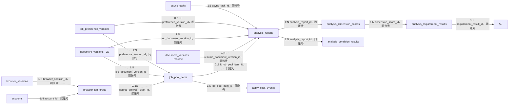

# Purslyx 匹配池数据库设计

| 项 | 内容 |
| --- | --- |
| 模块 | 匹配池 |
| 版本 | v0.2 |
| 更新日期 | 2026-09-15 |
| 状态 | 已评审 |
| 范围 | BOSS/猎聘岗位草稿、私有岗位入池、双端单岗位分析、维度得分、原文依据、条件对照与去投递点击 |
| 依赖模块 | 用户、简历、任务、用量；统计模块只读取已确认业务事件 |
| 需求/架构依据 | [需求说明 F03、F06、F07、F13 与 AC01、AC02、AC07、AC08、AC21](../../01-product/specs/需求说明.md)、[技术架构](../技术架构.md)、[数据库设计规范](数据库设计规范.md) |

## 1. 设计目标与边界

- 浏览器脚本只在求职者打开受支持 JD 详情页后生成待确认草稿；草稿上传不入池、不调用模型、不预留分析次数。相同账号、平台、规范化 URL 摘要和内容指纹幂等去重。
- 用户确认后才创建私有岗位。只保存岗位免费；同时确认分析消耗且简历、期望和余额满足时，入池、预留、任务与 outbox 在同一事务提交，岗位随后自动逐条分析。
- 求职分析报告固定从匹配池岗位详情进入。招聘端复用同一套报告、评分维度和证据表，但 `context_type` 为单人分析且不创建候选人池。
- 能力总分、条件对照和整体建议分别保存。未知、无依据与明确差距不能混为低分；报告绑定确切的简历、JD、期望、量表、提示词及任务版本。
- “去投递”只记录服务端受理的跳转点击。事件成功写入后才返回已保存原 JD 的 303 跳转；不记录或推断平台投递、回复、面试或 Offer 状态。

## 2. 实体关系

全部连线均为逻辑引用，不创建数据库外键。`browser_sessions` 属于用户模块，`document_versions` 与 `job_preference_versions` 属于简历模块，`async_tasks` 属于任务模块。

## 3. 表结构

### 表目录与中文备注

| 物理表名 | 中文表名（数据库 COMMENT） | 用途备注 |
| --- | --- | --- |
| `browser_job_drafts` | 浏览器岗位草稿表 | 保存 BOSS 与猎聘页面上传、待 Web 确认的短期岗位草稿。 |
| `job_pool_items` | 匹配池岗位表 | 保存求职账号确认入池的私有岗位及输入版本。 |
| `analysis_reports` | 分析报告表 | 保存求职匹配或招聘单人分析的结果父记录。 |
| `analysis_dimension_scores` | 分析维度得分表 | 保存报告内各适用能力维度的权重、得分与覆盖状态。 |
| `analysis_requirement_results` | JD 要求评估结果表 | 保存去重 JD 要求、支持程度和评分系数。 |
| `analysis_evidence` | 分析依据表 | 保存每条 JD 要求对应的可核对资料引用。 |
| `analysis_condition_results` | 条件对照结果表 | 保存岗位方向、地点、方式和薪资的代码比较结果。 |
| `apply_click_events` | 去投递点击事件表 | 保存已记录并发起原 JD 跳转的不可变点击事实。 |

### browser_job_drafts

| 字段名 | 数据类型 | 可空 | 默认值 | 约束/索引 | 说明 |
| --- | --- | --- | --- | --- | --- |
| id | BIGINT | 否 | GENERATED ALWAYS AS IDENTITY | PK | 服务端浏览器岗位草稿 ID |
| public_id | UUID | 否 | gen_random_uuid() | UK | 确认页使用的随机标识 |
| account_id | BIGINT | 否 | — | Index | 所属求职账号 ID |
| browser_session_id | BIGINT | 否 | — | — | 引用有效 `browser_sessions.id`；草稿读取按公开 ID 后校验会话 |
| platform | SMALLINT | 否 | — | CK: `platform IN (1,2)` | BOSS 直聘或猎聘 |
| normalized_url_digest | BYTEA | 否 | — | Index | 规范化来源 URL 摘要，用于去重 |
| content_fingerprint | BYTEA | 否 | — | Index | 提取内容指纹，用于 DOM 重绘去重 |
| upload_idempotency_key | UUID | 否 | — | UK | 浏览器上传重试键 |
| source_url | TEXT | 是 | — | — | 私有原 JD HTTPS 链接；确认或过期清理后置空 |
| job_title | VARCHAR(200) | 是 | — | — | 获取到的岗位标题 |
| company_name | VARCHAR(200) | 是 | — | — | 获取到的公司显示名 |
| location_text | VARCHAR(255) | 是 | — | — | 页面披露地点原文 |
| work_mode | SMALLINT | 是 | — | CK: `work_mode IN (1,2,3)` | 可确定时记录现场、混合或远程 |
| salary_text | VARCHAR(255) | 是 | — | — | 页面披露薪资原文，不猜测口径 |
| job_description_text | TEXT | 是 | — | — | 获取到的职责与要求正文，过期后清理 |
| captured_payload | JSONB | 是 | — | — | `browser-job-capture-v1` 校验后的字段与缺失状态；清理后置空 |
| capture_schema_version | VARCHAR(32) | 否 | — | — | 浏览器获取 Schema 版本 |
| status | SMALLINT | 否 | 1 | CK: `status IN (1,2,3,4)` | 待确认、已确认、已过期或失败 |
| expires_at | TIMESTAMPTZ | 否 | — | Index | 服务端未确认草稿过期时间点 |
| confirmed_at | TIMESTAMPTZ | 是 | — | — | 确认入池时间点 |
| created_at | TIMESTAMPTZ | 否 | now() | Index | 服务端接收时间点 |
| content_cleared_at | TIMESTAMPTZ | 是 | — | — | 草稿 URL、正文和结构化内容完成清理的时间点 |
| updated_at | TIMESTAMPTZ | 否 | now() | — | 缺失字段修正或状态更新时间点 |

### job_pool_items

| 字段名 | 数据类型 | 可空 | 默认值 | 约束/索引 | 说明 |
| --- | --- | --- | --- | --- | --- |
| id | BIGINT | 否 | GENERATED ALWAYS AS IDENTITY | PK | 私有匹配池岗位 ID |
| public_id | UUID | 否 | gen_random_uuid() | UK | 岗位详情路径标识 |
| account_id | BIGINT | 否 | — | Index | 所属求职账号 ID |
| source_browser_draft_id | BIGINT | 是 | — | Index | 浏览器获取时引用 `browser_job_drafts.id` |
| job_document_version_id | BIGINT | 否 | — | — | 引用已确认 JD `document_versions.id` |
| preference_version_id | BIGINT | 否 | — | — | 引用入池时选择的完整期望版本 |
| source_type | SMALLINT | 否 | — | CK: `source_type IN (1,2)` | 浏览器获取或手动填写 |
| platform | SMALLINT | 是 | — | CK: `platform IN (1,2)` | 有原站来源时为 BOSS 或猎聘 |
| source_url | TEXT | 是 | — | — | 经白名单校验的私有原 JD HTTPS 链接；删除清理后置空 |
| source_url_digest | BYTEA | 是 | — | — | 原链接规范化摘要 |
| job_title | VARCHAR(200) | 是 | — | — | 确认时岗位标题快照；删除清理后置空 |
| company_name | VARCHAR(200) | 是 | — | — | 确认时公司名称快照 |
| analysis_status | SMALLINT | 否 | 1 | CK: `analysis_status IN (1,2,3,4,5)` | 待条件、排队、分析中、可查看或失败 |
| revision | BIGINT | 否 | 1 | CK: `revision >= 1` | 标题等非输入元数据的乐观锁版本 |
| created_at | TIMESTAMPTZ | 否 | now() | Index | 入池时间点 |
| updated_at | TIMESTAMPTZ | 否 | now() | — | 状态或显示元数据更新时间点 |
| deleted_at | TIMESTAMPTZ | 是 | — | Index | 删除后岗位、报告和跳转入口立即不可访问 |
| content_cleared_at | TIMESTAMPTZ | 是 | — | — | 岗位标题、公司与原链接完成清理的时间点 |

### analysis_reports

| 字段名 | 数据类型 | 可空 | 默认值 | 约束/索引 | 说明 |
| --- | --- | --- | --- | --- | --- |
| id | BIGINT | 否 | GENERATED ALWAYS AS IDENTITY | PK | 一次完整分析报告 ID |
| public_id | UUID | 否 | gen_random_uuid() | UK | 报告详情标识 |
| account_id | BIGINT | 否 | — | Index | 所属账号 ID |
| context_type | SMALLINT | 否 | — | CK: `context_type IN (1,2)` | 求职匹配池或招聘单人分析 |
| job_pool_item_id | BIGINT | 是 | — | Index | 求职场景引用 `job_pool_items.id` |
| resume_document_version_id | BIGINT | 否 | — | — | 实际分析的简历版本 |
| job_document_version_id | BIGINT | 否 | — | — | 实际分析的 JD 版本 |
| preference_version_id | BIGINT | 是 | — | — | 本次求职期望或候选人明确期望版本 |
| async_task_id | BIGINT | 否 | — | UK | 引用分析 `async_tasks.id` |
| status | SMALLINT | 否 | 1 | CK: `status IN (1,2,3,4)` | 排队、分析中、可查看或失败 |
| ability_score | NUMERIC(6,3) | 是 | — | CK: `ability_score BETWEEN 0 AND 100` | 未舍入的能力总分 |
| evidence_coverage | NUMERIC(7,6) | 是 | — | CK: `evidence_coverage BETWEEN 0 AND 1` | 有可核对依据的评分覆盖率 |
| overall_advice | JSONB | 是 | — | — | `analysis-overall-advice-v1` 校验后的结论与下一步 |
| result_schema_version | VARCHAR(32) | 否 | — | — | 报告结果 Schema 版本 |
| scoring_rule_version | VARCHAR(32) | 否 | — | — | 维度、权重和计算规则版本 |
| prompt_version | VARCHAR(32) | 否 | — | — | 分析提示词版本 |
| created_at | TIMESTAMPTZ | 否 | now() | Index | 创建时间点 |
| completed_at | TIMESTAMPTZ | 是 | — | — | 全部结果可读时间点 |
| deleted_at | TIMESTAMPTZ | 是 | — | — | 删除后报告立即不可访问 |
| content_cleared_at | TIMESTAMPTZ | 是 | — | — | 报告建议、说明、条件值和引用文字完成清理的时间点 |

### analysis_dimension_scores

| 字段名 | 数据类型 | 可空 | 默认值 | 约束/索引 | 说明 |
| --- | --- | --- | --- | --- | --- |
| id | BIGINT | 否 | GENERATED ALWAYS AS IDENTITY | PK | 固定维度结果 ID |
| account_id | BIGINT | 否 | — | — | 所属账号 ID |
| analysis_report_id | BIGINT | 否 | — | Index | 引用 `analysis_reports.id` |
| dimension_code | SMALLINT | 否 | — | CK: `dimension_code IN (1,2,3,4)` | 固定能力维度 |
| weight | NUMERIC(7,6) | 否 | — | CK: `weight > 0 AND weight <= 1` | 本规则版本的权重 |
| score | NUMERIC(6,3) | 否 | — | CK: `score BETWEEN 0 AND 100` | 维度未舍入得分 |
| evidence_status | SMALLINT | 否 | — | CK: `evidence_status IN (1,2,3)` | 有依据、待确认或明确差距 |
| summary | TEXT | 是 | — | — | 面向用户的维度解释；报告清理后置空 |
| created_at | TIMESTAMPTZ | 否 | now() | — | 结果创建时间点 |

### analysis_requirement_results

| 字段名 | 数据类型 | 可空 | 默认值 | 约束/索引 | 说明 |
| --- | --- | --- | --- | --- | --- |
| id | BIGINT | 否 | GENERATED ALWAYS AS IDENTITY | PK | 一条去重 JD 要求的评估结果 ID |
| account_id | BIGINT | 否 | — | Index | 所属账号 ID |
| analysis_report_id | BIGINT | 否 | — | Index | 引用 `analysis_reports.id` |
| dimension_score_id | BIGINT | 否 | — | Index | 引用所属 `analysis_dimension_scores.id` |
| requirement_key | VARCHAR(96) | 否 | — | UK | 报告内稳定的去重要求键 |
| position_no | INTEGER | 否 | — | CK: `position_no >= 1` | 报告内展示顺序 |
| requirement_text | TEXT | 是 | — | — | 从 JD 拆分的要求；报告清理后置空 |
| finding_type | SMALLINT | 否 | — | CK: `finding_type IN (1,2,3,4)` | 直接支持、待确认、明确差距或部分支持 |
| match_coefficient | NUMERIC(3,2) | 否 | — | CK: `match_coefficient IN (0,0.5,1)` | 代码评分系数 |
| coverage_flag | BOOLEAN | 否 | — | — | 是否有足够资料做出判断 |
| explanation | TEXT | 是 | — | — | 判定说明；报告清理后置空 |
| content_cleared_at | TIMESTAMPTZ | 是 | — | — | 要求与说明完成清理的时间点 |
| created_at | TIMESTAMPTZ | 否 | now() | — | 结果创建时间点 |

### analysis_evidence

| 字段名 | 数据类型 | 可空 | 默认值 | 约束/索引 | 说明 |
| --- | --- | --- | --- | --- | --- |
| id | BIGINT | 否 | GENERATED ALWAYS AS IDENTITY | PK | 原文证据 ID |
| account_id | BIGINT | 否 | — | Index | 所属账号 ID |
| requirement_result_id | BIGINT | 否 | — | Index | 引用 `analysis_requirement_results.id` |
| document_version_id | BIGINT | 否 | — | — | 引用简历或 JD 的 `document_versions.id`；删除影响沿报告输入处理 |
| evidence_source | SMALLINT | 否 | — | CK: `evidence_source IN (1,2)` | 简历或 JD |
| source_segment_key | VARCHAR(96) | 否 | — | — | 确认版本中的稳定段落键 |
| quote_text | TEXT | 是 | — | — | 可核对的最小原文片段；报告清理后置空 |
| finding_type | SMALLINT | 否 | — | CK: `finding_type IN (1,2,3,4)` | 直接支持、待确认、差距或部分支持 |
| created_at | TIMESTAMPTZ | 否 | now() | — | 创建时间点 |

### analysis_condition_results

| 字段名 | 数据类型 | 可空 | 默认值 | 约束/索引 | 说明 |
| --- | --- | --- | --- | --- | --- |
| id | BIGINT | 否 | GENERATED ALWAYS AS IDENTITY | PK | 单项条件对照 ID |
| account_id | BIGINT | 否 | — | — | 所属账号 ID |
| analysis_report_id | BIGINT | 否 | — | Index | 引用 `analysis_reports.id` |
| condition_code | SMALLINT | 否 | — | CK: `condition_code IN (1,2,3,4)` | 岗位方向、地点、办公方式或薪资 |
| preference_value_status | SMALLINT | 否 | — | CK: `preference_value_status IN (1,2,3,4)` | 求职/候选人条件披露状态 |
| job_value_status | SMALLINT | 否 | — | CK: `job_value_status IN (1,2,3,4)` | JD 条件披露状态 |
| preference_value | JSONB | 是 | — | — | `condition-value-v1` 校验后的期望值快照 |
| job_value | JSONB | 是 | — | — | `condition-value-v1` 校验后的 JD 值快照 |
| strength | SMALLINT | 否 | — | CK: `strength IN (1,2,3)` | 本次期望条件强度 |
| result_status | SMALLINT | 否 | — | CK: `result_status IN (1,2,3,4)` | 匹配、冲突、未知或不适用 |
| explanation | TEXT | 是 | — | — | 对照说明；报告清理后置空 |
| schema_version | VARCHAR(32) | 否 | — | — | 两个值 JSONB 的 Schema 版本 |
| created_at | TIMESTAMPTZ | 否 | now() | — | 创建时间点 |

### apply_click_events

| 字段名 | 数据类型 | 可空 | 默认值 | 约束/索引 | 说明 |
| --- | --- | --- | --- | --- | --- |
| id | BIGINT | 否 | GENERATED ALWAYS AS IDENTITY | PK | 追加式去投递点击事件 ID |
| account_id | BIGINT | 否 | — | Index | 所属求职账号 ID |
| job_pool_item_id | BIGINT | 否 | — | — | 引用 `job_pool_items.id` |
| click_token | UUID | 否 | — | UK | 页面签发的一次性点击令牌 |
| platform | SMALLINT | 否 | — | CK: `platform IN (1,2)` | BOSS 直聘或猎聘 |
| target_url_digest | BYTEA | 否 | — | — | 目标链接摘要，供核对与统计 |
| metric_date | DATE | 否 | — | Index | 按 `Asia/Shanghai` 从 `created_at` 计算的业务日期 |
| created_at | TIMESTAMPTZ | 否 | now() | Index | 服务端成功记录点击的时间点 |

## 4. 索引清单

| 表名 | 索引名 | 字段或表达式 | 类型 | 条件与用途 |
| --- | --- | --- | --- | --- |
| browser_job_drafts | pk_browser_job_drafts | `id` | Primary | 主键 |
| browser_job_drafts | uq_browser_job_drafts_public_id | `public_id` | Unique | 确认页定位 |
| browser_job_drafts | uq_browser_job_drafts_upload_key | `account_id, upload_idempotency_key` | Unique | 上传重试去重并覆盖账号引用 |
| browser_job_drafts | uq_browser_job_drafts_content | `account_id, platform, normalized_url_digest, content_fingerprint` | Unique | 相同页面与内容不重复生成草稿 |
| browser_job_drafts | idx_browser_job_drafts_account_status | `account_id, status, created_at DESC` | B-tree | 待确认草稿列表 |
| browser_job_drafts | idx_browser_job_drafts_expiry | `expires_at` | B-tree partial | `status = 1`；过期扫描 |
| job_pool_items | pk_job_pool_items | `id` | Primary | 主键 |
| job_pool_items | uq_job_pool_items_public_id | `public_id` | Unique | 岗位详情定位 |
| job_pool_items | uq_job_pool_items_browser_draft | `source_browser_draft_id` | Unique partial | `source_browser_draft_id IS NOT NULL`；一个草稿最多入池一次 |
| job_pool_items | idx_job_pool_items_account_status | `account_id, analysis_status, created_at DESC` | B-tree partial | `deleted_at IS NULL`；匹配池按状态分页 |
| job_pool_items | idx_job_pool_items_deleted | `deleted_at` | B-tree partial | `deleted_at IS NOT NULL`；清理编排 |
| analysis_reports | pk_analysis_reports | `id` | Primary | 主键 |
| analysis_reports | uq_analysis_reports_public_id | `public_id` | Unique | 报告详情定位 |
| analysis_reports | uq_analysis_reports_task | `async_task_id` | Unique | 一个分析任务最多交付一个报告并覆盖任务引用 |
| analysis_reports | idx_analysis_reports_pool_item | `account_id, job_pool_item_id, created_at DESC` | B-tree partial | `job_pool_item_id IS NOT NULL AND deleted_at IS NULL`；求职岗位报告历史 |
| analysis_reports | idx_analysis_reports_account_context | `account_id, context_type, created_at DESC` | B-tree partial | `deleted_at IS NULL`；招聘分析列表或账号报告历史 |
| analysis_dimension_scores | pk_analysis_dimension_scores | `id` | Primary | 主键 |
| analysis_dimension_scores | uq_analysis_dimension_scores_code | `analysis_report_id, dimension_code` | Unique | 每报告每维度一行并覆盖报告引用 |
| analysis_requirement_results | pk_analysis_requirement_results | `id` | Primary | 主键 |
| analysis_requirement_results | uq_analysis_requirement_results_key | `analysis_report_id, requirement_key` | Unique | 每报告去重要求唯一并覆盖报告引用 |
| analysis_requirement_results | uq_analysis_requirement_results_position | `analysis_report_id, position_no` | Unique | 报告内展示顺序唯一 |
| analysis_requirement_results | idx_requirement_results_dimension | `account_id, dimension_score_id, position_no` | B-tree | 报告详情按维度读取要求 |
| analysis_evidence | pk_analysis_evidence | `id` | Primary | 主键 |
| analysis_evidence | idx_analysis_evidence_requirement | `account_id, requirement_result_id, id` | B-tree | 报告详情按要求读取证据 |
| analysis_condition_results | pk_analysis_condition_results | `id` | Primary | 主键 |
| analysis_condition_results | uq_analysis_condition_results_code | `analysis_report_id, condition_code` | Unique | 每报告每条件一行并覆盖报告引用 |
| apply_click_events | pk_apply_click_events | `id` | Primary | 主键 |
| apply_click_events | uq_apply_click_events_token | `account_id, click_token` | Unique | 同一次点击重试不重复计数并覆盖账号引用 |
| apply_click_events | idx_apply_click_events_account_date | `account_id, metric_date, created_at DESC` | B-tree | 用户今日点击数 |
| apply_click_events | idx_apply_click_events_site_date | `metric_date, platform` | B-tree | 管理端日聚合 |

## 5. 检查约束清单

| 表名 | 约束名 | 表达式 | 说明 |
| --- | --- | --- | --- |
| browser_job_drafts | ck_browser_job_drafts_platform | `platform IN (1,2)` | 仅支持 BOSS 与猎聘 |
| browser_job_drafts | ck_browser_job_drafts_work_mode | `work_mode IS NULL OR work_mode IN (1,2,3)` | 办公方式合法 |
| browser_job_drafts | ck_browser_job_drafts_status | `status IN (1,2,3,4)` | 草稿状态合法 |
| browser_job_drafts | ck_browser_job_drafts_content | `(status <> 1 OR (source_url IS NOT NULL AND captured_payload IS NOT NULL AND content_cleared_at IS NULL)) AND (captured_payload IS NOT NULL OR content_cleared_at IS NOT NULL)` | 待确认草稿内容完整；确认或过期后可清理 |
| browser_job_drafts | ck_browser_job_drafts_content_cleanup | `content_cleared_at IS NULL OR (source_url IS NULL AND job_title IS NULL AND company_name IS NULL AND location_text IS NULL AND work_mode IS NULL AND salary_text IS NULL AND job_description_text IS NULL AND captured_payload IS NULL)` | 标记清理完成后私有草稿内容必须为空 |
| browser_job_drafts | ck_browser_job_drafts_expiry | `expires_at > created_at` | 草稿必须有未来过期时间 |
| browser_job_drafts | ck_browser_job_drafts_confirmed | `(status = 2) = (confirmed_at IS NOT NULL)` | 已确认状态与时间一致 |
| job_pool_items | ck_job_pool_items_source | `source_type IN (1,2)` | 来源类型合法 |
| job_pool_items | ck_job_pool_items_platform | `platform IS NULL OR platform IN (1,2)` | 平台值合法 |
| job_pool_items | ck_job_pool_items_source_fields | `(source_type = 1 AND source_browser_draft_id IS NOT NULL AND platform IS NOT NULL AND source_url_digest IS NOT NULL AND (deleted_at IS NOT NULL OR source_url IS NOT NULL)) OR (source_type = 2 AND source_browser_draft_id IS NULL)` | 浏览器来源必须保留草稿和原链接 |
| job_pool_items | ck_job_pool_items_analysis_status | `analysis_status IN (1,2,3,4,5)` | 分析状态合法 |
| job_pool_items | ck_job_pool_items_revision | `revision >= 1` | 乐观锁版本为正数 |
| job_pool_items | ck_job_pool_items_content_cleanup | `content_cleared_at IS NULL OR (job_title IS NULL AND company_name IS NULL AND source_url IS NULL)` | 标记清理完成后岗位显示信息和原链接必须为空 |
| analysis_reports | ck_analysis_reports_context | `context_type IN (1,2)` | 报告上下文合法 |
| analysis_reports | ck_analysis_reports_pool_context | `(context_type = 1 AND job_pool_item_id IS NOT NULL) OR (context_type = 2 AND job_pool_item_id IS NULL)` | 求职报告必须属于岗位，招聘报告不得创建匹配池引用 |
| analysis_reports | ck_analysis_reports_status | `status IN (1,2,3,4)` | 报告状态合法 |
| analysis_reports | ck_analysis_reports_score | `ability_score IS NULL OR ability_score BETWEEN 0 AND 100` | 能力分范围合法 |
| analysis_reports | ck_analysis_reports_coverage | `evidence_coverage IS NULL OR evidence_coverage BETWEEN 0 AND 1` | 依据覆盖率范围合法 |
| analysis_reports | ck_analysis_reports_completion | `deleted_at IS NOT NULL OR (status = 3 AND ability_score IS NOT NULL AND overall_advice IS NOT NULL AND completed_at IS NOT NULL) OR status <> 3` | 可查看报告必须完整 |
| analysis_reports | ck_analysis_reports_content_cleanup | `content_cleared_at IS NULL OR overall_advice IS NULL` | 标记清理完成后报告整体建议必须为空 |
| analysis_dimension_scores | ck_analysis_dimension_scores_code | `dimension_code IN (1,2,3,4)` | 固定能力维度合法 |
| analysis_dimension_scores | ck_analysis_dimension_scores_weight | `weight > 0 AND weight <= 1` | 权重范围合法 |
| analysis_dimension_scores | ck_analysis_dimension_scores_score | `score BETWEEN 0 AND 100` | 得分范围合法 |
| analysis_dimension_scores | ck_analysis_dimension_scores_evidence | `evidence_status IN (1,2,3)` | 依据状态合法 |
| analysis_requirement_results | ck_analysis_requirement_results_position | `position_no >= 1` | 要求顺序为正数 |
| analysis_requirement_results | ck_analysis_requirement_results_finding | `finding_type IN (1,2,3,4)` | 直接支持、待确认、差距或部分支持 |
| analysis_requirement_results | ck_analysis_requirement_results_scoring | `(finding_type = 1 AND match_coefficient = 1 AND coverage_flag) OR (finding_type = 4 AND match_coefficient = 0.5 AND coverage_flag) OR (finding_type = 3 AND match_coefficient = 0 AND coverage_flag) OR (finding_type = 2 AND match_coefficient = 0 AND NOT coverage_flag)` | 要求状态、评分系数和覆盖标记一致 |
| analysis_requirement_results | ck_analysis_requirement_results_content | `(requirement_text IS NULL) = (explanation IS NULL) AND (requirement_text IS NULL) = (content_cleared_at IS NOT NULL)` | 要求与说明同时存在或同时清理 |
| analysis_evidence | ck_analysis_evidence_source | `evidence_source IN (1,2)` | 依据来源合法 |
| analysis_evidence | ck_analysis_evidence_finding | `finding_type IN (1,2,3,4)` | 依据结论合法 |
| analysis_condition_results | ck_analysis_condition_results_code | `condition_code IN (1,2,3,4)` | 条件类型合法 |
| analysis_condition_results | ck_analysis_condition_results_values | `preference_value_status IN (1,2,3,4) AND job_value_status IN (1,2,3,4)` | 双方值状态合法 |
| analysis_condition_results | ck_analysis_condition_results_strength | `strength IN (1,2,3)` | 条件强度合法 |
| analysis_condition_results | ck_analysis_condition_results_status | `result_status IN (1,2,3,4)` | 对照结果合法 |
| apply_click_events | ck_apply_click_events_platform | `platform IN (1,2)` | 仅允许受支持平台 |

## 6. 枚举与版本字典

| 表.字段 | 数据库值 | API 名称 | 含义 | 备注 |
| --- | --- | --- | --- | --- |
| browser_job_drafts.platform / job_pool_items.platform / apply_click_events.platform | 1 | boss | BOSS 直聘 | URL 必须匹配白名单 |
| browser_job_drafts.platform / job_pool_items.platform / apply_click_events.platform | 2 | liepin | 猎聘 | URL 必须匹配白名单 |
| browser_job_drafts.work_mode | 1 | onsite | 现场办公 | 页面明确披露时记录 |
| browser_job_drafts.work_mode | 2 | hybrid | 混合办公 | 页面明确披露时记录 |
| browser_job_drafts.work_mode | 3 | remote | 远程办公 | 页面明确披露时记录 |
| browser_job_drafts.status | 1 | awaiting_confirmation | 待用户确认 | 获取完成不等于入池 |
| browser_job_drafts.status | 2 | confirmed | 已确认 | 不能再次确认 |
| browser_job_drafts.status | 3 | expired | 已过期 | 正文待清理 |
| browser_job_drafts.status | 4 | failed | 获取或上传失败 | 可重试或手动粘贴 |
| job_pool_items.source_type | 1 | browser_capture | 浏览器获取 | 必须保留草稿和受支持原链接 |
| job_pool_items.source_type | 2 | manual | 手动填写 | 可以没有外站链接 |
| job_pool_items.analysis_status | 1 | awaiting_requirements | 待满足分析条件 | 输入不全或次数不足 |
| job_pool_items.analysis_status | 2 | queued | 已排队 | 已确认一次分析消耗 |
| job_pool_items.analysis_status | 3 | running | 分析中 | Worker 已认领 |
| job_pool_items.analysis_status | 4 | ready | 报告可查看 | 匹配池详情展示入口 |
| job_pool_items.analysis_status | 5 | failed | 分析失败 | 可恢复原任务 |
| analysis_reports.context_type | 1 | seeker_pool | 求职匹配池报告 | 必须关联私有岗位 |
| analysis_reports.context_type | 2 | recruiter_single | 招聘单人分析 | 不创建候选人池 |
| analysis_reports.status | 1 | queued | 已排队 | 尚无可读结果 |
| analysis_reports.status | 2 | running | 分析中 | 只接受当前执行代次 |
| analysis_reports.status | 3 | available | 可查看 | 完整后结算分析次数 |
| analysis_reports.status | 4 | failed | 分析失败 | 释放未结算预留 |
| analysis_dimension_scores.dimension_code | 1 | core_skills | 核心技能 | 权重随量表版本保存 |
| analysis_dimension_scores.dimension_code | 2 | relevant_experience | 相关经历 | 权重随量表版本保存 |
| analysis_dimension_scores.dimension_code | 3 | achievement_evidence | 成果依据 | 权重随量表版本保存 |
| analysis_dimension_scores.dimension_code | 4 | role_readiness | 岗位准备度 | 权重随量表版本保存 |
| analysis_evidence.evidence_source | 1 | resume | 简历原文 | 引用简历确认版本 |
| analysis_evidence.evidence_source | 2 | job_description | JD 原文 | 引用 JD 确认版本 |
| analysis_dimension_scores.evidence_status / analysis_evidence.finding_type | 1 | supported | 有依据支持 | 必须有可核对原文 |
| analysis_dimension_scores.evidence_status / analysis_evidence.finding_type | 2 | needs_confirmation | 待确认 | 当前资料未提供 |
| analysis_dimension_scores.evidence_status / analysis_evidence.finding_type | 3 | gap | 明确差距 | 不能把未知归入此类 |
| analysis_requirement_results.finding_type / analysis_evidence.finding_type | 4 | partially_supported | 部分支持 | 评分系数固定为 0.5，必须有可核对依据 |
| analysis_requirement_results.match_coefficient | 0 | unsupported_or_unknown | 未贡献已证实匹配分 | 由 `coverage_flag` 区分差距与待确认 |
| analysis_requirement_results.match_coefficient | 0.5 | partial | 部分支持 | 不允许模型返回其他任意小数 |
| analysis_requirement_results.match_coefficient | 1 | direct | 直接支持 | 必须有可核对依据 |
| analysis_condition_results.condition_code | 1 | job_title | 岗位方向 | 与能力分分开 |
| analysis_condition_results.condition_code | 2 | location | 地点 | 与能力分分开 |
| analysis_condition_results.condition_code | 3 | work_mode | 办公方式 | 与能力分分开 |
| analysis_condition_results.condition_code | 4 | salary | 薪资 | 只比较同口径信息 |
| analysis_condition_results.preference_value_status / job_value_status | 1 | specified | 已披露 | 存在可比较值 |
| analysis_condition_results.preference_value_status / job_value_status | 2 | unknown | 未知 | 不能显示全部符合 |
| analysis_condition_results.preference_value_status / job_value_status | 3 | unrestricted | 不限 | 用户或 JD 明确表达 |
| analysis_condition_results.preference_value_status / job_value_status | 4 | negotiable | 面议 | 仅薪资条件可用 |
| analysis_condition_results.strength | 1 | prefer | 偏好 | 冲突时提示 |
| analysis_condition_results.strength | 2 | important | 重要 | 默认强度 |
| analysis_condition_results.strength | 3 | required | 必须 | 明确冲突时突出不优先 |
| analysis_condition_results.result_status | 1 | matched | 条件匹配 | 有充分同口径信息 |
| analysis_condition_results.result_status | 2 | conflicted | 条件冲突 | 不降低能力分 |
| analysis_condition_results.result_status | 3 | unknown | 无法判断 | 信息不足 |
| analysis_condition_results.result_status | 4 | not_applicable | 不适用 | 不参与条件判断 |

`captured_payload` 使用 `browser-job-capture-v1`；条件值使用 `condition-value-v1`；整体建议使用 `analysis-overall-advice-v1`。分析报告固定保存 `result_schema_version`、`scoring_rule_version` 和 `prompt_version`，模型与价格版本从 `model_call_attempts` 追溯。量表升级只影响新任务，历史得分不重算。

## 7. 事务与生命周期

| 操作/触发 | 事务内校验与写入 | 事务外动作/补偿 | 幂等与失败结果 |
| --- | --- | --- | --- |
| 浏览器上传岗位草稿 | 校验浏览器会话有效、账号为求职身份、平台与 URL 白名单；按内容唯一键插入草稿 | 脚本提示“岗位信息获取完成”；服务端过期后清理正文 | 相同内容返回原草稿；上传不预留次数、不创建任务 |
| 确认入池但暂不分析 | 锁定账号、草稿/手动 JD 与期望版本；创建确认 JD 版本和 `job_pool_items`，条件更新草稿为已确认 | 无 | 来源草稿唯一；重试返回原岗位；全程免费 |
| 确认入池并自动分析 | 按账号、输入版本、用量余额顺序锁定；校验简历、JD、期望与身份；创建岗位、预留 1 次分析、任务、报告占位与 outbox | Worker 读取冻结版本分析 | 同幂等键返回原任务；输入不足或次数不足只保存待分析岗位 |
| 招聘端发起单人分析 | 校验招聘身份、候选人简历、JD 与明确期望均归本账号；预留分析次数并创建无岗位池引用的报告和任务 | Worker 使用与求职端相同评分规则生成待核实问题 | 任务幂等；完整可读后结算，失败释放预留 |
| 发布分析结果 | 锁定任务、报告和来源父资源；校验当前执行代次、未删除、4 个维度唯一且权重合计为 1、要求去重且系数/覆盖标记合法、证据可核对、条件结果完整；写结果并标可用 | 通知或页面轮询可重试 | 同任务最多一份可用报告；迟到执行不能覆盖或结算 |
| 修改简历或期望 | 不改旧岗位及报告引用；新分析创建新报告与任务 | 页面标记旧报告未应用最新输入 | 不暗中重跑或扣减 |
| 去投递点击 | 锁定岗位并校验求职身份、归属、未删除、平台和已保存 HTTPS 链接；插入点击事件 | 事务成功后返回 303 到事件中的目标链接 | `(account_id, click_token)` 唯一；记录失败不跳转也不计数 |
| 删除岗位或报告 | 锁定岗位/报告及未完成任务，写删除时间并取消任务；旧跳转入口立即失效 | 异步清理岗位标题/公司/原链接、JD 与报告正文、条件值、引用文字、产物和检查点 | 重复删除返回已删除；只含岗位引用和链接摘要的点击事件按保留规则留存 |
| 草稿过期 | 条件更新待确认草稿为过期 | 清理正文并通知失败时重试 | 已确认草稿不受过期扫描影响 |

## 8. 关键设计决策

- 匹配池只保存求职者自己确认的岗位，不是公共岗位库，也不做跨岗位排序推荐。招聘端只复用报告数据结构，不创建招聘候选人池。
- 浏览器草稿、确认 JD 版本与私有岗位分层保存，使“已获取”“已入池”“已分析”成为三个可核对状态，避免获取成功被误认为已分析。
- 能力维度、逐条 JD 要求、原文证据与条件对照拆表，前端可以逐项展示，代码可按要求系数复算，统计也无需解析报告大 JSON；整体建议保留受 Schema 校验的可变结构。
- 报告直接引用不可变输入版本，不在报告 JSON 中复制整个简历或 JD。删除后由父资源访问控制和清理任务共同阻断正文。
- 点击事件只保存岗位引用和当时目标链接摘要；同令牌重试仅在岗位仍有效且当前保存链接摘要一致时返回原目标，删除后不长期复制原链接。指标名称固定为“去投递点击数”。

- `analysis_evidence` 只直接引用要求结果，报告和维度从要求结果推导，避免三份引用不一致。浏览器会话、岗位输入版本、点击来源岗位和链接摘要仅在已定位记录上校验；输入删除先由父资源访问控制阻断，低频清理按主键分段扫描。匹配池与报告列表、草稿过期、正文清理、逐条要求读取和日期统计保留必要索引。

## 9. 待讨论项

- BOSS 与猎聘 URL 规范化规则、允许域名、SPA 路由样本和内容指纹算法需在两站实测后冻结版本。
- 首版量表四个维度的精确权重、证据覆盖率阈值和“无法可靠评分”的阻断条件需随提示词评审确定。
- 浏览器服务端草稿默认 24 小时的建议值、JD 正文及分析报告的具体保留期限需在上线配置中确认。
