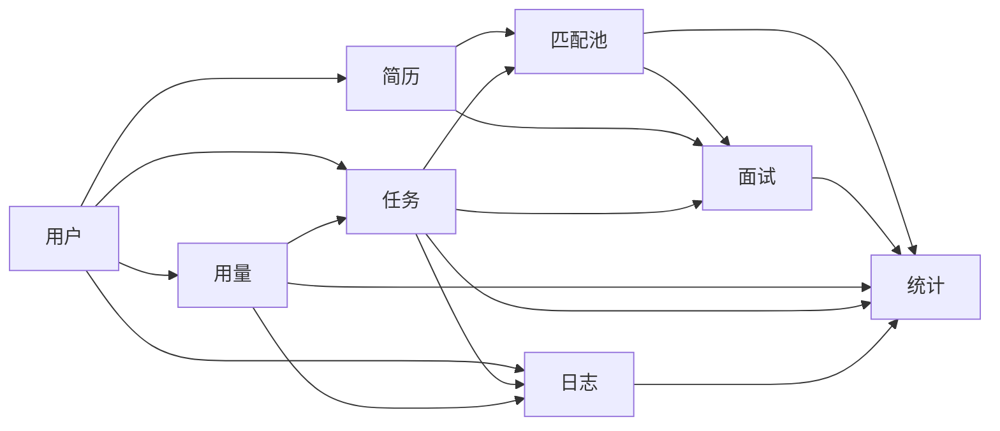

# Purslyx 模块数据库设计索引

| 项 | 内容 |
| --- | --- |
| 版本 | v0.2 |
| 更新日期 | 2026-09-15 |
| 状态 | 已评审 |
| 技术基线 | PostgreSQL 18、SQLAlchemy 2、psycopg 3、Alembic |
| 总规范 | [数据库设计规范](数据库设计规范.md) |
| 技术模块 | [技术模块设计索引](../modules/技术模块设计索引.md) |

数据库设计按产品短模块拆分。一个表只有一个主责模块；跨模块保存经事务校验的逻辑引用，不建数据库外键。只有首版反向读取、删除影响、Worker 回写或高频运维需要的引用才建索引，巡检不再单独驱动索引。模块文档固定使用九章结构、中文表备注、六列表结构，并分别列出索引、数据库 `CHECK`、枚举与事务生命周期。

## 模块依赖

箭头表示引用或事务依赖，不表示数据库外键。日志与统计读取其他模块的受限元数据；它们不得反向改变业务事实。跨模块事务的默认锁顺序为：`accounts` → 业务父资源 → `usage_balances`／`site_budget_buckets` → `async_tasks` → 模块结果 → `admin_audit_events`／outbox。模块文档有更具体顺序时以具体流程为准。

## 文档与表归属

| 模块文档 | 主责表 | 主要依赖 |
| --- | --- | --- |
| [用户数据库设计](用户数据库设计.md) | `accounts`、认证令牌与会话、后台角色与权限 | 无 |
| [简历数据库设计](简历数据库设计.md) | 私有文件、资料与版本、岗位期望、事实、改写、岗位版和 PDF 导出 | 用户、任务 |
| [匹配池数据库设计](匹配池数据库设计.md) | 浏览器岗位草稿、私有岗位、分析报告、逐条要求、证据、条件结果、去投递点击 | 用户、简历、任务、用量 |
| [面试数据库设计](面试数据库设计.md) | 面试会话、题目、回答、反馈和汇总 | 用户、简历、匹配池、任务、用量 |
| [任务数据库设计](任务数据库设计.md) | 异步任务、冻结输入、执行尝试、模型调用、outbox、步骤产物和检查点映射 | 用户、用量 |
| [用量数据库设计](用量数据库设计.md) | 功能余额、发放、预留、流水、价格版本和全站预算 | 用户、任务、日志 |
| [统计数据库设计](统计数据库设计.md) | 产品反馈、全站日聚合 | 用户、匹配池、面试、任务、用量、日志 |
| [日志数据库设计](日志数据库设计.md) | 管理操作、安全事件、日志导出、引用巡检 | 用户、任务、简历 |

## 首版索引基线

58 张表共保留 58 个主键索引、97 个唯一索引／约束和 61 个二级索引。主键与唯一索引用于身份定位、幂等和业务一致性，不能当作可选性能索引删除；二级索引只覆盖页面主列表、账号会话撤销、任务派发与租约恢复、Worker 清理、用量流水、核心日志筛选和按日统计。

低频删除影响、过期记录、完整性巡检和后台复核默认整表或按主键分段扫描。实现后只有慢查询证据、代表性数据量和 `EXPLAIN (ANALYZE, BUFFERS)` 结果同时支持时才新增索引；不为未来可能使用的筛选预建索引。

## 实施顺序

1. 用户：账号、登录、受限浏览器会话、后台角色与权限。
2. 简历：资料、确认版本、多岗位期望和私有文件。
3. 用量与任务：余额、幂等预留、任务状态、outbox、模型成本与预算。
4. 匹配池：岗位草稿确认、逐条分析报告和去投递点击。
5. 面试：开场计次、逐轮反馈、恢复与汇总。
6. 统计与日志：从稳定业务事实生成聚合、审计和巡检结果。

迁移也按上述顺序分批生成。日志基础表须在首次后台授权或次数发放前就绪；统计聚合表可以后建并从源流水回填。当前仓库没有 ORM 模型或 Alembic 迁移，模块设计通过评审后再生成代码。

## 跨模块校验原则

- 客户端只提交 `public_id` 或业务输入；服务端解析内部 ID，不能接受客户端指定 `account_id`。
- 每个逻辑引用写入前都读取目标行，校验存在、所属账号、用途、状态与删除时间；需要防删除竞态时锁定父行。
- 关联表、版本表和流水表显式保存 `account_id`，既用于隔离查询，也用于巡检跨账号引用。
- 多模块事务失败整体回滚；模型调用、文件写入、邮件和队列发布放在事务外，由状态表和 outbox 补偿。
- 每日巡检只报告孤儿、跨账号引用和已删除父对象仍可见的子对象，不自动修改数据。
