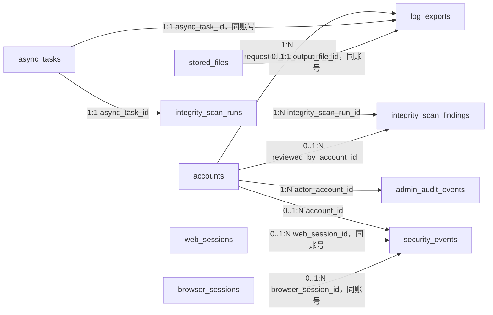

# Purslyx 日志数据库设计

| 项 | 内容 |
| --- | --- |
| 模块 | 日志 |
| 版本 | v0.1 |
| 更新日期 | 2026-09-14 |
| 状态 | 待评审；模型与迁移尚未实现 |
| 范围 | 管理操作审计、登录安全事件、受控日志导出、每日逻辑引用巡检运行与异常明细 |
| 依赖模块 | 用户、任务、简历；读取其他模块逻辑引用但不自动修改业务数据 |
| 需求/架构依据 | [需求说明 F14 与 AC10、AC14、AC22](../../01-product/specs/需求说明.md)、[技术架构第 6、7 章](../技术架构.md)、[数据库设计规范](数据库设计规范.md) |

## 1. 设计目标与边界

- `admin_audit_events` 保存操作者、权限动作、目标、结果、理由与脱敏前后值。角色权限、账号状态、次数发放、反馈处理与日志导出均须留痕。
- `security_events` 保存登录成功/失败、限频、锁定、密码重置、Web/浏览器会话签发和撤销的必要元数据，不保存密码、令牌、Cookie、邮件正文、完整 IP 或完整 User-Agent。
- 任务运行日志不复制到本模块，管理端按权限读取 `async_tasks`、`task_attempts` 和 `model_call_attempts` 的非正文列。
- 日志查询、详情和导出分别鉴权。导出文件使用私有存储并短期有效；导出动作自身写审计，不允许导出业务正文或凭据。
- 每日完整性巡检检查孤儿、跨账号引用和已删除父对象仍可见的子对象，只报告、告警和人工标记，不自动修复数据。

## 2. 实体关系

全部连线均为应用层校验的逻辑引用，不创建数据库外键。审计目标与巡检目标使用受控“表/类型＋内部 ID”引用，写入和查看时按类型校验。

## 3. 表结构

### admin_audit_events

| 字段名 | 数据类型 | 可空 | 默认值 | 约束/索引 | 说明 |
| --- | --- | --- | --- | --- | --- |
| id | BIGINT | 否 | GENERATED ALWAYS AS IDENTITY | PK | 追加式管理操作事件 ID |
| public_id | UUID | 否 | gen_random_uuid() | UK | 管理端详情标识 |
| actor_account_id | BIGINT | 否 | — | Index | 引用执行操作的管理员 `accounts.id` |
| action_key | VARCHAR(96) | 否 | — | Index | 与权限目录对应的稳定动作键 |
| target_type | VARCHAR(64) | 否 | — | Index | 账号、角色、权限、发放、反馈、日志导出等受控类型 |
| target_id | BIGINT | 是 | — | Index | 目标内部 ID；创建失败且尚无目标时可空 |
| request_id | UUID | 否 | — | Index | 关联一次 HTTP/命令请求 |
| idempotency_key | UUID | 是 | — | Index | 幂等管理动作的请求键 |
| result | SMALLINT | 否 | — | CK: `result IN (1,2,3)` | 成功、拒绝或失败 |
| reason | VARCHAR(500) | 是 | — | — | 管理原因或稳定拒绝/失败说明 |
| before_values | JSONB | 是 | — | — | `admin-audit-values-v1` 校验的脱敏变更前值 |
| after_values | JSONB | 是 | — | — | 同 Schema 的脱敏变更后值 |
| values_schema_version | VARCHAR(32) | 是 | — | — | 前后值 JSONB 的 Schema 版本 |
| correlation_id | UUID | 否 | — | Index | 跨请求、任务与日志关联标识 |
| ip_digest | BYTEA | 是 | — | — | 带轮换盐的来源 IP 摘要 |
| created_at | TIMESTAMPTZ | 否 | now() | Index | 事件发生时间点 |

### security_events

| 字段名 | 数据类型 | 可空 | 默认值 | 约束/索引 | 说明 |
| --- | --- | --- | --- | --- | --- |
| id | BIGINT | 否 | GENERATED ALWAYS AS IDENTITY | PK | 追加式安全事件 ID |
| public_id | UUID | 否 | gen_random_uuid() | UK | 授权管理详情标识 |
| account_id | BIGINT | 是 | — | Index | 可识别账号时引用 `accounts.id` |
| web_session_id | BIGINT | 是 | — | Index | 可选引用 `web_sessions.id` |
| browser_session_id | BIGINT | 是 | — | Index | 可选引用 `browser_sessions.id` |
| event_type | SMALLINT | 否 | — | CK: `event_type BETWEEN 1 AND 9` | 登录、限频、锁定、重置、会话签发/撤销等 |
| result | SMALLINT | 否 | — | CK: `result IN (1,2,3)` | 成功、拒绝或失败 |
| reason_code | VARCHAR(64) | 是 | — | — | 稳定原因码 |
| email_digest | BYTEA | 是 | — | Index | 账号未知时使用规范化邮箱的带盐摘要 |
| ip_prefix | INET | 是 | — | — | 降精度网络前缀，不保存完整客户端 IP |
| ip_digest | BYTEA | 是 | — | Index | 带轮换盐的完整 IP 摘要 |
| user_agent_digest | BYTEA | 是 | — | — | User-Agent 摘要 |
| request_id | UUID | 否 | — | Index | 请求关联标识 |
| correlation_id | UUID | 否 | — | Index | 跨日志关联标识 |
| event_metadata | JSONB | 是 | — | — | `security-event-metadata-v1` 校验的非凭据元数据 |
| metadata_schema_version | VARCHAR(32) | 是 | — | — | 与元数据 JSONB 同时出现 |
| created_at | TIMESTAMPTZ | 否 | now() | Index | 事件时间点 |

### log_exports

| 字段名 | 数据类型 | 可空 | 默认值 | 约束/索引 | 说明 |
| --- | --- | --- | --- | --- | --- |
| id | BIGINT | 否 | GENERATED ALWAYS AS IDENTITY | PK | 日志导出记录 ID |
| public_id | UUID | 否 | gen_random_uuid() | UK | 导出状态和下载标识 |
| requested_by_account_id | BIGINT | 否 | — | Index | 引用申请管理员账号 |
| log_category | SMALLINT | 否 | — | CK: `log_category IN (1,2,3)` | 管理操作、安全或任务运行 |
| export_format | SMALLINT | 否 | 1 | CK: `export_format IN (1,2)` | CSV 或 JSON Lines |
| filter_spec | JSONB | 否 | — | — | `log-export-filter-v1` 校验的时间和筛选条件 |
| filter_schema_version | VARCHAR(32) | 否 | — | — | 筛选 Schema 版本 |
| async_task_id | BIGINT | 否 | — | UK | 引用日志导出 `async_tasks.id` |
| output_file_id | BIGINT | 是 | — | Index | 成功后引用私有 `stored_files.id` |
| status | SMALLINT | 否 | 1 | CK: `status IN (1,2,3,4,5)` | 排队、导出中、可下载、失败或过期 |
| row_count | BIGINT | 是 | — | CK: `row_count >= 0` | 成功导出的日志行数 |
| expires_at | TIMESTAMPTZ | 否 | — | Index | 下载和文件到期时间点 |
| completed_at | TIMESTAMPTZ | 是 | — | — | 成功或失败时间点 |
| downloaded_at | TIMESTAMPTZ | 是 | — | — | 首次成功下载时间点 |
| created_at | TIMESTAMPTZ | 否 | now() | Index | 申请时间点 |
| deleted_at | TIMESTAMPTZ | 是 | — | Index | 提前删除后立即不可下载 |

### integrity_scan_runs

| 字段名 | 数据类型 | 可空 | 默认值 | 约束/索引 | 说明 |
| --- | --- | --- | --- | --- | --- |
| id | BIGINT | 否 | GENERATED ALWAYS AS IDENTITY | PK | 一次只读完整性巡检 ID |
| public_id | UUID | 否 | gen_random_uuid() | UK | 管理端巡检详情标识 |
| async_task_id | BIGINT | 否 | — | UK | 引用巡检 `async_tasks.id` |
| scan_scope | SMALLINT | 否 | — | CK: `scan_scope IN (1,2,3)` | 全部、指定模块或复查 |
| module_key | VARCHAR(64) | 是 | — | — | 指定模块时的受控短名 |
| rule_version | VARCHAR(32) | 否 | — | — | 引用表、列和判定规则版本 |
| status | SMALLINT | 否 | 1 | CK: `status IN (1,2,3,4)` | 排队、运行、完成或失败 |
| checked_reference_count | BIGINT | 否 | 0 | CK: `checked_reference_count >= 0` | 已检查逻辑引用数 |
| finding_count | BIGINT | 否 | 0 | CK: `finding_count >= 0` | 异常总数 |
| orphan_count | BIGINT | 否 | 0 | CK: `orphan_count >= 0` | 目标不存在数量 |
| cross_account_count | BIGINT | 否 | 0 | CK: `cross_account_count >= 0` | 跨账号引用数量 |
| deleted_parent_visible_count | BIGINT | 否 | 0 | CK: `deleted_parent_visible_count >= 0` | 已删父对象仍可见子对象数量 |
| failure_code | VARCHAR(64) | 是 | — | — | 稳定失败码 |
| started_at | TIMESTAMPTZ | 是 | — | — | 巡检开始时间点 |
| completed_at | TIMESTAMPTZ | 是 | — | — | 巡检结束时间点 |
| created_at | TIMESTAMPTZ | 否 | now() | Index | 创建时间点 |

### integrity_scan_findings

| 字段名 | 数据类型 | 可空 | 默认值 | 约束/索引 | 说明 |
| --- | --- | --- | --- | --- | --- |
| id | BIGINT | 否 | GENERATED ALWAYS AS IDENTITY | PK | 单条巡检异常 ID |
| public_id | UUID | 否 | gen_random_uuid() | UK | 管理端异常详情标识 |
| integrity_scan_run_id | BIGINT | 否 | — | Index | 引用 `integrity_scan_runs.id` |
| finding_type | SMALLINT | 否 | — | CK: `finding_type IN (1,2,3)` | 孤儿、跨账号或删除可见性异常 |
| source_table | VARCHAR(63) | 否 | — | Index | 受控来源表名 |
| source_record_id | BIGINT | 否 | — | Index | 来源记录内部 ID |
| source_account_id | BIGINT | 是 | — | Index | 来源记录账号 ID；全局表可空 |
| reference_column | VARCHAR(63) | 否 | — | — | 被检查的逻辑引用列 |
| target_table | VARCHAR(63) | 否 | — | Index | 受控目标表名 |
| target_record_id | BIGINT | 否 | — | Index | 引用中记录的目标 ID |
| target_account_id | BIGINT | 是 | — | Index | 可找到目标时的账号 ID |
| severity | SMALLINT | 否 | — | CK: `severity IN (1,2,3)` | 提示、警告或严重 |
| sample_metadata | JSONB | 否 | — | — | `integrity-finding-v1` 校验的脱敏定位信息 |
| schema_version | VARCHAR(32) | 否 | — | — | 异常样本 Schema 版本 |
| status | SMALLINT | 否 | 1 | CK: `status IN (1,2,3)` | 待处理、已确认或已复查解决 |
| reviewed_by_account_id | BIGINT | 是 | — | Index | 引用复核管理员账号 |
| reviewed_at | TIMESTAMPTZ | 是 | — | — | 人工复核时间点 |
| resolution_note | VARCHAR(1000) | 是 | — | — | 迁移/修复说明，不由巡检自动填写 |
| created_at | TIMESTAMPTZ | 否 | now() | Index | 异常记录时间点 |

## 4. 索引清单

| 表名 | 索引名 | 字段或表达式 | 类型 | 条件与用途 |
| --- | --- | --- | --- | --- |
| admin_audit_events | pk_admin_audit_events | `id` | Primary | 主键 |
| admin_audit_events | uq_admin_audit_events_public_id | `public_id` | Unique | 详情定位 |
| admin_audit_events | uq_admin_audit_events_idempotency | `actor_account_id, action_key, idempotency_key` | Unique partial | `idempotency_key IS NOT NULL`；管理动作幂等并覆盖操作者引用 |
| admin_audit_events | idx_admin_audit_actor_created | `actor_account_id, created_at DESC` | B-tree | 操作者历史和引用巡检 |
| admin_audit_events | idx_admin_audit_target_created | `target_type, target_id, created_at DESC` | B-tree partial | `target_id IS NOT NULL`；目标历史和动态引用巡检 |
| admin_audit_events | idx_admin_audit_action_created | `action_key, result, created_at DESC` | B-tree | 管理日志筛选 |
| admin_audit_events | idx_admin_audit_request | `request_id` | B-tree | 请求关联 |
| admin_audit_events | idx_admin_audit_correlation | `correlation_id` | B-tree | 跨日志关联 |
| security_events | pk_security_events | `id` | Primary | 主键 |
| security_events | uq_security_events_public_id | `public_id` | Unique | 详情定位 |
| security_events | idx_security_events_account_created | `account_id, created_at DESC` | B-tree partial | `account_id IS NOT NULL`；账号安全历史和引用巡检 |
| security_events | idx_security_events_web_session | `account_id, web_session_id, created_at DESC` | B-tree partial | `web_session_id IS NOT NULL`；Web 会话引用巡检 |
| security_events | idx_security_events_browser_session | `account_id, browser_session_id, created_at DESC` | B-tree partial | `browser_session_id IS NOT NULL`；浏览器会话引用巡检 |
| security_events | idx_security_events_type_result | `event_type, result, created_at DESC` | B-tree | 安全日志筛选和告警 |
| security_events | idx_security_events_email | `email_digest, created_at DESC` | B-tree partial | `email_digest IS NOT NULL`；未识别账号登录失败关联 |
| security_events | idx_security_events_ip | `ip_digest, created_at DESC` | B-tree partial | `ip_digest IS NOT NULL`；短期限频关联 |
| security_events | idx_security_events_request | `request_id` | B-tree | 请求关联 |
| security_events | idx_security_events_correlation | `correlation_id` | B-tree | 跨日志关联 |
| log_exports | pk_log_exports | `id` | Primary | 主键 |
| log_exports | uq_log_exports_public_id | `public_id` | Unique | 状态和下载定位 |
| log_exports | uq_log_exports_task | `async_task_id` | Unique | 一任务一导出并覆盖任务引用 |
| log_exports | idx_log_exports_requester_created | `requested_by_account_id, created_at DESC` | B-tree | 申请人历史和账号巡检 |
| log_exports | idx_log_exports_output_file | `requested_by_account_id, output_file_id` | B-tree partial | `output_file_id IS NOT NULL`；文件引用和清理 |
| log_exports | idx_log_exports_expiry | `expires_at` | B-tree partial | `status = 3 AND deleted_at IS NULL`；可下载文件到期清理 |
| log_exports | idx_log_exports_deleted | `deleted_at` | B-tree partial | `deleted_at IS NOT NULL`；提前删除清理 |
| integrity_scan_runs | pk_integrity_scan_runs | `id` | Primary | 主键 |
| integrity_scan_runs | uq_integrity_scan_runs_public_id | `public_id` | Unique | 巡检详情定位 |
| integrity_scan_runs | uq_integrity_scan_runs_task | `async_task_id` | Unique | 一任务一巡检并覆盖任务引用 |
| integrity_scan_runs | idx_integrity_scan_runs_created | `created_at DESC` | B-tree | 巡检历史 |
| integrity_scan_runs | idx_integrity_scan_runs_status | `status, created_at` | B-tree | 运行监测 |
| integrity_scan_findings | pk_integrity_scan_findings | `id` | Primary | 主键 |
| integrity_scan_findings | uq_integrity_scan_findings_public_id | `public_id` | Unique | 异常详情定位 |
| integrity_scan_findings | idx_integrity_findings_run | `integrity_scan_run_id, id` | B-tree | 本次异常列表并覆盖巡检引用 |
| integrity_scan_findings | idx_integrity_findings_source | `source_table, source_record_id, reference_column` | B-tree | 来源记录复查和来源 ID 巡检 |
| integrity_scan_findings | idx_integrity_findings_target | `target_table, target_record_id` | B-tree | 目标引用复查 |
| integrity_scan_findings | idx_integrity_findings_source_account | `source_account_id, created_at DESC` | B-tree partial | `source_account_id IS NOT NULL`；来源账号引用巡检 |
| integrity_scan_findings | idx_integrity_findings_target_account | `target_account_id, created_at DESC` | B-tree partial | `target_account_id IS NOT NULL`；目标账号引用巡检 |
| integrity_scan_findings | idx_integrity_findings_open | `status, severity, created_at DESC` | B-tree partial | `status IN (1,2)`；待处理异常 |
| integrity_scan_findings | idx_integrity_findings_reviewer | `reviewed_by_account_id, reviewed_at DESC` | B-tree partial | `reviewed_by_account_id IS NOT NULL`；复核人引用巡检 |

## 5. 检查约束清单

| 表名 | 约束名 | 表达式 | 说明 |
| --- | --- | --- | --- |
| admin_audit_events | ck_admin_audit_result | `result IN (1,2,3)` | 成功、拒绝或失败 |
| admin_audit_events | ck_admin_audit_schema | `(before_values IS NULL AND after_values IS NULL AND values_schema_version IS NULL) OR (values_schema_version IS NOT NULL AND (before_values IS NOT NULL OR after_values IS NOT NULL))` | 有前后值时必须标 Schema |
| security_events | ck_security_events_type | `event_type BETWEEN 1 AND 9` | 首版安全事件类型合法 |
| security_events | ck_security_events_result | `result IN (1,2,3)` | 事件结果合法 |
| security_events | ck_security_events_session | `NOT (web_session_id IS NOT NULL AND browser_session_id IS NOT NULL)` | 一条事件至多引用一种会话 |
| security_events | ck_security_events_schema | `(event_metadata IS NULL) = (metadata_schema_version IS NULL)` | 元数据和 Schema 同时出现 |
| log_exports | ck_log_exports_category | `log_category IN (1,2,3)` | 三类日志合法 |
| log_exports | ck_log_exports_format | `export_format IN (1,2)` | 导出格式合法 |
| log_exports | ck_log_exports_status | `status IN (1,2,3,4,5)` | 导出状态合法 |
| log_exports | ck_log_exports_rows | `row_count IS NULL OR row_count >= 0` | 行数为空或非负 |
| log_exports | ck_log_exports_expiry | `expires_at > created_at` | 导出短期有效 |
| log_exports | ck_log_exports_result | `(status = 3 AND output_file_id IS NOT NULL AND row_count IS NOT NULL AND completed_at IS NOT NULL) OR status <> 3` | 可下载导出必须有完整产物 |
| integrity_scan_runs | ck_integrity_scan_scope | `scan_scope IN (1,2,3)` | 巡检范围合法 |
| integrity_scan_runs | ck_integrity_scan_module | `(scan_scope = 2 AND module_key IS NOT NULL) OR (scan_scope <> 2 AND module_key IS NULL)` | 指定模块必须有模块键 |
| integrity_scan_runs | ck_integrity_scan_status | `status IN (1,2,3,4)` | 巡检状态合法 |
| integrity_scan_runs | ck_integrity_scan_counts | `checked_reference_count >= 0 AND finding_count >= 0 AND orphan_count >= 0 AND cross_account_count >= 0 AND deleted_parent_visible_count >= 0 AND finding_count = orphan_count + cross_account_count + deleted_parent_visible_count` | 异常分类和总数一致 |
| integrity_scan_findings | ck_integrity_findings_type | `finding_type IN (1,2,3)` | 异常类型合法 |
| integrity_scan_findings | ck_integrity_findings_severity | `severity IN (1,2,3)` | 严重级别合法 |
| integrity_scan_findings | ck_integrity_findings_status | `status IN (1,2,3)` | 处理状态合法 |
| integrity_scan_findings | ck_integrity_findings_review | `(status = 1 AND reviewed_by_account_id IS NULL AND reviewed_at IS NULL) OR (status IN (2,3) AND reviewed_by_account_id IS NOT NULL AND reviewed_at IS NOT NULL)` | 已处理异常必须有人复核 |

## 6. 枚举与版本字典

| 表.字段 | 数据库值 | API 名称 | 含义 | 备注 |
| --- | --- | --- | --- | --- |
| admin_audit_events.result / security_events.result | 1 | succeeded | 成功 | 操作或认证成功 |
| admin_audit_events.result / security_events.result | 2 | denied | 被权限或规则拒绝 | 与系统失败分开 |
| admin_audit_events.result / security_events.result | 3 | failed | 执行失败 | 保存稳定原因码 |
| security_events.event_type | 1 | login | 登录尝试 | 结果字段区分成功/拒绝 |
| security_events.event_type | 2 | rate_limited | 触发限频 | 不暴露账号存在性 |
| security_events.event_type | 3 | account_locked | 账号锁定 | 保存锁定原因码 |
| security_events.event_type | 4 | password_reset | 密码重置 | 不记录重置令牌 |
| security_events.event_type | 5 | web_session_issued | Web 会话签发 | 不记录会话令牌 |
| security_events.event_type | 6 | web_session_revoked | Web 会话撤销 | 可引用会话 ID |
| security_events.event_type | 7 | browser_session_issued | 浏览器会话签发 | 不记录授权码和令牌 |
| security_events.event_type | 8 | browser_session_revoked | 浏览器会话撤销 | 可引用会话 ID |
| security_events.event_type | 9 | email_verified | 邮箱验证完成 | 不记录验证令牌 |
| log_exports.log_category | 1 | admin_operations | 管理操作日志 | 需管理操作日志权限 |
| log_exports.log_category | 2 | security | 登录安全日志 | 需安全日志权限 |
| log_exports.log_category | 3 | task_runs | 任务运行日志 | 从任务模块读取 |
| log_exports.export_format | 1 | csv | CSV | 防公式注入并固定 UTF-8 |
| log_exports.export_format | 2 | jsonl | JSON Lines | 每行固定版本结构 |
| log_exports.status | 1 | queued | 已排队 | 等待导出 Worker |
| log_exports.status | 2 | exporting | 导出中 | 不可下载 |
| log_exports.status | 3 | downloadable | 可下载 | 必须有私有文件和行数 |
| log_exports.status | 4 | failed | 导出失败 | 不生成下载入口 |
| log_exports.status | 5 | expired | 已过期 | 立即禁止下载 |
| integrity_scan_runs.scan_scope | 1 | all | 全量巡检 | 覆盖全部已登记逻辑引用 |
| integrity_scan_runs.scan_scope | 2 | module | 指定模块巡检 | 必须有模块短名 |
| integrity_scan_runs.scan_scope | 3 | recheck | 修复后复查 | 仍只读业务数据 |
| integrity_scan_runs.status | 1 | queued | 已排队 | 等待巡检 Worker |
| integrity_scan_runs.status | 2 | running | 巡检中 | 使用一致读取水位 |
| integrity_scan_runs.status | 3 | completed | 巡检完成 | 汇总数与明细一致 |
| integrity_scan_runs.status | 4 | failed | 巡检失败 | 告警并可重试 |
| integrity_scan_findings.finding_type | 1 | orphan | 逻辑引用目标不存在 | 不自动删除来源 |
| integrity_scan_findings.finding_type | 2 | cross_account | 来源与目标账号不一致 | 视权限风险定级 |
| integrity_scan_findings.finding_type | 3 | deleted_parent_visible | 已删父对象仍有可见子对象 | 正文泄露风险为严重 |
| integrity_scan_findings.severity | 1 | info | 提示 | 仍需人工查看 |
| integrity_scan_findings.severity | 2 | warning | 警告 | 需安排修复 |
| integrity_scan_findings.severity | 3 | critical | 严重 | 权限或正文泄露风险 |
| integrity_scan_findings.status | 1 | open | 待处理 | 尚无人复核 |
| integrity_scan_findings.status | 2 | confirmed | 已确认 | 修复需独立迁移 |
| integrity_scan_findings.status | 3 | resolved_after_recheck | 复查已解决 | 不覆盖原异常 |

前后值、登录元数据、导出筛选和巡检样本分别使用 `admin-audit-values-v1`、`security-event-metadata-v1`、`log-export-filter-v1`、`integrity-finding-v1`。Schema 字段白名单默认拒绝未知键，并明确排除密码、令牌、Cookie、简历/JD/回答/反馈正文和文件内容。

## 7. 事务与生命周期

| 操作/触发 | 事务内校验与写入 | 事务外动作/补偿 | 幂等与失败结果 |
| --- | --- | --- | --- |
| 角色、权限、账号状态或次数变更 | 业务模块校验权限与锁顺序；业务写入和成功审计同事务提交 | 无 | 业务回滚则成功审计不成立；拒绝事件独立追加 |
| 登录/会话安全事件 | 完成认证条件判断后追加事件；已知账号和会话须校验关联 | 限频计数可由 Redis 执行 | 响应不泄露账号存在性；写入失败触发告警 |
| 查询日志列表/详情 | 校验对应类别查看权限；按允许筛选读取脱敏列 | 无 | 普通账号 403；详情不得绕过类别权限 |
| 申请日志导出 | 再次校验导出权限、日期范围和字段白名单；创建任务、outbox、导出记录和审计 | Worker 分页读取允许列并写短期私有文件 | 请求幂等；失败不生成下载入口 |
| 下载日志导出 | 校验申请人/下载权限、未过期和文件状态；记录首次下载审计 | 返回私有文件流 | 过期、删除或异常均不可用 |
| 导出到期/删除 | 条件更新为过期或写删除时间，文件置待清理 | 文件清理失败告警并重试 | 立即阻断下载，不因清理失败恢复 |
| 每日完整性巡检 | 创建巡检任务；按规则版本使用一致快照读取逻辑引用，批量追加脱敏异常，完成时核对总数 | 有异常时告警 | 只读业务表，不自动删除或改归属 |
| 人工修复与复查 | 修复使用经审核迁移；复查创建新运行，管理员填写说明和审计 | 复查结果告警或关闭 | 只有复查未再发现时标解决 |
| 来源资料删除 | 保留无正文审计和必要运行事实，撤销相关导出访问 | 清理包含受限正文的导出文件 | 删除资料不删除用量/成本事实 |

## 8. 关键设计决策

- 不建立通用 `logs` 表。管理审计和安全事件的权限与保留风险不同，分别建表；任务运行数据直接读任务模块。
- 审计目标与巡检目标采用受控动态引用以覆盖所有模块，必须由白名单校验和每日巡检维护。
- 登录网络信息只保存降精度前缀和带轮换盐摘要，兼顾限频复核和数据最小化。
- 日志导出作为异步私有文件，有独立到期状态；查询权限不自动包含导出权限，导出动作自身也写审计。
- 巡检只报告和复查。任何修复都通过单独审核的数据迁移完成，避免错误规则批量修改业务数据。

## 9. 待讨论项

- 三类日志、导出文件、巡检运行和异常记录的保留/归档期限需结合隐私告知和磁盘容量确定。
- IP 摘要轮换周期、网络前缀精度、可查看安全日志的角色和紧急访问流程需经上线安全评审。
- 日巡检执行窗口、每批大小、告警渠道和严重级别阈值需根据首批数据量与备份窗口配置。
