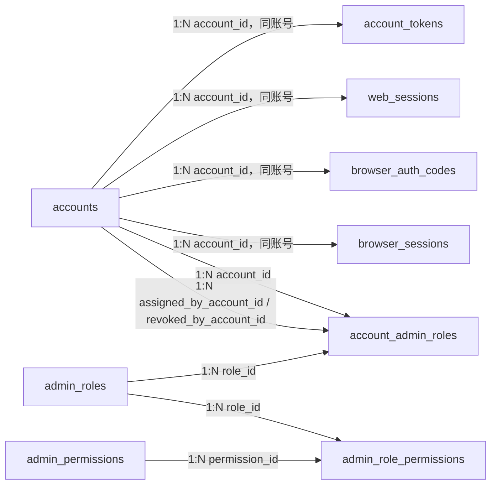

# Purslyx 用户数据库设计

| 项 | 内容 |
| --- | --- |
| 模块 | 用户 |
| 版本 | v0.2 |
| 更新日期 | 2026-09-15 |
| 状态 | 待评审；模型与迁移尚未实现 |
| 范围 | 固定注册身份账号、邮箱验证、密码重置与账号恢复、Web 会话、受限浏览器会话、后台角色与权限 |
| 依赖模块 | 无；角色变更事务会调用日志模块写审计事件 |
| 需求/架构依据 | [需求说明 F01、F11、F14 与 AC09、AC10、AC22](../../01-product/specs/需求说明.md)、[技术架构](../技术架构.md)、[数据库设计规范](数据库设计规范.md) |

## 1. 设计目标与边界

- 注册时写入求职或招聘身份，首版创建后不可由本人或管理员修改；另一身份须另注册账号。
- 规范化邮箱全局唯一；密码只存 Argon2id 摘要，验证、重置、恢复、Web 会话和浏览器会话只存随机秘密的摘要。
- 浏览器脚本使用短期、最小权限、可撤销会话，只能创建和读取本人待确认岗位草稿并撤销自身会话。
- 后台角色与注册身份完全分离。权限由受控种子定义；管理员不能修改自己的角色、授予超出自身的权限或移除最后一位超级管理员。
- 首版不实现账号注销。账号暂停会立即阻止新会话，并撤销现有会话；私有资料删除由各业务模块负责。

## 2. 实体关系

全部连线均为应用层校验的逻辑引用，不创建数据库外键。`account_admin_roles` 的账号、角色、授予人和撤销人都必须在写入事务中验证。

## 3. 表结构

### 表目录与中文备注

| 物理表名 | 中文表名（数据库 COMMENT） | 用途备注 |
| --- | --- | --- |
| `accounts` | 账号表 | 保存固定注册身份、邮箱、密码摘要、账号状态与并发版本。 |
| `account_tokens` | 账号一次性令牌表 | 保存邮箱验证、密码重置和账号恢复令牌摘要及生命周期。 |
| `web_sessions` | Web 会话表 | 保存网站 HttpOnly 会话摘要、期限与撤销状态。 |
| `browser_auth_codes` | 浏览器授权码表 | 保存 Web 向篡改猴签发的一次性授权码和握手随机数。 |
| `browser_sessions` | 浏览器会话表 | 保存篡改猴最小权限会话摘要、期限与撤销状态。 |
| `admin_roles` | 后台角色表 | 保存后台角色名称、状态与权限组合版本。 |
| `admin_permissions` | 后台权限表 | 保存由代码种子维护的稳定后台权限目录。 |
| `admin_role_permissions` | 角色权限关联表 | 保存后台角色与权限的当前对应关系。 |
| `account_admin_roles` | 账号后台角色授权表 | 保存账号角色的授予与撤销历史。 |

### accounts

| 字段名 | 数据类型 | 可空 | 默认值 | 约束/索引 | 说明 |
| --- | --- | --- | --- | --- | --- |
| id | BIGINT | 否 | GENERATED ALWAYS AS IDENTITY | PK | 内部账号 ID，不对外返回 |
| public_id | UUID | 否 | gen_random_uuid() | UK | 对外账号标识 |
| email_normalized | VARCHAR(254) | 否 | — | UK | 经过统一大小写与空白规则处理的邮箱；受限读取 |
| password_hash | TEXT | 否 | — | — | Argon2id 摘要，禁止记录明文或可逆密文 |
| display_name | VARCHAR(80) | 是 | — | — | 页面显示名，不作为登录凭据 |
| registration_role | SMALLINT | 否 | — | CK: `registration_role IN (1,2)` | 固定注册身份：求职或招聘 |
| status | SMALLINT | 否 | 1 | CK: `status IN (1,2,3)` | 账号状态 |
| email_verified_at | TIMESTAMPTZ | 是 | — | — | 邮箱验证完成时间点 |
| locked_until | TIMESTAMPTZ | 是 | — | — | 持久安全锁定结束时间；短期限频仍可使用 Redis |
| last_login_at | TIMESTAMPTZ | 是 | — | — | 最近一次成功登录时间点 |
| revision | BIGINT | 否 | 1 | CK: `revision >= 1` | 管理更新的乐观锁版本 |
| created_at | TIMESTAMPTZ | 否 | now() | Index | 创建时间点 |
| updated_at | TIMESTAMPTZ | 否 | now() | — | 最后更新时间点，由应用显式维护 |

### account_tokens

| 字段名 | 数据类型 | 可空 | 默认值 | 约束/索引 | 说明 |
| --- | --- | --- | --- | --- | --- |
| id | BIGINT | 否 | GENERATED ALWAYS AS IDENTITY | PK | 内部令牌记录 ID |
| account_id | BIGINT | 否 | — | Index | 引用 `accounts.id`，应用层校验 |
| token_type | SMALLINT | 否 | — | CK: `token_type IN (1,2,3)` | 邮箱验证、密码重置或账号恢复 |
| token_digest | BYTEA | 否 | — | UK | 随机令牌摘要；原令牌只发送给用户 |
| expires_at | TIMESTAMPTZ | 否 | — | — | 令牌过期时间点 |
| consumed_at | TIMESTAMPTZ | 是 | — | — | 成功使用时间点 |
| revoked_at | TIMESTAMPTZ | 是 | — | — | 主动撤销时间点 |
| created_at | TIMESTAMPTZ | 否 | now() | — | 创建时间点 |

### web_sessions

| 字段名 | 数据类型 | 可空 | 默认值 | 约束/索引 | 说明 |
| --- | --- | --- | --- | --- | --- |
| id | BIGINT | 否 | GENERATED ALWAYS AS IDENTITY | PK | 内部会话 ID |
| public_id | UUID | 否 | gen_random_uuid() | UK | 账号安全页可见的会话标识 |
| account_id | BIGINT | 否 | — | Index | 引用 `accounts.id`，应用层校验 |
| token_digest | BYTEA | 否 | — | UK | HttpOnly 会话随机秘密的摘要 |
| status | SMALLINT | 否 | 1 | CK: `status IN (1,2,3)` | 有效、撤销或过期 |
| expires_at | TIMESTAMPTZ | 否 | — | Index | 会话绝对过期时间点 |
| last_seen_at | TIMESTAMPTZ | 是 | — | — | 最近一次通过节流规则持久化的使用时间 |
| revoked_at | TIMESTAMPTZ | 是 | — | — | 撤销时间点 |
| revoke_reason | VARCHAR(64) | 是 | — | — | 退出、密码重置、账号暂停等稳定原因码 |
| created_at | TIMESTAMPTZ | 否 | now() | — | 创建时间点 |

### browser_auth_codes

| 字段名 | 数据类型 | 可空 | 默认值 | 约束/索引 | 说明 |
| --- | --- | --- | --- | --- | --- |
| id | BIGINT | 否 | GENERATED ALWAYS AS IDENTITY | PK | 一次性浏览器授权码记录 ID |
| account_id | BIGINT | 否 | — | — | 引用 `accounts.id`，应用层校验 |
| code_digest | BYTEA | 否 | — | UK | 一次性授权码摘要 |
| nonce_digest | BYTEA | 否 | — | — | Web 与脚本握手随机数摘要，防重放 |
| redirect_origin | VARCHAR(255) | 否 | — | — | 经白名单校验的产品域名来源 |
| expires_at | TIMESTAMPTZ | 否 | — | — | 短期过期时间点 |
| consumed_at | TIMESTAMPTZ | 是 | — | — | 成功换取浏览器会话的时间点 |
| created_at | TIMESTAMPTZ | 否 | now() | — | 创建时间点 |

### browser_sessions

| 字段名 | 数据类型 | 可空 | 默认值 | 约束/索引 | 说明 |
| --- | --- | --- | --- | --- | --- |
| id | BIGINT | 否 | GENERATED ALWAYS AS IDENTITY | PK | 内部浏览器会话 ID |
| public_id | UUID | 否 | gen_random_uuid() | UK | 会话管理与撤销使用的随机标识 |
| account_id | BIGINT | 否 | — | Index | 引用 `accounts.id`，应用层校验 |
| token_digest | BYTEA | 否 | — | UK | 受限会话令牌摘要 |
| scope_version | SMALLINT | 否 | 1 | CK: `scope_version = 1` | 固定最小权限范围版本 |
| status | SMALLINT | 否 | 1 | CK: `status IN (1,2,3)` | 有效、撤销或过期 |
| expires_at | TIMESTAMPTZ | 否 | — | Index | 会话过期时间点 |
| last_used_at | TIMESTAMPTZ | 是 | — | — | 最近一次成功调用时间点 |
| revoked_at | TIMESTAMPTZ | 是 | — | — | 撤销时间点 |
| revoke_reason | VARCHAR(64) | 是 | — | — | 稳定原因码，不写凭据正文 |
| created_at | TIMESTAMPTZ | 否 | now() | — | 创建时间点 |

### admin_roles

| 字段名 | 数据类型 | 可空 | 默认值 | 约束/索引 | 说明 |
| --- | --- | --- | --- | --- | --- |
| id | BIGINT | 否 | GENERATED ALWAYS AS IDENTITY | PK | 后台角色内部 ID |
| public_id | UUID | 否 | gen_random_uuid() | UK | 管理接口使用的随机标识 |
| role_key | VARCHAR(64) | 否 | — | UK | 稳定角色键，不随显示名改变 |
| display_name | VARCHAR(80) | 否 | — | — | 后台角色名称 |
| description | VARCHAR(500) | 是 | — | — | 权限用途说明 |
| is_system | BOOLEAN | 否 | false | — | 内置角色标记；超级管理员为真 |
| status | SMALLINT | 否 | 1 | CK: `status IN (1,2)` | 启用或停用 |
| revision | BIGINT | 否 | 1 | CK: `revision >= 1` | 权限组合更新的乐观锁版本 |
| created_at | TIMESTAMPTZ | 否 | now() | — | 创建时间点 |
| updated_at | TIMESTAMPTZ | 否 | now() | — | 最后更新时间点 |

### admin_permissions

| 字段名 | 数据类型 | 可空 | 默认值 | 约束/索引 | 说明 |
| --- | --- | --- | --- | --- | --- |
| id | BIGINT | 否 | GENERATED ALWAYS AS IDENTITY | PK | 权限内部 ID |
| permission_key | VARCHAR(96) | 否 | — | UK | 代码与种子共用的稳定权限键 |
| display_name | VARCHAR(80) | 否 | — | — | 管理端显示名称 |
| description | VARCHAR(500) | 否 | — | — | 允许执行的动作及数据边界 |
| status | SMALLINT | 否 | 1 | CK: `status IN (1,2)` | 启用或停用 |
| created_at | TIMESTAMPTZ | 否 | now() | — | 创建时间点 |

### admin_role_permissions

| 字段名 | 数据类型 | 可空 | 默认值 | 约束/索引 | 说明 |
| --- | --- | --- | --- | --- | --- |
| role_id | BIGINT | 否 | — | PK, Index | 引用 `admin_roles.id`，应用层校验；联合主键第一列 |
| permission_id | BIGINT | 否 | — | PK, Index | 引用 `admin_permissions.id`，应用层校验 |
| granted_by_account_id | BIGINT | 否 | — | — | 引用操作者 `accounts.id`，应用层校验后台权限 |
| created_at | TIMESTAMPTZ | 否 | now() | — | 授权时间点 |

### account_admin_roles

| 字段名 | 数据类型 | 可空 | 默认值 | 约束/索引 | 说明 |
| --- | --- | --- | --- | --- | --- |
| id | BIGINT | 否 | GENERATED ALWAYS AS IDENTITY | PK | 账号角色授权记录 ID |
| account_id | BIGINT | 否 | — | Index | 引用被授权 `accounts.id`，应用层校验 |
| role_id | BIGINT | 否 | — | Index | 引用 `admin_roles.id`，应用层校验 |
| assigned_by_account_id | BIGINT | 否 | — | — | 引用授权人 `accounts.id`，应用层校验 |
| assigned_at | TIMESTAMPTZ | 否 | now() | — | 授权时间点 |
| revoked_by_account_id | BIGINT | 是 | — | — | 引用撤销人 `accounts.id`，应用层校验 |
| revoked_at | TIMESTAMPTZ | 是 | — | — | 撤销时间点；空表示当前有效 |

## 4. 索引清单

| 表名 | 索引名 | 字段或表达式 | 类型 | 条件与用途 |
| --- | --- | --- | --- | --- |
| accounts | pk_accounts | `id` | Primary | 主键 |
| accounts | uq_accounts_public_id | `public_id` | Unique | 对外标识 |
| accounts | uq_accounts_email_normalized | `email_normalized` | Unique | 登录与注册幂等；邮箱永久不复用 |
| accounts | idx_accounts_role_status_created | `registration_role, status, created_at DESC` | B-tree | 管理端按身份和状态查用户 |
| account_tokens | pk_account_tokens | `id` | Primary | 主键 |
| account_tokens | uq_account_tokens_digest | `token_digest` | Unique | 令牌摘要查找与防重复 |
| account_tokens | idx_account_tokens_account_type_created | `account_id, token_type, created_at DESC` | B-tree | 重发前撤销账号同类旧令牌 |
| web_sessions | pk_web_sessions | `id` | Primary | 主键 |
| web_sessions | uq_web_sessions_public_id | `public_id` | Unique | 会话管理页定位 |
| web_sessions | uq_web_sessions_token_digest | `token_digest` | Unique | 请求认证 |
| web_sessions | idx_web_sessions_account_status_expiry | `account_id, status, expires_at` | B-tree | 账号会话列表与批量撤销 |
| browser_auth_codes | pk_browser_auth_codes | `id` | Primary | 主键 |
| browser_auth_codes | uq_browser_auth_codes_digest | `code_digest` | Unique | 一次性换取会话 |
| browser_sessions | pk_browser_sessions | `id` | Primary | 主键 |
| browser_sessions | uq_browser_sessions_public_id | `public_id` | Unique | 撤销入口 |
| browser_sessions | uq_browser_sessions_token_digest | `token_digest` | Unique | 受限 API 认证 |
| browser_sessions | idx_browser_sessions_account_status_expiry | `account_id, status, expires_at` | B-tree | 本账号浏览器会话读取与批量撤销 |
| admin_roles | pk_admin_roles | `id` | Primary | 主键 |
| admin_roles | uq_admin_roles_public_id | `public_id` | Unique | 管理接口定位 |
| admin_roles | uq_admin_roles_role_key | `role_key` | Unique | 稳定角色种子与代码授权 |
| admin_permissions | pk_admin_permissions | `id` | Primary | 主键 |
| admin_permissions | uq_admin_permissions_key | `permission_key` | Unique | 权限种子幂等 |
| admin_role_permissions | pk_admin_role_permissions | `role_id, permission_id` | Primary | 防重复授权并覆盖 `role_id` 引用 |
| account_admin_roles | pk_account_admin_roles | `id` | Primary | 主键 |
| account_admin_roles | uq_account_admin_roles_active | `account_id, role_id` | Unique partial | `revoked_at IS NULL`；同角色当前只授予一次 |
| account_admin_roles | idx_account_admin_roles_role_active | `role_id, account_id` | B-tree partial | `revoked_at IS NULL`；角色人数与最后超级管理员校验 |

## 5. 检查约束清单

| 表名 | 约束名 | 表达式 | 说明 |
| --- | --- | --- | --- |
| accounts | ck_accounts_registration_role | `registration_role IN (1,2)` | 只允许求职或招聘身份 |
| accounts | ck_accounts_status | `status IN (1,2,3)` | 待验证、有效、暂停 |
| accounts | ck_accounts_revision | `revision >= 1` | 乐观锁版本为正数 |
| account_tokens | ck_account_tokens_type | `token_type IN (1,2,3)` | 验证、重置或账号恢复令牌 |
| account_tokens | ck_account_tokens_expiry | `expires_at > created_at` | 令牌必须有未来过期时间 |
| account_tokens | ck_account_tokens_terminal | `NOT (consumed_at IS NOT NULL AND revoked_at IS NOT NULL)` | 令牌只允许一种终态 |
| web_sessions | ck_web_sessions_status | `status IN (1,2,3)` | 会话状态合法 |
| web_sessions | ck_web_sessions_expiry | `expires_at > created_at` | 会话期限合法 |
| web_sessions | ck_web_sessions_revoked | `(status = 2) = (revoked_at IS NOT NULL)` | 撤销状态与时间一致 |
| browser_auth_codes | ck_browser_auth_codes_expiry | `expires_at > created_at` | 授权码必须短期有效 |
| browser_sessions | ck_browser_sessions_scope | `scope_version = 1` | 首版只能使用固定最小权限范围 |
| browser_sessions | ck_browser_sessions_status | `status IN (1,2,3)` | 浏览器会话状态合法 |
| browser_sessions | ck_browser_sessions_expiry | `expires_at > created_at` | 浏览器会话期限合法 |
| browser_sessions | ck_browser_sessions_revoked | `(status = 2) = (revoked_at IS NOT NULL)` | 撤销状态与时间一致 |
| admin_roles | ck_admin_roles_status | `status IN (1,2)` | 启用或停用 |
| admin_roles | ck_admin_roles_revision | `revision >= 1` | 权限组合版本为正数 |
| admin_permissions | ck_admin_permissions_status | `status IN (1,2)` | 启用或停用 |
| account_admin_roles | ck_account_admin_roles_revocation | `(revoked_at IS NULL AND revoked_by_account_id IS NULL) OR (revoked_at IS NOT NULL AND revoked_by_account_id IS NOT NULL)` | 撤销人和时间同时出现 |

## 6. 枚举与版本字典

| 表.字段 | 数据库值 | API 名称 | 含义 | 备注 |
| --- | --- | --- | --- | --- |
| accounts.registration_role | 1 | seeker | 求职账号 | 创建后固定 |
| accounts.registration_role | 2 | recruiter | 招聘账号 | 创建后固定 |
| accounts.status | 1 | pending_verification | 待邮箱验证 | 不能进入私有工作台 |
| accounts.status | 2 | active | 正常使用 | 仍须检查会话与权限 |
| accounts.status | 3 | suspended | 管理暂停 | 立即撤销会话，不等于注销 |
| account_tokens.token_type | 1 | verify_email | 验证邮箱 | 成功后激活账号 |
| account_tokens.token_type | 2 | reset_password | 重置密码 | 成功后撤销旧 Web 会话 |
| account_tokens.token_type | 3 | recover_account | 恢复账号 | 仅暂停账号可用；成功后恢复为有效状态 |
| web_sessions.status / browser_sessions.status | 1 | active | 当前有效 | 还须同时检查过期时间与账号状态 |
| web_sessions.status / browser_sessions.status | 2 | revoked | 已撤销 | 必须有 `revoked_at` |
| web_sessions.status / browser_sessions.status | 3 | expired | 已过期 | 由读取或清理任务转换 |
| admin_roles.status / admin_permissions.status | 1 | active | 启用 | 可参与鉴权 |
| admin_roles.status / admin_permissions.status | 2 | disabled | 停用 | 历史授权仍保留但不生效 |

权限目录版本保存为代码种子 `admin-permissions-v1`，首版至少包含 `admin.users.read`、`admin.users.manage_status`、`admin.roles.manage`、`admin.usage.grant`、`admin.stats.read`、`admin.logs.operations.read`、`admin.logs.security.read`、`admin.logs.tasks.read` 和 `admin.logs.export`。`browser_sessions.scope_version=1` 固定为创建／读取本人岗位草稿和撤销自身会话；扩大权限必须新增版本并重新签发，不能静默解释旧会话。

## 7. 事务与生命周期

| 操作/触发 | 事务内校验与写入 | 事务外动作/补偿 | 幂等与失败结果 |
| --- | --- | --- | --- |
| 注册 | 规范化邮箱；插入 `accounts` 待验证账号与一条验证令牌；相同邮箱冲突不暴露额外账号信息 | 发送验证邮件；失败可重发新令牌并撤销旧令牌 | 邮箱唯一；重复提交返回一致的中性提示 |
| 验证邮箱 | 以摘要锁定未使用令牌，校验未过期；条件更新令牌和账号；按固定身份调用用量模块发放试用批次 | 发送完成通知可重试 | 同令牌只成功一次；已消费返回完成状态，失效返回 410 |
| 登录 | 锁定账号并校验状态、验证时间、锁定时间和密码摘要；创建 `web_sessions`；更新最近登录时间 | 安全事件由日志模块追加；短期限频可在 Redis 执行 | 失败不创建会话；响应不区分邮箱不存在与密码错误 |
| 重置密码 | 锁定重置令牌和账号；更新密码摘要及 `revision`，消费令牌并撤销全部有效 Web 会话 | 发送结果通知 | 同令牌只成功一次；事务失败保留旧密码与会话状态 |
| 邮件恢复账号 | 锁定恢复令牌和暂停账号；消费令牌，将账号恢复为有效并递增 `revision`；同事务写安全事件 | 发送恢复完成通知 | 同令牌只成功一次；账号已恢复时返回完成状态，失效返回 410 |
| 换取浏览器会话 | 锁定一次性授权码，校验账号、nonce、来源和期限；消费授权码并创建固定 scope 的 `browser_sessions` | 将原始会话令牌只返回一次 | 授权码摘要唯一；重放返回已消费，不再签发 |
| 退出或撤销会话 | 锁定目标会话，校验归属；条件更新为撤销并写原因 | 客户端清理本地令牌 | 重复撤销返回当前状态，不新建记录 |
| 暂停账号 | 校验 `admin.users.manage_status`；锁定账号，条件更新状态与版本，撤销全部有效会话，创建账号恢复令牌并写管理操作日志 | 发送含恢复链接的暂停通知；失败可由用户重新申请 | `revision` 防并发覆盖；不能借此改变注册身份或重复生成有效令牌 |
| 更新角色权限 | 按 `accounts`、`admin_roles`、`admin_permissions` 顺序锁定；校验操作者权限、内置角色、权限子集；替换关联行并递增角色版本；同事务写审计 | 无 | 请求幂等键由日志模块唯一；冲突或越权整体回滚 |
| 授予或撤销账号角色 | 锁定操作者、目标账号、角色及当前授权；禁止自改、越权和移除最后一位超级管理员；写授权变化和审计 | 无 | 有效授权部分唯一；重复请求返回原结果 |

所有角色与权限查询同时过滤账号、角色和权限有效状态。ORM 关系须显式 `primaryjoin`；写入不能依赖关系赋值自动保证完整性。

## 8. 关键设计决策

- `accounts` 不含 `deleted_at`，因为首版未确定账号注销；暂停使用受约束状态，不能伪装成已完成删除。
- 注册身份直接放在账号表并由服务层禁止更新。后台角色使用独立多对多关系，避免把“求职／招聘”和“管理员”混成一个枚举。
- 认证秘密一律只保存摘要；`public_id` 用于用户可见的会话管理，不承担认证作用。
- 角色授权保留撤销历史，当前有效关系使用部分唯一索引；前后值和理由写入日志模块的追加式事件。
- 默认不建外键的代价是所有维护命令、种子和迁移都必须执行同样的引用校验，并纳入每日巡检。

- 首版不为授权码 nonce、授权码账号、权限授予人、角色授权人／撤销人和各类有效记录的统一过期扫描单独建索引；短期令牌与会话在访问时校验期限，低频清理由主键分段扫描。账号会话批量撤销、令牌重发和角色成员反查保留必要索引。

## 9. 已确定配置

- 默认有效期为：邮箱验证链接 24 小时、密码重置链接 30 分钟、账号恢复链接 30 分钟、Web 会话 7 天、浏览器授权码 1 分钟、浏览器会话 4 小时。它们由服务端受控配置管理，可按部署环境调整，不写入数据库检查约束，也不允许普通客户端逐次覆盖。
- 管理员暂停账号后，系统立即撤销全部会话并发送恢复邮件，文案为“你的 Purslyx 账号已被暂停。如需恢复，请在 30 分钟内点击邮件中的恢复链接；若非本人操作，请联系管理员。”用户也可在暂停提示页重新申请恢复邮件。恢复链接一次性使用，成功后账号恢复为有效状态，注册身份、资料和使用次数保持不变。
- 初始版本采用以上默认值；以后调整须记录配置变更时间，并且只影响新签发的令牌与会话。
