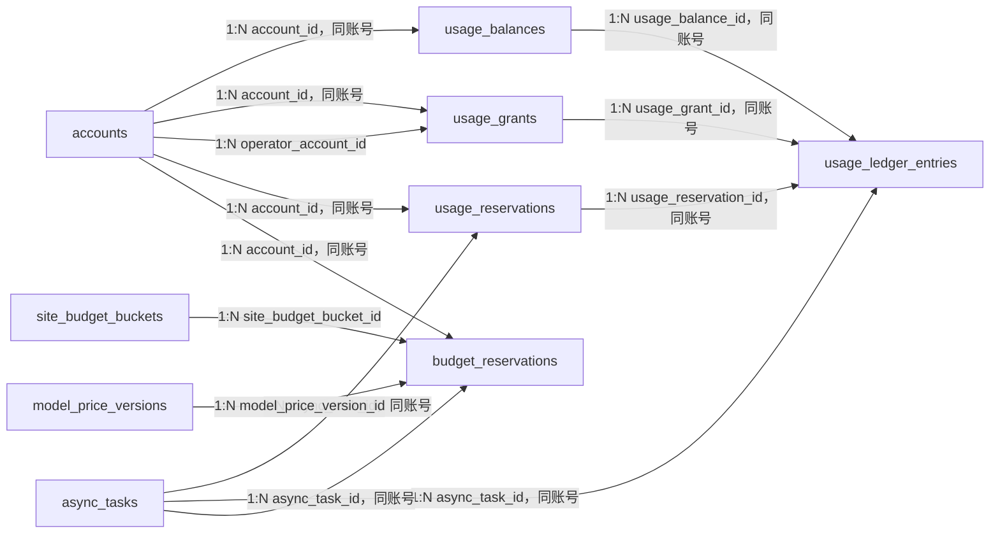

# Purslyx 用量数据库设计

| 项 | 内容 |
| --- | --- |
| 模块 | 用量 |
| 版本 | v0.1 |
| 更新日期 | 2026-09-14 |
| 状态 | 待评审；模型与迁移尚未实现 |
| 范围 | 功能剩余次数、试用/后台发放、预留与结算流水、模型价格版本、每日全站美元预算与并发槽 |
| 依赖模块 | 用户、任务；后台发放与预算复核调用日志模块 |
| 需求/架构依据 | [需求说明 F09、F10、F14 与 AC11—AC14、AC22](../../01-product/specs/需求说明.md)、[技术架构第 5 章](../技术架构.md)、[数据库设计规范](数据库设计规范.md) |

## 1. 设计目标与边界

- 求职账号适用分析、改写、面试三类次数，招聘账号只适用分析次数。账号完成邮箱验证后按注册身份领取一次试用发放，不因登录、删除资料或任务重试重置。
- 用户可用量公式固定为 `granted_total - reserved_total - settled_total`。余额行用于并发锁定与快速读取，发放、预留、释放和结算使用追加式流水复核，任何流程不得直接覆盖为目标余额。
- 分析/改写在完整结果可读后结算；面试在 3 个开场问题原子保存后结算一场。失败前未交付则释放，恢复原任务不重复结算。
- 后台只能为目标固定身份适用的功能追加正数次数，必须保存操作者、原因、幂等键、变更前后值并同事务写管理操作日志。
- 用户功能次数与供应商美元预算是两套控制。每次真实模型调用前按价格版本预留成本上界和并发槽；未知结果保留保守占用，不能记成 0。

## 2. 实体关系

全部连线均为应用层校验的逻辑引用，不创建数据库外键。全局价格版本和预算桶没有用户归属；其引用仍需显式索引和事务校验。

## 3. 表结构

### usage_balances

| 字段名 | 数据类型 | 可空 | 默认值 | 约束/索引 | 说明 |
| --- | --- | --- | --- | --- | --- |
| id | BIGINT | 否 | GENERATED ALWAYS AS IDENTITY | PK | 功能余额内部 ID |
| account_id | BIGINT | 否 | — | Index | 所属账号 ID |
| feature | SMALLINT | 否 | — | CK: `feature IN (1,2,3)` | 分析、改写或面试 |
| granted_total | BIGINT | 否 | 0 | CK: `granted_total >= 0` | 累计发放次数 |
| reserved_total | BIGINT | 否 | 0 | CK: `reserved_total >= 0` | 当前有效预留次数 |
| settled_total | BIGINT | 否 | 0 | CK: `settled_total >= 0` | 累计成功消耗次数 |
| revision | BIGINT | 否 | 1 | CK: `revision >= 1` | 条件更新版本 |
| created_at | TIMESTAMPTZ | 否 | now() | — | 余额行创建时间点 |
| updated_at | TIMESTAMPTZ | 否 | now() | — | 最近变更时间点 |

### usage_grants

| 字段名 | 数据类型 | 可空 | 默认值 | 约束/索引 | 说明 |
| --- | --- | --- | --- | --- | --- |
| id | BIGINT | 否 | GENERATED ALWAYS AS IDENTITY | PK | 追加式发放记录 ID |
| public_id | UUID | 否 | gen_random_uuid() | UK | 用户/后台流水详情标识 |
| account_id | BIGINT | 否 | — | Index | 被发放账号 ID |
| feature | SMALLINT | 否 | — | CK: `feature IN (1,2,3)` | 发放适用功能 |
| grant_type | SMALLINT | 否 | — | CK: `grant_type IN (1,2)` | 试用或后台追加 |
| grant_batch | VARCHAR(96) | 否 | — | Index | 试用配置批次或后台业务批次 |
| amount | BIGINT | 否 | — | CK: `amount > 0` | 本次追加数量 |
| operator_account_id | BIGINT | 是 | — | Index | 后台追加时引用操作者 `accounts.id` |
| idempotency_key | UUID | 是 | — | Index | 后台请求幂等键；试用以批次去重 |
| reason | VARCHAR(500) | 否 | — | — | 发放原因，不含业务正文 |
| granted_total_before | BIGINT | 否 | — | CK: `granted_total_before >= 0` | 发放前累计值 |
| granted_total_after | BIGINT | 否 | — | CK: `granted_total_after >= 0` | 发放后累计值 |
| created_at | TIMESTAMPTZ | 否 | now() | Index | 发放时间点 |

### usage_reservations

| 字段名 | 数据类型 | 可空 | 默认值 | 约束/索引 | 说明 |
| --- | --- | --- | --- | --- | --- |
| id | BIGINT | 否 | GENERATED ALWAYS AS IDENTITY | PK | 用户功能预留 ID |
| public_id | UUID | 否 | gen_random_uuid() | UK | 页面状态与复核标识 |
| account_id | BIGINT | 否 | — | Index | 所属账号 ID |
| feature | SMALLINT | 否 | — | CK: `feature IN (1,2,3)` | 预留功能 |
| async_task_id | BIGINT | 否 | — | Index | 引用业务 `async_tasks.id` |
| reservation_key | UUID | 否 | — | UK | 预留/释放/结算幂等键 |
| amount | BIGINT | 否 | 1 | CK: `amount > 0` | 首版计次请求通常为 1 |
| status | SMALLINT | 否 | 1 | CK: `status IN (1,2,3)` | 已预留、已结算或已释放 |
| expires_at | TIMESTAMPTZ | 否 | — | Index | 异常任务的预留复核时间点 |
| settled_at | TIMESTAMPTZ | 是 | — | — | 成功结算时间点 |
| released_at | TIMESTAMPTZ | 是 | — | — | 失败/取消释放时间点 |
| release_reason | VARCHAR(64) | 是 | — | — | 稳定释放原因码 |
| created_at | TIMESTAMPTZ | 否 | now() | Index | 预留时间点 |

### usage_ledger_entries

| 字段名 | 数据类型 | 可空 | 默认值 | 约束/索引 | 说明 |
| --- | --- | --- | --- | --- | --- |
| id | BIGINT | 否 | GENERATED ALWAYS AS IDENTITY | PK | 追加式用户用量流水 ID |
| account_id | BIGINT | 否 | — | Index | 所属账号 ID |
| usage_balance_id | BIGINT | 否 | — | Index | 引用 `usage_balances.id` |
| usage_grant_id | BIGINT | 是 | — | Index | 发放事件引用 `usage_grants.id` |
| usage_reservation_id | BIGINT | 是 | — | Index | 预留相关事件引用 `usage_reservations.id` |
| async_task_id | BIGINT | 是 | — | Index | 计次业务任务 ID |
| feature | SMALLINT | 否 | — | CK: `feature IN (1,2,3)` | 流水功能 |
| entry_type | SMALLINT | 否 | — | CK: `entry_type IN (1,2,3,4)` | 发放、预留、释放或结算 |
| delta_granted | BIGINT | 否 | 0 | — | 对发放累计量的变化 |
| delta_reserved | BIGINT | 否 | 0 | — | 对当前预留量的变化 |
| delta_settled | BIGINT | 否 | 0 | — | 对累计结算量的变化 |
| granted_total_after | BIGINT | 否 | — | CK: `granted_total_after >= 0` | 事务后发放累计量 |
| reserved_total_after | BIGINT | 否 | — | CK: `reserved_total_after >= 0` | 事务后预留量 |
| settled_total_after | BIGINT | 否 | — | CK: `settled_total_after >= 0` | 事务后结算累计量 |
| created_at | TIMESTAMPTZ | 否 | now() | Index | 流水时间点 |

### model_price_versions

| 字段名 | 数据类型 | 可空 | 默认值 | 约束/索引 | 说明 |
| --- | --- | --- | --- | --- | --- |
| id | BIGINT | 否 | GENERATED ALWAYS AS IDENTITY | PK | 模型价格版本 ID |
| public_id | UUID | 否 | gen_random_uuid() | UK | 管理复核标识 |
| provider | VARCHAR(64) | 否 | — | Index | 供应商键 |
| model | VARCHAR(128) | 否 | — | Index | 模型键 |
| currency | CHAR(3) | 否 | 'USD' | — | 价格币种 |
| unit_tokens | BIGINT | 否 | 1000000 | CK: `unit_tokens > 0` | 以下价格对应的 token 单位 |
| input_unit_price | NUMERIC(20,8) | 否 | — | CK: `input_unit_price >= 0` | 非缓存输入价格 |
| cached_input_unit_price | NUMERIC(20,8) | 是 | — | CK: `cached_input_unit_price >= 0` | 缓存输入价格；供应商未区分时为空 |
| output_unit_price | NUMERIC(20,8) | 否 | — | CK: `output_unit_price >= 0` | 总输出 token 价格，含推理 token |
| pricing_tiers | JSONB | 是 | — | — | `model-pricing-tiers-v1` 校验后的分层价格 |
| schema_version | VARCHAR(32) | 是 | — | — | 分层价格 Schema 版本 |
| source_reference | TEXT | 否 | — | — | 可复核的官方价格来源标识 |
| effective_from | TIMESTAMPTZ | 否 | — | Index | 生效起点 |
| effective_to | TIMESTAMPTZ | 是 | — | Index | 生效终点；当前版本为空 |
| verified_at | TIMESTAMPTZ | 否 | — | — | 人工或自动核验时间点 |
| created_at | TIMESTAMPTZ | 否 | now() | — | 版本创建时间点 |

### site_budget_buckets

| 字段名 | 数据类型 | 可空 | 默认值 | 约束/索引 | 说明 |
| --- | --- | --- | --- | --- | --- |
| id | BIGINT | 否 | GENERATED ALWAYS AS IDENTITY | PK | 全站自然日预算桶 ID |
| budget_date | DATE | 否 | — | UK | `Asia/Shanghai` 业务日期 |
| currency | CHAR(3) | 否 | 'USD' | UK | 预算币种 |
| budget_limit | NUMERIC(20,8) | 否 | — | CK: `budget_limit > 0` | 受控配置写入的当日上限；初值 30 美元 |
| reserved_amount | NUMERIC(20,8) | 否 | 0 | CK: `reserved_amount >= 0` | 当前调用成本上界预留 |
| settled_amount | NUMERIC(20,8) | 否 | 0 | CK: `settled_amount >= 0` | 已知实际成本累计 |
| unknown_held_amount | NUMERIC(20,8) | 否 | 0 | CK: `unknown_held_amount >= 0` | 结果/用量待核实的保守占用 |
| active_slots | INTEGER | 否 | 0 | CK: `active_slots >= 0` | 当前模型调用并发槽 |
| slot_limit | INTEGER | 否 | — | CK: `slot_limit > 0` | 受控配置写入的并发上限；首版建议 5 |
| revision | BIGINT | 否 | 1 | CK: `revision >= 1` | 原子更新版本 |
| created_at | TIMESTAMPTZ | 否 | now() | — | 预算桶创建时间点 |
| updated_at | TIMESTAMPTZ | 否 | now() | — | 最近结算/释放时间点 |

### budget_reservations

| 字段名 | 数据类型 | 可空 | 默认值 | 约束/索引 | 说明 |
| --- | --- | --- | --- | --- | --- |
| id | BIGINT | 否 | GENERATED ALWAYS AS IDENTITY | PK | 单次模型调用预算预留 ID |
| public_id | UUID | 否 | gen_random_uuid() | UK | 管理复核标识 |
| site_budget_bucket_id | BIGINT | 否 | — | Index | 引用 `site_budget_buckets.id` |
| account_id | BIGINT | 否 | — | Index | 调用所属账号 ID |
| async_task_id | BIGINT | 否 | — | Index | 调用所属任务 ID |
| model_price_version_id | BIGINT | 否 | — | Index | 计算上界所用价格版本 |
| reservation_key | UUID | 否 | — | UK | 单次调用预留幂等键 |
| reserved_amount | NUMERIC(20,8) | 否 | — | CK: `reserved_amount > 0` | 调用前成本上界 |
| settled_amount | NUMERIC(20,8) | 是 | — | CK: `settled_amount >= 0` | 用量已知后的实际估算成本 |
| currency | CHAR(3) | 否 | 'USD' | — | 预留币种 |
| slot_count | INTEGER | 否 | 1 | CK: `slot_count = 1` | 首版每次调用占一个槽 |
| status | SMALLINT | 否 | 1 | CK: `status IN (1,2,3,4)` | 已预留、已结算、已释放或待核实 |
| reserved_at | TIMESTAMPTZ | 否 | now() | Index | 预留时间点及成本归属日期依据 |
| finalized_at | TIMESTAMPTZ | 是 | — | — | 结算、释放或转待核实时间点 |
| review_note | VARCHAR(500) | 是 | — | — | 待核实/人工调整说明 |

## 4. 索引清单

| 表名 | 索引名 | 字段或表达式 | 类型 | 条件与用途 |
| --- | --- | --- | --- | --- |
| usage_balances | pk_usage_balances | `id` | Primary | 主键 |
| usage_balances | uq_usage_balances_account_feature | `account_id, feature` | Unique | 每账号每功能一行并覆盖账号引用 |
| usage_balances | idx_usage_balances_account | `account_id, feature` | B-tree | 余额页、锁定和巡检；由唯一索引实际覆盖 |
| usage_grants | pk_usage_grants | `id` | Primary | 主键 |
| usage_grants | uq_usage_grants_public_id | `public_id` | Unique | 流水详情定位 |
| usage_grants | uq_usage_grants_trial | `account_id, feature, grant_batch` | Unique partial | `grant_type = 1`；每试用批次只发一次 |
| usage_grants | uq_usage_grants_admin_request | `operator_account_id, idempotency_key` | Unique partial | `grant_type = 2`；后台请求幂等 |
| usage_grants | idx_usage_grants_account_created | `account_id, created_at DESC` | B-tree | 用户发放历史与账号巡检 |
| usage_grants | idx_usage_grants_operator_created | `operator_account_id, created_at DESC` | B-tree partial | `operator_account_id IS NOT NULL`；操作者引用巡检与管理复核 |
| usage_grants | idx_usage_grants_batch | `grant_batch, created_at` | B-tree | 按批次核对发放 |
| usage_reservations | pk_usage_reservations | `id` | Primary | 主键 |
| usage_reservations | uq_usage_reservations_public_id | `public_id` | Unique | 页面状态定位 |
| usage_reservations | uq_usage_reservations_key | `account_id, reservation_key` | Unique | 预留幂等并覆盖账号引用 |
| usage_reservations | uq_usage_reservations_task_feature | `async_task_id, feature` | Unique | 同业务任务同功能最多一个预留 |
| usage_reservations | idx_usage_reservations_account_status | `account_id, feature, status, created_at DESC` | B-tree | 用户消耗历史与巡检 |
| usage_reservations | idx_usage_reservations_expiry | `expires_at` | B-tree partial | `status = 1`；异常预留复核 |
| usage_ledger_entries | pk_usage_ledger_entries | `id` | Primary | 主键 |
| usage_ledger_entries | idx_usage_ledger_balance | `usage_balance_id, id` | B-tree | 余额重放并覆盖余额引用 |
| usage_ledger_entries | idx_usage_ledger_account_created | `account_id, feature, created_at DESC` | B-tree | 用户用量流水与账号巡检 |
| usage_ledger_entries | idx_usage_ledger_grant | `account_id, usage_grant_id` | B-tree partial | `usage_grant_id IS NOT NULL`；发放引用巡检 |
| usage_ledger_entries | idx_usage_ledger_reservation | `account_id, usage_reservation_id, id` | B-tree partial | `usage_reservation_id IS NOT NULL`；预留生命周期与引用巡检 |
| usage_ledger_entries | idx_usage_ledger_task | `account_id, async_task_id` | B-tree partial | `async_task_id IS NOT NULL`；任务结算追溯 |
| model_price_versions | pk_model_price_versions | `id` | Primary | 主键 |
| model_price_versions | uq_model_price_versions_public_id | `public_id` | Unique | 管理复核定位 |
| model_price_versions | uq_model_price_versions_start | `provider, model, currency, effective_from` | Unique | 价格版本起点唯一 |
| model_price_versions | uq_model_price_versions_current | `provider, model, currency` | Unique partial | `effective_to IS NULL`；每模型一个当前价格 |
| model_price_versions | idx_model_price_versions_effective | `provider, model, effective_from DESC, effective_to` | B-tree | 按调用时间选价格 |
| site_budget_buckets | pk_site_budget_buckets | `id` | Primary | 主键 |
| site_budget_buckets | uq_site_budget_buckets_date | `budget_date, currency` | Unique | 每日每币种一桶 |
| budget_reservations | pk_budget_reservations | `id` | Primary | 主键 |
| budget_reservations | uq_budget_reservations_public_id | `public_id` | Unique | 管理复核定位 |
| budget_reservations | uq_budget_reservations_key | `reservation_key` | Unique | 单调用预留幂等 |
| budget_reservations | idx_budget_reservations_bucket_status | `site_budget_bucket_id, status, reserved_at` | B-tree | 预算桶占用与引用巡检 |
| budget_reservations | idx_budget_reservations_account_task | `account_id, async_task_id, reserved_at` | B-tree | 账号/任务成本追溯并覆盖两个引用 |
| budget_reservations | idx_budget_reservations_price | `model_price_version_id, reserved_at` | B-tree | 价格版本引用巡检 |
| budget_reservations | idx_budget_reservations_review | `reserved_at` | B-tree partial | `status = 4`；未知成本复核 |

## 5. 检查约束清单

| 表名 | 约束名 | 表达式 | 说明 |
| --- | --- | --- | --- |
| usage_balances | ck_usage_balances_feature | `feature IN (1,2,3)` | 功能合法 |
| usage_balances | ck_usage_balances_nonnegative | `granted_total >= 0 AND reserved_total >= 0 AND settled_total >= 0` | 累计量非负 |
| usage_balances | ck_usage_balances_available | `granted_total - reserved_total - settled_total >= 0` | 可用次数不能为负 |
| usage_balances | ck_usage_balances_revision | `revision >= 1` | 版本为正数 |
| usage_grants | ck_usage_grants_feature | `feature IN (1,2,3)` | 功能合法 |
| usage_grants | ck_usage_grants_type | `grant_type IN (1,2)` | 发放类型合法 |
| usage_grants | ck_usage_grants_amount | `amount > 0` | 只允许追加正数 |
| usage_grants | ck_usage_grants_operator | `(grant_type = 1 AND operator_account_id IS NULL AND idempotency_key IS NULL) OR (grant_type = 2 AND operator_account_id IS NOT NULL AND idempotency_key IS NOT NULL)` | 后台发放必须有操作者和幂等键 |
| usage_grants | ck_usage_grants_totals | `granted_total_before >= 0 AND granted_total_after = granted_total_before + amount` | 发放前后值一致 |
| usage_reservations | ck_usage_reservations_feature | `feature IN (1,2,3)` | 功能合法 |
| usage_reservations | ck_usage_reservations_amount | `amount > 0` | 预留量为正数 |
| usage_reservations | ck_usage_reservations_status | `status IN (1,2,3)` | 预留状态合法 |
| usage_reservations | ck_usage_reservations_expiry | `expires_at > created_at` | 异常复核时间晚于创建 |
| usage_reservations | ck_usage_reservations_terminal | `(status = 1 AND settled_at IS NULL AND released_at IS NULL) OR (status = 2 AND settled_at IS NOT NULL AND released_at IS NULL) OR (status = 3 AND settled_at IS NULL AND released_at IS NOT NULL)` | 预留恰好一种生命周期状态 |
| usage_ledger_entries | ck_usage_ledger_feature | `feature IN (1,2,3)` | 功能合法 |
| usage_ledger_entries | ck_usage_ledger_type | `entry_type IN (1,2,3,4)` | 流水类型合法 |
| usage_ledger_entries | ck_usage_ledger_totals | `granted_total_after >= 0 AND reserved_total_after >= 0 AND settled_total_after >= 0 AND granted_total_after - reserved_total_after - settled_total_after >= 0` | 流水后余额合法 |
| usage_ledger_entries | ck_usage_ledger_deltas | `(entry_type = 1 AND delta_granted > 0 AND delta_reserved = 0 AND delta_settled = 0) OR (entry_type = 2 AND delta_granted = 0 AND delta_reserved > 0 AND delta_settled = 0) OR (entry_type = 3 AND delta_granted = 0 AND delta_reserved < 0 AND delta_settled = 0) OR (entry_type = 4 AND delta_granted = 0 AND delta_reserved < 0 AND delta_settled > 0 AND -delta_reserved = delta_settled)` | 各流水变动方向固定 |
| model_price_versions | ck_model_prices_unit | `unit_tokens > 0` | 计价单位为正数 |
| model_price_versions | ck_model_prices_amounts | `input_unit_price >= 0 AND output_unit_price >= 0 AND (cached_input_unit_price IS NULL OR cached_input_unit_price >= 0)` | 价格非负 |
| model_price_versions | ck_model_prices_schema | `(pricing_tiers IS NULL) = (schema_version IS NULL)` | 分层价格与 Schema 同时出现 |
| model_price_versions | ck_model_prices_effective | `effective_to IS NULL OR effective_to > effective_from` | 有效期合法 |
| site_budget_buckets | ck_site_budget_limit | `budget_limit > 0` | 每日上限为正数 |
| site_budget_buckets | ck_site_budget_amounts | `reserved_amount >= 0 AND settled_amount >= 0 AND unknown_held_amount >= 0` | 预算累计量非负 |
| site_budget_buckets | ck_site_budget_slots | `active_slots >= 0 AND slot_limit > 0 AND active_slots <= slot_limit` | 并发槽合法 |
| budget_reservations | ck_budget_reservations_amount | `reserved_amount > 0 AND (settled_amount IS NULL OR settled_amount >= 0)` | 预留为正、结算非负 |
| budget_reservations | ck_budget_reservations_slot | `slot_count = 1` | 首版每调用一个槽 |
| budget_reservations | ck_budget_reservations_status | `status IN (1,2,3,4)` | 状态合法 |
| budget_reservations | ck_budget_reservations_terminal | `(status = 1 AND finalized_at IS NULL AND settled_amount IS NULL) OR (status = 2 AND finalized_at IS NOT NULL AND settled_amount IS NOT NULL) OR (status IN (3,4) AND finalized_at IS NOT NULL AND settled_amount IS NULL)` | 预算生命周期字段一致 |

## 6. 枚举与版本字典

| 表.字段 | 数据库值 | API 名称 | 含义 | 备注 |
| --- | --- | --- | --- | --- |
| usage_balances.feature / usage_grants.feature / usage_reservations.feature / usage_ledger_entries.feature | 1 | analysis | 分析次数 | 求职与招聘账号适用 |
| usage_balances.feature / usage_grants.feature / usage_reservations.feature / usage_ledger_entries.feature | 2 | rewrite | 改写次数 | 仅求职账号适用 |
| usage_balances.feature / usage_grants.feature / usage_reservations.feature / usage_ledger_entries.feature | 3 | interview | 面试场次 | 仅求职账号适用 |
| usage_grants.grant_type | 1 | trial | 邮箱验证试用发放 | 按身份与批次一次性发放 |
| usage_grants.grant_type | 2 | admin | 后台追加 | 必须有操作者、理由和幂等键 |
| usage_reservations.status | 1 | reserved | 已预留 | 尚未交付完整结果 |
| usage_reservations.status | 2 | settled | 已结算 | 终态，不可释放 |
| usage_reservations.status | 3 | released | 已释放 | 终态，不可结算 |
| usage_ledger_entries.entry_type | 1 | grant | 发放 | 增加累计发放量 |
| usage_ledger_entries.entry_type | 2 | reserve | 预留 | 增加当前预留量 |
| usage_ledger_entries.entry_type | 3 | release | 释放 | 减少当前预留量 |
| usage_ledger_entries.entry_type | 4 | settle | 结算 | 预留转为累计消耗 |
| budget_reservations.status | 1 | reserved | 预算已预留 | 占用金额与并发槽 |
| budget_reservations.status | 2 | settled | 实际成本已结算 | 释放差额与槽 |
| budget_reservations.status | 3 | released | 已确定无需占用 | 释放金额与槽 |
| budget_reservations.status | 4 | review_required | 结果或用量待核实 | 保留保守金额，释放槽 |

`model_price_versions.pricing_tiers` 使用 `model-pricing-tiers-v1`。价格来源、单位、生效区间与验证时间共同构成版本依据；不能用当前价格重算历史调用。功能初始次数和每日 30 美元/并发 5 都来自版本化受控配置，数据库保存实际发放量与每个自然日采用的值，不在迁移或 `CHECK` 中硬编码。

## 7. 事务与生命周期

| 操作/触发 | 事务内校验与写入 | 事务外动作/补偿 | 幂等与失败结果 |
| --- | --- | --- | --- |
| 邮箱验证发放试用 | 锁定账号，校验首次激活与固定身份；为适用功能锁定/创建余额，追加发放与流水 | 无 | 账号/功能/试用批次唯一；重复验证返回原余额 |
| 后台追加次数 | 校验权限、操作者非自提权、目标身份与功能适用；按账号和功能锁余额，写发放、流水、余额和审计 | 无 | 操作者/幂等键唯一；同键不同请求冲突 |
| 预留功能次数 | 锁定账号和余额，校验可用量；创建预留和流水，增加 `reserved_total` | 创建任务和 outbox 与此同事务 | 并发只允许合法请求成功；任务/功能唯一 |
| 结算功能次数 | 锁定余额、预留、任务和完整业务结果；减少预留、增加结算并追加流水 | 无 | 已结算重复调用返回原结果；每任务一次 |
| 释放功能次数 | 锁定余额和仍有效预留；减少预留并写释放流水/原因 | 无 | 已释放重复调用无额外变化；已结算不能释放 |
| 建立每日预算桶 | 从受控配置取得上海自然日上限和并发数，插入当日桶 | 配置缺失告警 | 日期/币种唯一；不得悄悄沿用未知价格 |
| 模型调用前预算预留 | 选择调用时间有效价格，保守计算输入与最大输出成本；锁定预算桶，校验金额和槽，创建预算预留并增加占用 | 事务成功后才发起供应商调用 | 预留键唯一；预算或并发不足拒绝但保留业务输入 |
| 已知用量结算 | 锁定桶和预留；按实际 token 与原价格版本计算，预留转实际成本并释放差额/槽；实际值即使意外超过上限也如实入账并阻止后续调用 | 与供应商账单异步核对并告警超支 | 重复结算返回原值；推理 token 不重复计费 |
| 调用失败且确定未执行 | 锁定桶和预留，释放金额与并发槽并标释放 | 任务可按策略重试并新建预留 | 每次真实重试使用新预留键 |
| 结果或用量未知 | 锁定桶，预留金额转 `unknown_held_amount`，释放并发槽并标待核实 | 管理复核后以更正事务转实际或释放 | 未核实金额不视为 0，跨日仍占全站可用预算 |

## 8. 关键设计决策

- 余额表和追加式流水并存：余额表提供原子并发控制，流水提供复核。两者每次变更同事务提交，日巡检可重放核对。
- 用户功能次数只追加发放，不提供直接减余额或覆盖总数的管理操作。误发通过另行审核的更正设计处理，首版不预建负数流水入口。
- 功能预留绑定业务任务，分析/改写交付完整结果、面试开场完整保存后才结算；模型调用失败成本与用户是否扣次分开。
- 每日预算按上海自然日建桶，未知费用单列保守占用；跨日未核实占用继续影响可用预算，但调用统计仍归开始日。
- 预算上限在新调用预留时由锁定事务执行，不能用 `CHECK` 限制累计实际成本；否则供应商实际费用意外超出预留时会阻止真实成本入账。
- 价格版本只表达实际供应商计价依据。推理 token 是输出 token 子集，成本计算不重复相加。

## 9. 待讨论项

- 初始试用次数目前按求职分析 20、改写 20、面试 5，招聘分析 20；上线前需确认配置批次名及是否按内测名单分批生效。
- 模型价格自动同步还是人工核验、账单差异如何形成更正事件，需在首次真实供应商联调后确定。
- 异常功能预留的复核时长、全站预算告警阈值和未知成本人工处理权限需在运维配置中确认。
