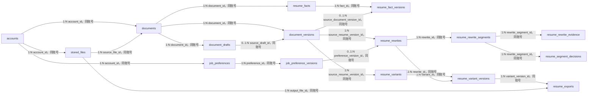

# Purslyx 简历数据库设计

| 项 | 内容 |
| --- | --- |
| 模块 | 简历 |
| 版本 | v0.2 |
| 更新日期 | 2026-09-15 |
| 状态 | 已评审 |
| 范围 | 私有文件、简历与 JD 导入确认、多条岗位期望、事实补充、逐段改写、岗位版编辑与 PDF 导出 |
| 依赖模块 | 用户、任务；分析报告由匹配池模块负责 |
| 需求/架构依据 | [需求说明 F02、F04、F05、F12 与 AC01—AC05、AC17—AC20](../../01-product/specs/需求说明.md)、[技术架构](../技术架构.md)、[数据库设计规范](数据库设计规范.md) |

## 1. 设计目标与边界

- 用户导入的简历、招聘方导入的候选人简历与 JD 都是所属账号的私有资料；确认前是可修正草稿，确认后生成不可变版本。分析只引用提交时冻结的版本，不读取“当前最新内容”。
- 求职账号可保存多条岗位期望；招聘账号可为当前候选人保存其明确提供的期望。每条版本包含一组完整的岗位方向、地点、办公方式和薪资条件，不跨期望记录拼接字段。
- 用户补充的事实单独留存来源与确认版本。AI 改写只能引用已确认资料或事实，逐段保存原文、建议、依据与用户采用历史，不覆盖原始简历。
- 岗位版简历的文字与排版在同一个不可变版本中提交。PDF 必须绑定确切岗位版版本和私有文件，导出失败可重试且不消耗 AI 使用次数。
- 删除资料后立即阻断原文件、正文、改写、岗位版与 PDF 的访问，取消相关未完成任务；物理文件和正文由清理任务异步移除并重试。

## 2. 实体关系

全部连线均为应用层校验的逻辑引用，不创建数据库外键。跨模块的 `analysis_report_id`、`job_pool_item_id` 与 `async_task_id` 同样校验账号、用途和删除状态。

## 3. 表结构

### 表目录与中文备注

| 物理表名 | 中文表名（数据库 COMMENT） | 用途备注 |
| --- | --- | --- |
| `stored_files` | 私有文件表 | 保存导入原件、PDF、临时文件和日志导出的存储元数据。 |
| `documents` | 资料表 | 保存本人简历、候选人简历和 JD 的父记录。 |
| `document_drafts` | 资料解析草稿表 | 保存待用户核对的文本、结构化草稿与解析状态。 |
| `document_versions` | 资料确认版本表 | 保存用户确认后不可变的简历或 JD 版本。 |
| `job_preferences` | 岗位期望表 | 保存按岗位方向建立的求职或候选人期望父记录。 |
| `job_preference_versions` | 岗位期望版本表 | 保存地点、办公方式、薪资和强度的完整不可变版本。 |
| `resume_facts` | 简历事实表 | 保存用户确认的补充事实父记录与撤回状态。 |
| `resume_fact_versions` | 简历事实版本表 | 保存事实正文、来源与不可变版本。 |
| `resume_rewrites` | 简历改写表 | 保存一次按报告和简历版本发起的改写结果父记录。 |
| `resume_rewrite_segments` | 改写段落表 | 保存逐段原文、建议、理由和可用状态。 |
| `resume_rewrite_evidence` | 改写依据表 | 保存改写建议引用的资料段落或已确认事实。 |
| `resume_segment_decisions` | 段落改写决策表 | 追加保存采用、保留原文和撤回操作。 |
| `resume_variants` | 岗位版简历表 | 保存针对匹配池岗位创建的简历父记录。 |
| `resume_variant_versions` | 岗位版简历版本表 | 保存内容、排版和模板绑定的不可变版本。 |
| `resume_exports` | 简历导出表 | 保存岗位版 PDF 的生成状态、文件和任务引用。 |

### stored_files

| 字段名 | 数据类型 | 可空 | 默认值 | 约束/索引 | 说明 |
| --- | --- | --- | --- | --- | --- |
| id | BIGINT | 否 | GENERATED ALWAYS AS IDENTITY | PK | 私有文件内部 ID |
| public_id | UUID | 否 | gen_random_uuid() | UK | 下载或管理使用的随机标识 |
| account_id | BIGINT | 否 | — | Index | 引用 `accounts.id`，应用层校验 |
| file_purpose | SMALLINT | 否 | — | CK: `file_purpose IN (1,2,3,4)` | 导入原件、岗位版 PDF、临时转换文件或日志导出 |
| storage_backend | SMALLINT | 否 | 1 | CK: `storage_backend IN (1,2)` | 本机私有目录或兼容 OSS 的对象存储 |
| storage_key | TEXT | 否 | — | UK | 对应后端内的私有逻辑键，不保存对外 URL 或服务器绝对路径 |
| original_filename | VARCHAR(255) | 是 | — | — | 经清理的原文件名，仅授权页面显示 |
| media_type | VARCHAR(127) | 否 | — | — | 经服务端探测的 MIME 类型 |
| byte_size | BIGINT | 否 | — | CK: `byte_size > 0` | 文件字节数 |
| sha256_digest | BYTEA | 否 | — | Index | 同账号内校验与复用；不跨账号暴露命中 |
| status | SMALLINT | 否 | 1 | CK: `status IN (1,2,3,4)` | 待写入、可用、待清理或已清理 |
| available_at | TIMESTAMPTZ | 是 | — | — | 文件完整写入并可读的时间点 |
| cleanup_requested_at | TIMESTAMPTZ | 是 | — | — | 请求异步清理的时间点 |
| cleaned_at | TIMESTAMPTZ | 是 | — | — | 物理文件确认移除时间点 |
| created_at | TIMESTAMPTZ | 否 | now() | — | 元数据创建时间点 |

### documents

| 字段名 | 数据类型 | 可空 | 默认值 | 约束/索引 | 说明 |
| --- | --- | --- | --- | --- | --- |
| id | BIGINT | 否 | GENERATED ALWAYS AS IDENTITY | PK | 私有资料内部 ID |
| public_id | UUID | 否 | gen_random_uuid() | UK | 对外资料标识 |
| account_id | BIGINT | 否 | — | Index | 引用 `accounts.id`，应用层校验 |
| source_file_id | BIGINT | 是 | — | — | 引用 `stored_files.id`；纯文本导入时为空 |
| document_type | SMALLINT | 否 | — | CK: `document_type IN (1,2)` | 简历或 JD |
| subject_type | SMALLINT | 否 | — | CK: `subject_type IN (1,2,3)` | 本人简历、候选人简历或岗位 JD |
| title | VARCHAR(160) | 是 | — | — | 用户可修改的列表标题；删除清理后置空 |
| status | SMALLINT | 否 | 1 | CK: `status IN (1,2,3)` | 导入中、可用或失败 |
| revision | BIGINT | 否 | 1 | CK: `revision >= 1` | 元数据编辑乐观锁版本 |
| created_at | TIMESTAMPTZ | 否 | now() | Index | 创建时间点 |
| updated_at | TIMESTAMPTZ | 否 | now() | — | 最后更新时间点 |
| deleted_at | TIMESTAMPTZ | 是 | — | Index | 非空后资料及全部后代立即不可访问 |

### document_drafts

| 字段名 | 数据类型 | 可空 | 默认值 | 约束/索引 | 说明 |
| --- | --- | --- | --- | --- | --- |
| id | BIGINT | 否 | GENERATED ALWAYS AS IDENTITY | PK | 待确认解析草稿内部 ID |
| public_id | UUID | 否 | gen_random_uuid() | UK | 确认页面使用的随机标识 |
| account_id | BIGINT | 否 | — | Index | 所属账号 ID |
| document_id | BIGINT | 否 | — | — | 引用 `documents.id`，应用层校验 |
| source_file_id | BIGINT | 是 | — | — | 引用本次解析的 `stored_files.id` |
| parse_task_id | BIGINT | 是 | — | Index | 引用任务模块 `async_tasks.id`；直接粘贴时可空 |
| source_type | SMALLINT | 否 | — | CK: `source_type IN (1,2,3,4)` | 文本、PDF、DOC 或 DOCX |
| status | SMALLINT | 否 | 1 | CK: `status IN (1,2,3,4)` | 解析中、待确认、已确认或失败 |
| plain_text | TEXT | 是 | — | — | 待用户检查的解析正文，删除时清理 |
| structured_content | JSONB | 是 | — | — | `document-draft-v1` 校验后的段落与字段 |
| content_schema_version | VARCHAR(32) | 是 | — | — | 与 JSONB 同时出现的 Schema 版本 |
| missing_fields | JSONB | 否 | `'[]'::jsonb` | — | `missing-fields-v1` 校验后的缺失字段码 |
| missing_fields_schema_version | VARCHAR(32) | 否 | 'missing-fields-v1' | — | 缺失字段 JSONB 的 Schema 版本 |
| failure_code | VARCHAR(64) | 是 | — | — | 稳定失败码，不包含正文或堆栈 |
| revision | BIGINT | 否 | 1 | CK: `revision >= 1` | 用户修正草稿的乐观锁版本 |
| expires_at | TIMESTAMPTZ | 是 | — | — | 未确认临时草稿的清理时间点 |
| confirmed_at | TIMESTAMPTZ | 是 | — | — | 生成确认版本的时间点 |
| created_at | TIMESTAMPTZ | 否 | now() | — | 创建时间点 |
| updated_at | TIMESTAMPTZ | 否 | now() | — | 最后更新时间点 |

### document_versions

| 字段名 | 数据类型 | 可空 | 默认值 | 约束/索引 | 说明 |
| --- | --- | --- | --- | --- | --- |
| id | BIGINT | 否 | GENERATED ALWAYS AS IDENTITY | PK | 不可变资料版本内部 ID |
| public_id | UUID | 否 | gen_random_uuid() | UK | 历史输入版本随机标识 |
| account_id | BIGINT | 否 | — | — | 所属账号 ID |
| document_id | BIGINT | 否 | — | Index | 引用 `documents.id`，应用层校验 |
| source_draft_id | BIGINT | 是 | — | — | 引用已确认 `document_drafts.id` |
| version_no | BIGINT | 否 | — | UK, CK: `version_no >= 1` | 同一资料内递增版本号 |
| title | VARCHAR(160) | 是 | — | — | 确认时标题快照；内容清理后置空 |
| plain_text | TEXT | 是 | — | — | 确认正文；删除父资料后异步置空 |
| structured_content | JSONB | 是 | — | — | `document-content-v1` 校验后的稳定段落结构；清理后置空 |
| content_schema_version | VARCHAR(32) | 否 | — | — | 正文结构 Schema 版本 |
| source_type | SMALLINT | 否 | — | CK: `source_type IN (1,2,3,4,5)` | 文本、PDF、DOC、DOCX 或页面表单 |
| confirmed_at | TIMESTAMPTZ | 否 | now() | — | 用户确认时间点 |
| content_cleared_at | TIMESTAMPTZ | 是 | — | — | 正文、标题和结构化内容完成清理的时间点 |
| created_at | TIMESTAMPTZ | 否 | now() | — | 版本创建时间点 |

### job_preferences

| 字段名 | 数据类型 | 可空 | 默认值 | 约束/索引 | 说明 |
| --- | --- | --- | --- | --- | --- |
| id | BIGINT | 否 | GENERATED ALWAYS AS IDENTITY | PK | 岗位期望父记录 ID |
| public_id | UUID | 否 | gen_random_uuid() | UK | 对外标识 |
| account_id | BIGINT | 否 | — | Index | 所属账号；求职本人或招聘方当前候选人资料 |
| subject_document_id | BIGINT | 是 | — | Index | 招聘场景引用候选人 `documents.id`；本人期望为空 |
| preference_context | SMALLINT | 否 | — | CK: `preference_context IN (1,2)` | 本人求职期望或候选人明确提供的期望 |
| display_name | VARCHAR(120) | 是 | — | — | 例如“前端 · 杭州 · 远程”；删除清理后置空 |
| is_default | BOOLEAN | 否 | false | — | 本人期望中每账号最多一条默认值 |
| status | SMALLINT | 否 | 1 | CK: `status IN (1,2)` | 启用或停用 |
| revision | BIGINT | 否 | 1 | CK: `revision >= 1` | 父记录更新乐观锁版本 |
| created_at | TIMESTAMPTZ | 否 | now() | — | 创建时间点 |
| updated_at | TIMESTAMPTZ | 否 | now() | — | 最后更新时间点 |
| deleted_at | TIMESTAMPTZ | 是 | — | — | 删除时间点；历史分析仍保留版本引用但不可由用户打开已删期望 |

### job_preference_versions

| 字段名 | 数据类型 | 可空 | 默认值 | 约束/索引 | 说明 |
| --- | --- | --- | --- | --- | --- |
| id | BIGINT | 否 | GENERATED ALWAYS AS IDENTITY | PK | 不可变岗位期望版本 ID |
| public_id | UUID | 否 | gen_random_uuid() | UK | 分析输入展示标识 |
| account_id | BIGINT | 否 | — | — | 所属账号 ID |
| preference_id | BIGINT | 否 | — | Index | 引用 `job_preferences.id` |
| version_no | BIGINT | 否 | — | UK, CK: `version_no >= 1` | 同一期望内递增版本号 |
| job_title | VARCHAR(160) | 是 | — | — | 岗位方向原文或规范化显示值 |
| job_title_status | SMALLINT | 否 | 1 | CK: `job_title_status IN (1,2,3)` | 已填写、未知或不限 |
| job_title_strength | SMALLINT | 否 | 2 | CK: `job_title_strength IN (1,2,3)` | 偏好、重要或必须 |
| location_text | VARCHAR(255) | 是 | — | — | 地点原文或规范化显示值 |
| location_values | JSONB | 是 | — | — | `preference-locations-v1` 校验后的一个或多个地点；未知或不限时为空 |
| location_schema_version | VARCHAR(32) | 是 | — | — | 地点数组 Schema 版本；与 `location_values` 同时出现 |
| location_status | SMALLINT | 否 | 2 | CK: `location_status IN (1,2,3)` | 已填写、未知或不限 |
| location_strength | SMALLINT | 否 | 2 | CK: `location_strength IN (1,2,3)` | 条件强度 |
| work_mode | SMALLINT | 是 | — | CK: `work_mode IN (1,2,3)` | 现场、混合或远程 |
| work_mode_status | SMALLINT | 否 | 2 | CK: `work_mode_status IN (1,2,3)` | 已填写、未知或不限 |
| work_mode_strength | SMALLINT | 否 | 2 | CK: `work_mode_strength IN (1,2,3)` | 条件强度 |
| salary_min | NUMERIC(14,2) | 是 | — | — | 同一币种与周期的最低薪资 |
| salary_max | NUMERIC(14,2) | 是 | — | — | 同一币种与周期的最高薪资 |
| salary_currency | CHAR(3) | 是 | — | — | ISO 4217 币种 |
| salary_period | SMALLINT | 是 | — | CK: `salary_period IN (1,2,3)` | 时薪、月薪或年薪 |
| salary_tax_basis | SMALLINT | 是 | — | CK: `salary_tax_basis IN (1,2)` | 明确时记录税前或税后；未知为空 |
| salary_months | NUMERIC(4,1) | 是 | — | CK: `salary_months > 0` | 明确披露的计薪月数，未知为空 |
| salary_status | SMALLINT | 否 | 2 | CK: `salary_status IN (1,2,3,4)` | 已填写、未知、不限或面议 |
| salary_strength | SMALLINT | 否 | 2 | CK: `salary_strength IN (1,2,3)` | 条件强度 |
| source_type | SMALLINT | 否 | — | CK: `source_type IN (1,2)` | 本人确认或候选人明确提供 |
| content_cleared_at | TIMESTAMPTZ | 是 | — | — | 期望值完成清理的时间点；状态和强度仅作最小历史解释 |
| confirmed_at | TIMESTAMPTZ | 否 | now() | — | 确认时间点 |
| created_at | TIMESTAMPTZ | 否 | now() | — | 版本创建时间点 |

### resume_facts

| 字段名 | 数据类型 | 可空 | 默认值 | 约束/索引 | 说明 |
| --- | --- | --- | --- | --- | --- |
| id | BIGINT | 否 | GENERATED ALWAYS AS IDENTITY | PK | 可追踪事实父记录 ID |
| public_id | UUID | 否 | gen_random_uuid() | UK | 页面引用标识 |
| account_id | BIGINT | 否 | — | Index | 所属账号 ID |
| document_id | BIGINT | 否 | — | Index | 引用本人简历 `documents.id` |
| fact_key | UUID | 否 | gen_random_uuid() | UK | 跨版本稳定事实键 |
| status | SMALLINT | 否 | 1 | CK: `status IN (1,2)` | 有效或撤回 |
| revision | BIGINT | 否 | 1 | CK: `revision >= 1` | 创建事实版本时的乐观锁版本 |
| created_at | TIMESTAMPTZ | 否 | now() | — | 创建时间点 |
| updated_at | TIMESTAMPTZ | 否 | now() | — | 最后更新时间点 |
| deleted_at | TIMESTAMPTZ | 是 | — | — | 用户删除时间点 |

### resume_fact_versions

| 字段名 | 数据类型 | 可空 | 默认值 | 约束/索引 | 说明 |
| --- | --- | --- | --- | --- | --- |
| id | BIGINT | 否 | GENERATED ALWAYS AS IDENTITY | PK | 不可变事实版本 ID |
| public_id | UUID | 否 | gen_random_uuid() | UK | 对外版本标识 |
| account_id | BIGINT | 否 | — | — | 所属账号 ID |
| fact_id | BIGINT | 否 | — | Index | 引用 `resume_facts.id` |
| source_document_version_id | BIGINT | 是 | — | — | 可选引用原资料 `document_versions.id` |
| version_no | BIGINT | 否 | — | UK, CK: `version_no >= 1` | 同一事实内递增版本号 |
| fact_category | SMALLINT | 否 | — | CK: `fact_category IN (1,2,3,4,5)` | 经历、职责、技能、成果或背景 |
| fact_text | TEXT | 是 | — | — | 用户确认的事实正文；删除清理后置空 |
| source_segment_key | VARCHAR(96) | 是 | — | — | 原资料中的稳定段落键 |
| source_type | SMALLINT | 否 | — | CK: `source_type IN (1,2)` | 原资料确认或用户补充 |
| confirmed_at | TIMESTAMPTZ | 否 | now() | — | 用户确认时间点 |
| content_cleared_at | TIMESTAMPTZ | 是 | — | — | 事实正文完成清理的时间点 |
| created_at | TIMESTAMPTZ | 否 | now() | — | 版本创建时间点 |

### resume_rewrites

| 字段名 | 数据类型 | 可空 | 默认值 | 约束/索引 | 说明 |
| --- | --- | --- | --- | --- | --- |
| id | BIGINT | 否 | GENERATED ALWAYS AS IDENTITY | PK | 一次改写请求与结果 ID |
| public_id | UUID | 否 | gen_random_uuid() | UK | 对外改写标识 |
| account_id | BIGINT | 否 | — | Index | 所属求职账号 ID |
| analysis_report_id | BIGINT | 否 | — | Index | 引用匹配池 `analysis_reports.id` |
| source_resume_version_id | BIGINT | 否 | — | — | 引用实际使用的 `document_versions.id` |
| preference_version_id | BIGINT | 是 | — | — | 引用本次分析期望版本 |
| async_task_id | BIGINT | 否 | — | Index | 引用生成任务 `async_tasks.id` |
| status | SMALLINT | 否 | 1 | CK: `status IN (1,2,3,4)` | 排队、生成中、可用或失败 |
| rule_version | VARCHAR(32) | 否 | — | — | 事实约束与改写规则版本 |
| prompt_version | VARCHAR(32) | 否 | — | — | 生成提示词版本 |
| created_at | TIMESTAMPTZ | 否 | now() | Index | 创建时间点 |
| completed_at | TIMESTAMPTZ | 是 | — | — | 完整结果可读时间点 |
| deleted_at | TIMESTAMPTZ | 是 | — | — | 删除后立即不可访问 |

### resume_rewrite_segments

| 字段名 | 数据类型 | 可空 | 默认值 | 约束/索引 | 说明 |
| --- | --- | --- | --- | --- | --- |
| id | BIGINT | 否 | GENERATED ALWAYS AS IDENTITY | PK | 改写段落 ID |
| public_id | UUID | 否 | gen_random_uuid() | UK | 页面操作标识 |
| account_id | BIGINT | 否 | — | — | 所属账号 ID |
| rewrite_id | BIGINT | 否 | — | Index | 引用 `resume_rewrites.id` |
| source_segment_key | VARCHAR(96) | 否 | — | — | 原简历稳定段落键 |
| position_no | INTEGER | 否 | — | CK: `position_no >= 1` | 结果展示顺序 |
| original_text | TEXT | 是 | — | — | 来源版本的原文快照；清理后置空 |
| suggested_text | TEXT | 是 | — | — | AI 建议文本；清理后置空 |
| rationale | TEXT | 是 | — | — | 改写理由；清理后置空 |
| status | SMALLINT | 否 | 1 | CK: `status IN (1,2)` | 可用或因删除失效 |
| content_cleared_at | TIMESTAMPTZ | 是 | — | — | 段落正文完成清理的时间点 |
| created_at | TIMESTAMPTZ | 否 | now() | — | 创建时间点 |

### resume_rewrite_evidence

| 字段名 | 数据类型 | 可空 | 默认值 | 约束/索引 | 说明 |
| --- | --- | --- | --- | --- | --- |
| id | BIGINT | 否 | GENERATED ALWAYS AS IDENTITY | PK | 改写依据 ID |
| account_id | BIGINT | 否 | — | Index | 所属账号 ID |
| rewrite_segment_id | BIGINT | 否 | — | Index | 引用 `resume_rewrite_segments.id` |
| fact_version_id | BIGINT | 是 | — | — | 可选引用 `resume_fact_versions.id` |
| document_version_id | BIGINT | 是 | — | — | 可选引用 `document_versions.id` |
| source_segment_key | VARCHAR(96) | 是 | — | — | 资料段落稳定键 |
| quote_text | TEXT | 是 | — | — | 用户可核对的最小原文引用；清理后置空 |
| evidence_type | SMALLINT | 否 | — | CK: `evidence_type IN (1,2)` | 简历原文或补充事实 |
| content_cleared_at | TIMESTAMPTZ | 是 | — | — | 引用文字完成清理的时间点 |
| created_at | TIMESTAMPTZ | 否 | now() | — | 创建时间点 |

### resume_segment_decisions

| 字段名 | 数据类型 | 可空 | 默认值 | 约束/索引 | 说明 |
| --- | --- | --- | --- | --- | --- |
| id | BIGINT | 否 | GENERATED ALWAYS AS IDENTITY | PK | 追加式段落决策事件 ID |
| account_id | BIGINT | 否 | — | — | 所属账号 ID |
| rewrite_segment_id | BIGINT | 否 | — | Index | 引用 `resume_rewrite_segments.id` |
| decision_no | BIGINT | 否 | — | UK, CK: `decision_no >= 1` | 同一段落内递增事件号 |
| decision | SMALLINT | 否 | — | CK: `decision IN (1,2,3)` | 采用、保留原文或撤回上次决定 |
| edited_text | TEXT | 是 | — | — | 采用前用户编辑后的文字；其余决定为空 |
| created_at | TIMESTAMPTZ | 否 | now() | — | 用户决定时间点 |

### resume_variants

| 字段名 | 数据类型 | 可空 | 默认值 | 约束/索引 | 说明 |
| --- | --- | --- | --- | --- | --- |
| id | BIGINT | 否 | GENERATED ALWAYS AS IDENTITY | PK | 岗位版简历父记录 ID |
| public_id | UUID | 否 | gen_random_uuid() | UK | 对外岗位版标识 |
| account_id | BIGINT | 否 | — | Index | 所属求职账号 ID |
| job_pool_item_id | BIGINT | 否 | — | Index | 引用匹配池 `job_pool_items.id` |
| source_resume_version_id | BIGINT | 否 | — | — | 引用作为起点的 `document_versions.id` |
| title | VARCHAR(160) | 是 | — | — | 岗位版列表标题；删除清理后置空 |
| status | SMALLINT | 否 | 1 | CK: `status IN (1,2)` | 编辑中或已定稿 |
| revision | BIGINT | 否 | 1 | CK: `revision >= 1` | 父记录乐观锁版本 |
| created_at | TIMESTAMPTZ | 否 | now() | Index | 创建时间点 |
| updated_at | TIMESTAMPTZ | 否 | now() | — | 最后更新时间点 |
| deleted_at | TIMESTAMPTZ | 是 | — | — | 删除后版本和导出立即不可访问 |

### resume_variant_versions

| 字段名 | 数据类型 | 可空 | 默认值 | 约束/索引 | 说明 |
| --- | --- | --- | --- | --- | --- |
| id | BIGINT | 否 | GENERATED ALWAYS AS IDENTITY | PK | 岗位版不可变版本 ID |
| public_id | UUID | 否 | gen_random_uuid() | UK | 导出和历史读取标识 |
| account_id | BIGINT | 否 | — | — | 所属账号 ID |
| variant_id | BIGINT | 否 | — | Index | 引用 `resume_variants.id` |
| rewrite_id | BIGINT | 是 | — | — | 可选引用采用建议来源 `resume_rewrites.id` |
| version_no | BIGINT | 否 | — | UK, CK: `version_no >= 1` | 同一岗位版内递增版本号 |
| content | JSONB | 是 | — | — | `resume-variant-content-v1` 校验后的全部模块与文字；清理后置空 |
| layout | JSONB | 是 | — | — | `resume-layout-v1` 校验后的排序与样式；清理后置空 |
| content_schema_version | VARCHAR(32) | 否 | — | — | 内容 Schema 版本 |
| layout_schema_version | VARCHAR(32) | 否 | — | — | 排版 Schema 版本 |
| template_version | VARCHAR(32) | 否 | — | — | 首版模板资源版本 |
| content_cleared_at | TIMESTAMPTZ | 是 | — | — | 内容与排版完成清理的时间点 |
| created_at | TIMESTAMPTZ | 否 | now() | — | 保存版本时间点 |

### resume_exports

| 字段名 | 数据类型 | 可空 | 默认值 | 约束/索引 | 说明 |
| --- | --- | --- | --- | --- | --- |
| id | BIGINT | 否 | GENERATED ALWAYS AS IDENTITY | PK | PDF 导出记录 ID |
| public_id | UUID | 否 | gen_random_uuid() | UK | 下载接口标识 |
| account_id | BIGINT | 否 | — | Index | 所属账号 ID |
| variant_version_id | BIGINT | 否 | — | Index | 引用确切 `resume_variant_versions.id` |
| output_file_id | BIGINT | 是 | — | — | 成功后引用 `stored_files.id` |
| async_task_id | BIGINT | 否 | — | Index | 引用导出任务 `async_tasks.id` |
| status | SMALLINT | 否 | 1 | CK: `status IN (1,2,3,4)` | 排队、生成中、可下载或失败 |
| page_count | INTEGER | 是 | — | CK: `page_count > 0` | 成功 PDF 页数 |
| output_sha256_digest | BYTEA | 是 | — | — | 下载完整性校验摘要 |
| failure_code | VARCHAR(64) | 是 | — | — | 稳定失败码 |
| created_at | TIMESTAMPTZ | 否 | now() | Index | 创建时间点 |
| completed_at | TIMESTAMPTZ | 是 | — | — | 成功或失败结束时间点 |
| deleted_at | TIMESTAMPTZ | 是 | — | — | 删除后立即禁止下载 |

## 4. 索引清单

| 表名 | 索引名 | 字段或表达式 | 类型 | 条件与用途 |
| --- | --- | --- | --- | --- |
| stored_files | pk_stored_files | `id` | Primary | 主键 |
| stored_files | uq_stored_files_public_id | `public_id` | Unique | 下载鉴权定位 |
| stored_files | uq_stored_files_storage_key | `storage_backend, storage_key` | Unique | 防止同一后端内多个元数据指向同一逻辑键 |
| stored_files | idx_stored_files_account_digest | `account_id, sha256_digest` | B-tree | 同账号文件摘要复用 |
| stored_files | idx_stored_files_cleanup | `status, cleanup_requested_at` | B-tree partial | `status = 3`；清理任务扫描 |
| documents | pk_documents | `id` | Primary | 主键 |
| documents | uq_documents_public_id | `public_id` | Unique | 对外定位 |
| documents | idx_documents_account_type_created | `account_id, document_type, created_at DESC` | B-tree partial | `deleted_at IS NULL`；资料列表与账号引用 |
| documents | idx_documents_deleted | `deleted_at` | B-tree partial | `deleted_at IS NOT NULL`；清理编排 |
| document_drafts | pk_document_drafts | `id` | Primary | 主键 |
| document_drafts | uq_document_drafts_public_id | `public_id` | Unique | 确认页面定位 |
| document_drafts | idx_document_drafts_parse_task | `account_id, parse_task_id` | B-tree partial | `parse_task_id IS NOT NULL`；解析任务回写对应草稿 |
| document_versions | pk_document_versions | `id` | Primary | 主键 |
| document_versions | uq_document_versions_public_id | `public_id` | Unique | 历史版本定位 |
| document_versions | uq_document_versions_number | `document_id, version_no` | Unique | 同资料版本号唯一并覆盖父引用 |
| job_preferences | pk_job_preferences | `id` | Primary | 主键 |
| job_preferences | uq_job_preferences_public_id | `public_id` | Unique | 对外定位 |
| job_preferences | uq_job_preferences_default_self | `account_id` | Unique partial | `is_default AND preference_context = 1 AND deleted_at IS NULL`；本人默认期望唯一 |
| job_preferences | idx_job_preferences_account_context | `account_id, preference_context, created_at DESC` | B-tree partial | `deleted_at IS NULL`；期望列表分页 |
| job_preferences | idx_job_preferences_subject_document | `account_id, subject_document_id` | B-tree partial | `subject_document_id IS NOT NULL AND deleted_at IS NULL`；招聘候选人期望 |
| job_preference_versions | pk_job_preference_versions | `id` | Primary | 主键 |
| job_preference_versions | uq_job_preference_versions_public_id | `public_id` | Unique | 分析输入定位 |
| job_preference_versions | uq_job_preference_versions_number | `preference_id, version_no` | Unique | 版本号唯一并覆盖父引用 |
| resume_facts | pk_resume_facts | `id` | Primary | 主键 |
| resume_facts | uq_resume_facts_public_id | `public_id` | Unique | 页面定位 |
| resume_facts | uq_resume_facts_key | `fact_key` | Unique | 跨版本稳定事实键 |
| resume_facts | idx_resume_facts_document | `account_id, document_id, created_at` | B-tree partial | `deleted_at IS NULL`；简历事实列表 |
| resume_fact_versions | pk_resume_fact_versions | `id` | Primary | 主键 |
| resume_fact_versions | uq_resume_fact_versions_public_id | `public_id` | Unique | 历史版本定位 |
| resume_fact_versions | uq_resume_fact_versions_number | `fact_id, version_no` | Unique | 事实版本号唯一并覆盖父引用 |
| resume_rewrites | pk_resume_rewrites | `id` | Primary | 主键 |
| resume_rewrites | uq_resume_rewrites_public_id | `public_id` | Unique | 对外定位 |
| resume_rewrites | uq_resume_rewrites_task | `async_task_id` | Unique | 一个任务只交付一份改写并覆盖任务引用 |
| resume_rewrites | idx_resume_rewrites_report | `account_id, analysis_report_id, created_at DESC` | B-tree partial | `deleted_at IS NULL`；从报告查看改写 |
| resume_rewrite_segments | pk_resume_rewrite_segments | `id` | Primary | 主键 |
| resume_rewrite_segments | uq_resume_rewrite_segments_public_id | `public_id` | Unique | 页面操作定位 |
| resume_rewrite_segments | uq_resume_rewrite_segments_position | `rewrite_id, position_no` | Unique | 同结果顺序唯一并覆盖父引用 |
| resume_rewrite_evidence | pk_resume_rewrite_evidence | `id` | Primary | 主键 |
| resume_rewrite_evidence | idx_rewrite_evidence_segment | `account_id, rewrite_segment_id, id` | B-tree | 段落依据读取并覆盖引用 |
| resume_segment_decisions | pk_resume_segment_decisions | `id` | Primary | 主键 |
| resume_segment_decisions | uq_resume_segment_decisions_number | `rewrite_segment_id, decision_no` | Unique | 决策顺序唯一并覆盖父引用 |
| resume_variants | pk_resume_variants | `id` | Primary | 主键 |
| resume_variants | uq_resume_variants_public_id | `public_id` | Unique | 对外定位 |
| resume_variants | idx_resume_variants_job | `account_id, job_pool_item_id, created_at DESC` | B-tree partial | `deleted_at IS NULL`；岗位详情回到岗位版 |
| resume_variant_versions | pk_resume_variant_versions | `id` | Primary | 主键 |
| resume_variant_versions | uq_resume_variant_versions_public_id | `public_id` | Unique | 导出输入定位 |
| resume_variant_versions | uq_resume_variant_versions_number | `variant_id, version_no` | Unique | 岗位版版本唯一并覆盖父引用 |
| resume_exports | pk_resume_exports | `id` | Primary | 主键 |
| resume_exports | uq_resume_exports_public_id | `public_id` | Unique | 下载鉴权定位 |
| resume_exports | uq_resume_exports_task | `async_task_id` | Unique | 一个导出任务对应一个导出记录并覆盖任务引用 |
| resume_exports | idx_resume_exports_variant | `account_id, variant_version_id, created_at DESC` | B-tree partial | `deleted_at IS NULL`；岗位版详情读取导出历史 |

## 5. 检查约束清单

| 表名 | 约束名 | 表达式 | 说明 |
| --- | --- | --- | --- |
| stored_files | ck_stored_files_purpose | `file_purpose IN (1,2,3,4)` | 文件用途合法 |
| stored_files | ck_stored_files_backend | `storage_backend IN (1,2)` | 本机或 OSS 存储后端合法 |
| stored_files | ck_stored_files_size | `byte_size > 0` | 禁止空文件元数据被视为可用文件 |
| stored_files | ck_stored_files_status | `status IN (1,2,3,4)` | 文件状态合法 |
| stored_files | ck_stored_files_available | `status <> 2 OR available_at IS NOT NULL` | 标为可用时必须有可用时间；部分写入失败也可直接进入待清理 |
| documents | ck_documents_type | `document_type IN (1,2)` | 简历或 JD |
| documents | ck_documents_subject | `subject_type IN (1,2,3)` | 资料主体合法 |
| documents | ck_documents_type_subject | `(document_type = 1 AND subject_type IN (1,2)) OR (document_type = 2 AND subject_type = 3)` | 简历与 JD 主体组合合法 |
| documents | ck_documents_status | `status IN (1,2,3)` | 资料状态合法 |
| documents | ck_documents_revision | `revision >= 1` | 乐观锁版本为正数 |
| document_drafts | ck_document_drafts_source | `source_type IN (1,2,3,4)` | 支持的导入来源 |
| document_drafts | ck_document_drafts_status | `status IN (1,2,3,4)` | 草稿状态合法 |
| document_drafts | ck_document_drafts_schema | `(structured_content IS NULL) = (content_schema_version IS NULL)` | JSON 内容和 Schema 版本同时出现 |
| document_drafts | ck_document_drafts_revision | `revision >= 1` | 乐观锁版本为正数 |
| document_versions | ck_document_versions_number | `version_no >= 1` | 版本号为正数 |
| document_versions | ck_document_versions_source | `source_type IN (1,2,3,4,5)` | 确认版本来源合法 |
| document_versions | ck_document_versions_content_cleanup | `(title IS NULL) = (plain_text IS NULL) AND (plain_text IS NULL) = (structured_content IS NULL) AND (plain_text IS NULL) = (content_cleared_at IS NOT NULL)` | 活跃版本正文完整，清理后正文与结构同时置空 |
| job_preferences | ck_job_preferences_context | `preference_context IN (1,2)` | 期望上下文合法 |
| job_preferences | ck_job_preferences_subject | `(preference_context = 1 AND subject_document_id IS NULL) OR (preference_context = 2 AND subject_document_id IS NOT NULL)` | 本人和候选人期望的主体引用一致 |
| job_preferences | ck_job_preferences_status | `status IN (1,2)` | 期望状态合法 |
| job_preferences | ck_job_preferences_revision | `revision >= 1` | 乐观锁版本为正数 |
| job_preference_versions | ck_job_pref_versions_values | `job_title_status IN (1,2,3) AND location_status IN (1,2,3) AND work_mode_status IN (1,2,3) AND salary_status IN (1,2,3,4)` | 各字段未知、不限和已填写状态合法 |
| job_preference_versions | ck_job_pref_versions_strengths | `job_title_strength IN (1,2,3) AND location_strength IN (1,2,3) AND work_mode_strength IN (1,2,3) AND salary_strength IN (1,2,3)` | 条件强度合法 |
| job_preference_versions | ck_job_pref_versions_locations_schema | `(location_values IS NULL) = (location_schema_version IS NULL)` | 地点数组和 Schema 版本同时出现 |
| job_preference_versions | ck_job_pref_versions_location_fields | `content_cleared_at IS NOT NULL OR (location_status = 1 AND location_values IS NOT NULL AND jsonb_typeof(location_values) = 'array' AND jsonb_array_length(location_values) BETWEEN 1 AND 10) OR (location_status <> 1 AND location_values IS NULL)` | 未清理时地点数组与状态一致 |
| job_preference_versions | ck_job_pref_versions_salary_range | `salary_min IS NULL OR salary_max IS NULL OR salary_min <= salary_max` | 薪资上下界合法 |
| job_preference_versions | ck_job_pref_versions_salary_tax | `salary_tax_basis IS NULL OR salary_tax_basis IN (1,2)` | 税前／税后口径合法，未知为空 |
| job_preference_versions | ck_job_pref_versions_salary_fields | `content_cleared_at IS NOT NULL OR (salary_status = 1 AND salary_currency IS NOT NULL AND salary_period IS NOT NULL AND (salary_min IS NOT NULL OR salary_max IS NOT NULL)) OR (salary_status <> 1 AND salary_min IS NULL AND salary_max IS NULL AND salary_currency IS NULL AND salary_period IS NULL AND salary_tax_basis IS NULL AND salary_months IS NULL)` | 未清理时薪资值与状态一致 |
| job_preference_versions | ck_job_pref_versions_work_mode | `content_cleared_at IS NOT NULL OR (work_mode_status = 1 AND work_mode IS NOT NULL) OR (work_mode_status <> 1 AND work_mode IS NULL)` | 未清理时办公方式值与状态一致 |
| job_preference_versions | ck_job_pref_versions_content_cleanup | `content_cleared_at IS NULL OR (job_title IS NULL AND location_text IS NULL AND location_values IS NULL AND work_mode IS NULL AND salary_min IS NULL AND salary_max IS NULL AND salary_currency IS NULL AND salary_period IS NULL AND salary_tax_basis IS NULL AND salary_months IS NULL)` | 标记清理完成后期望值必须为空 |
| resume_facts | ck_resume_facts_status | `status IN (1,2)` | 事实状态合法 |
| resume_facts | ck_resume_facts_revision | `revision >= 1` | 事实版本并发号为正数 |
| resume_fact_versions | ck_resume_fact_versions_number | `version_no >= 1` | 版本号为正数 |
| resume_fact_versions | ck_resume_fact_versions_category | `fact_category IN (1,2,3,4,5)` | 事实类别合法 |
| resume_fact_versions | ck_resume_fact_versions_source | `source_type IN (1,2)` | 事实来源合法 |
| resume_fact_versions | ck_resume_fact_versions_content_cleanup | `(fact_text IS NULL) = (content_cleared_at IS NOT NULL)` | 清理前有事实正文，清理后正文为空 |
| resume_rewrites | ck_resume_rewrites_status | `status IN (1,2,3,4)` | 改写状态合法 |
| resume_rewrite_segments | ck_resume_rewrite_segments_position | `position_no >= 1` | 段落顺序为正数 |
| resume_rewrite_segments | ck_resume_rewrite_segments_status | `status IN (1,2)` | 段落状态合法 |
| resume_rewrite_segments | ck_rewrite_segments_content_cleanup | `((original_text IS NULL)::integer + (suggested_text IS NULL)::integer + (rationale IS NULL)::integer) IN (0,3) AND (original_text IS NULL) = (content_cleared_at IS NOT NULL)` | 三段正文同时存在或同时清理 |
| resume_rewrite_evidence | ck_resume_rewrite_evidence_source | `(fact_version_id IS NOT NULL)::integer + (document_version_id IS NOT NULL)::integer = 1` | 每条依据恰好引用事实版本或资料版本 |
| resume_rewrite_evidence | ck_resume_rewrite_evidence_type | `evidence_type IN (1,2)` | 依据类型合法 |
| resume_rewrite_evidence | ck_rewrite_evidence_content_cleanup | `(quote_text IS NULL) = (content_cleared_at IS NOT NULL)` | 清理前有引用文字，清理后为空 |
| resume_segment_decisions | ck_resume_segment_decisions_number | `decision_no >= 1` | 决策序号为正数 |
| resume_segment_decisions | ck_resume_segment_decisions_value | `decision IN (1,2,3)` | 决策合法 |
| resume_segment_decisions | ck_resume_segment_decisions_text | `(decision = 1) OR edited_text IS NULL` | 仅采用事件可保存编辑文本 |
| resume_variants | ck_resume_variants_status | `status IN (1,2)` | 岗位版状态合法 |
| resume_variants | ck_resume_variants_revision | `revision >= 1` | 乐观锁版本为正数 |
| resume_variant_versions | ck_resume_variant_versions_number | `version_no >= 1` | 岗位版版本号为正数 |
| resume_variant_versions | ck_variant_versions_content_cleanup | `(content IS NULL) = (layout IS NULL) AND (content IS NULL) = (content_cleared_at IS NOT NULL)` | 内容与排版同时存在或同时清理 |
| resume_exports | ck_resume_exports_status | `status IN (1,2,3,4)` | 导出状态合法 |
| resume_exports | ck_resume_exports_page_count | `page_count IS NULL OR page_count > 0` | 页数为空或正数 |
| resume_exports | ck_resume_exports_result | `(status = 3 AND output_file_id IS NOT NULL AND page_count IS NOT NULL AND completed_at IS NOT NULL) OR status <> 3` | 可下载状态必须有完整产物 |

## 6. 枚举与版本字典

| 表.字段 | 数据库值 | API 名称 | 含义 | 备注 |
| --- | --- | --- | --- | --- |
| stored_files.file_purpose | 1 | import_source | 用户导入原件 | PDF、DOC 或 DOCX |
| stored_files.file_purpose | 2 | resume_pdf | 岗位版 PDF | 私有成品 |
| stored_files.file_purpose | 3 | conversion_temp | 临时转换文件 | 成功或失败后清理 |
| stored_files.file_purpose | 4 | log_export | 管理日志导出 | 短期私有文件，下载须再次鉴权 |
| stored_files.storage_backend | 1 | local | 本机私有目录 | 首版默认；`storage_key` 禁止使用绝对路径 |
| stored_files.storage_backend | 2 | oss | 兼容 OSS 的对象存储 | 后续容量迁移使用；对象必须保持私有 |
| stored_files.status | 1 | pending | 待写入 | 不可下载 |
| stored_files.status | 2 | available | 可用 | 必须有 `available_at` |
| stored_files.status | 3 | cleanup_pending | 待清理 | 立即禁止访问 |
| stored_files.status | 4 | cleaned | 已清理 | 不可回到可用 |
| documents.document_type | 1 | resume | 简历 | 本人或招聘候选人资料 |
| documents.document_type | 2 | job_description | JD | 私有岗位资料 |
| documents.subject_type | 1 | self_resume | 本人简历 | 求职账号使用 |
| documents.subject_type | 2 | candidate_resume | 候选人简历 | 归招聘账号所有 |
| documents.subject_type | 3 | job_description | 岗位 JD | 与简历主体分开 |
| documents.status | 1 | importing | 导入中 | 尚无确认版本 |
| documents.status | 2 | available | 可用 | 至少一个确认版本 |
| documents.status | 3 | failed | 导入失败 | 可修正或重新导入 |
| document_drafts.status | 1 | parsing | 解析中 | 不可确认 |
| document_drafts.status | 2 | awaiting_confirmation | 待确认 | 可修正正文 |
| document_drafts.status | 3 | confirmed | 已确认 | 不可再次确认 |
| document_drafts.status | 4 | failed | 解析失败 | 保存稳定失败码 |
| document_drafts.source_type | 1 | text | 文本粘贴 | 无原文件也可导入 |
| document_drafts.source_type | 2 | pdf | 文字型 PDF | 文件类型以探测为准 |
| document_drafts.source_type | 3 | doc | DOC | 文件类型以探测为准 |
| document_drafts.source_type | 4 | docx | DOCX | 文件类型以探测为准 |
| document_versions.source_type | 1 | text | 文本来源 | 用户已确认 |
| document_versions.source_type | 2 | pdf | PDF 来源 | 用户已确认 |
| document_versions.source_type | 3 | doc | DOC 来源 | 用户已确认 |
| document_versions.source_type | 4 | docx | DOCX 来源 | 用户已确认 |
| document_versions.source_type | 5 | form | 页面表单 | 手动 JD 使用 |
| job_preferences.status | 1 | active | 启用 | 可用于新分析 |
| job_preferences.status | 2 | disabled | 停用 | 历史版本仍可解释旧报告 |
| job_preferences.preference_context | 1 | seeker_self | 本人岗位期望 | `subject_document_id` 为空 |
| job_preferences.preference_context | 2 | candidate_disclosed | 候选人明确提供的期望 | 必须关联候选人资料 |
| job_preference_versions.job_title_status / location_status / work_mode_status | 1 | specified | 已填写 | 存在可比较值 |
| job_preference_versions.job_title_status / location_status / work_mode_status | 2 | unknown | 未知 | 不能当成不限 |
| job_preference_versions.job_title_status / location_status / work_mode_status | 3 | unrestricted | 不限 | 用户明确选择 |
| job_preference_versions.salary_status | 1 | specified | 已填写 | 至少有上下界之一及币种、周期 |
| job_preference_versions.salary_status | 2 | unknown | 未知 | 不能当成不限 |
| job_preference_versions.salary_status | 3 | unrestricted | 不限 | 用户明确选择 |
| job_preference_versions.salary_status | 4 | negotiable | 面议 | 只用于薪资 |
| job_preference_versions.*_strength | 1 | prefer | 偏好 | 冲突时提示但不阻断 |
| job_preference_versions.*_strength | 2 | important | 重要 | 默认强度 |
| job_preference_versions.*_strength | 3 | required | 必须 | 明确冲突时突出不优先 |
| job_preference_versions.work_mode | 1 | onsite | 现场办公 | 已填写状态使用 |
| job_preference_versions.work_mode | 2 | hybrid | 混合办公 | 已填写状态使用 |
| job_preference_versions.work_mode | 3 | remote | 远程办公 | 地域限制未知时仍待确认 |
| job_preference_versions.salary_period | 1 | hourly | 时薪 | 不自动换算 |
| job_preference_versions.salary_period | 2 | monthly | 月薪 | 默认表单口径仍须展示 |
| job_preference_versions.salary_period | 3 | yearly | 年薪 | 与月薪比较需明确月数 |
| job_preference_versions.salary_tax_basis | 1 | pre_tax | 税前 | 页面明确披露或用户确认 |
| job_preference_versions.salary_tax_basis | 2 | after_tax | 税后 | 与税前不可直接比较 |
| job_preference_versions.source_type | 1 | self_confirmed | 本人确认 | 求职账号自己的期望 |
| job_preference_versions.source_type | 2 | candidate_disclosed | 候选人明确提供 | 招聘方不能写模型推断 |
| resume_facts.status | 1 | active | 可用于新改写 | 用户已确认 |
| resume_facts.status | 2 | withdrawn | 已撤回 | 旧结果仍引用当时版本 |
| resume_fact_versions.fact_category | 1 | experience | 经历 | 教育或工作经历事实 |
| resume_fact_versions.fact_category | 2 | responsibility | 职责 | 实际承担内容 |
| resume_fact_versions.fact_category | 3 | skill | 技能 | 有事实来源 |
| resume_fact_versions.fact_category | 4 | achievement | 成果 | 不允许虚构数字 |
| resume_fact_versions.fact_category | 5 | context | 背景 | 项目或组织上下文 |
| resume_fact_versions.source_type | 1 | document_confirmed | 原资料确认 | 可定位资料段落 |
| resume_fact_versions.source_type | 2 | user_added | 用户补充 | 必须由用户确认 |
| resume_rewrites.status | 1 | queued | 已排队 | 尚未调用模型 |
| resume_rewrites.status | 2 | running | 生成中 | 按任务代次写入 |
| resume_rewrites.status | 3 | available | 可查看 | 完整结果后结算一次 |
| resume_rewrites.status | 4 | failed | 失败 | 释放未结算预留 |
| resume_rewrite_segments.status | 1 | available | 可用 | 可做采用决定 |
| resume_rewrite_segments.status | 2 | invalidated | 因来源删除失效 | 立即禁止访问正文 |
| resume_rewrite_evidence.evidence_type | 1 | document | 简历原文依据 | 引用确认资料版本 |
| resume_rewrite_evidence.evidence_type | 2 | confirmed_fact | 补充事实依据 | 引用确认事实版本 |
| resume_segment_decisions.decision | 1 | adopt | 采用建议 | 可带用户编辑文字 |
| resume_segment_decisions.decision | 2 | keep_original | 保留原文 | 不等于采用 |
| resume_segment_decisions.decision | 3 | revert | 撤回上次决定 | 以最新事件为准 |
| resume_variants.status | 1 | editing | 编辑中 | 可继续保存新版本 |
| resume_variants.status | 2 | finalized | 已定稿 | 仍可复制为新版本 |
| resume_exports.status | 1 | queued | 已排队 | 不消耗 AI 次数 |
| resume_exports.status | 2 | rendering | 渲染中 | 导出 Worker 处理 |
| resume_exports.status | 3 | downloadable | 可下载 | 必须有文件和页数 |
| resume_exports.status | 4 | failed | 导出失败 | 可免费重试 |

JSONB 只接受版本化 Schema：`document-draft-v1`、`missing-fields-v1`、`document-content-v1`、`preference-locations-v1`、`resume-variant-content-v1` 和 `resume-layout-v1`。Schema 文件与 Pydantic 模型同版本提交；读取旧版本时使用对应解析器，升级生成新资料或岗位版版本，不能原地重写历史。改写结果还固定 `rule_version`、`prompt_version`；PDF 固定 `template_version`、字体包版本和渲染镜像摘要。

## 7. 事务与生命周期

| 操作/触发 | 事务内校验与写入 | 事务外动作/补偿 | 幂等与失败结果 |
| --- | --- | --- | --- |
| 导入文本或文件 | 校验账号身份与文件用途；创建 `stored_files`/`documents`/`document_drafts`、解析任务和 outbox；文件类型任务不预留功能次数 | 写入私有文件、解析与病毒/格式检查；失败更新稳定失败码 | 上传幂等键由任务模块保证；文件未写完整不能标可用 |
| 确认资料草稿 | 锁定账号、资料和草稿，校验归属、状态与 `revision`；创建下一 `document_versions` 并将草稿标已确认 | 无 | 同一草稿只确认一次；重复请求返回原版本 |
| 修改已确认资料 | 锁定资料及最新版本，校验乐观锁；从完整新内容创建下一版本，不覆盖旧版 | 旧报告提示仍基于旧版本，不自动重新分析 | 同版本提交摘要幂等；并发冲突返回 409 |
| 新建或修改岗位期望 | 校验求职本人或招聘候选人上下文；锁定父记录，创建完整新版本并更新显示名/默认标志 | 已有分析保持原快照并显示“未应用新条件” | 默认期望部分唯一；冲突回滚后重试 |
| 补充或修正事实 | 锁定简历与事实父记录；校验来源段落和账号；追加事实版本 | 无 | 同事实版本号唯一；撤回不改变历史改写 |
| 发起改写 | 校验分析报告、简历版本、期望版本与事实均属于账号且可读；用量模块预留 1 次改写，创建任务、`resume_rewrites` 和 outbox | Worker 调模型；失败释放预留，成功保存全部段落和依据 | 同幂等键返回原任务；完整可读后才结算一次 |
| 采用、保留或撤回段落 | 锁定改写段落，核对最新 `decision_no`；追加决策事件 | 更新编辑器本地视图无需模型 | 同请求键不重复追加；并发序号冲突返回 409 |
| 保存岗位版 | 校验岗位、来源简历、改写和全部采用依据；锁定父记录并追加同时含内容与排版的版本 | 无 | `variant_id + version_no` 唯一；保存不消耗次数 |
| 导出 PDF | 校验岗位版版本和父资源未删除；创建导出、任务、outbox | 导出 Worker 使用固定模板/字体渲染，成功写私有文件；失败可重试 | 相同任务不重复生成记录；重试不消耗 AI 次数 |
| 删除资料或岗位版 | 按账号、资料、相关业务父对象、任务顺序锁定；写 `deleted_at`，取消未完成任务并将文件置为待清理 | 清理原件、正文、PDF、任务产物和检查点；失败告警并重试 | 重复删除返回已删除；迟到 Worker 复查后丢弃结果且不得结算 |

## 8. 关键设计决策

- `documents` 同时承接两端导入，但用 `subject_type` 明确本人简历、候选人简历和 JD；数据归属始终是登录账号，不建立跨账号候选人档案。
- 资料草稿与确认版本分表，避免用户修正解析结果时改变运行中任务的输入。父表不保存“当前版本 ID”，以 `(document_id, version_no DESC)` 读取，减少双向指针一致性问题。
- 岗位期望作为简历模块能力保存完整版本。招聘方只记录候选人明确提供的条件，来源类型阻止把模型推断伪装成候选人意愿。
- 逐段采用使用追加式事件，能够复核采用率、手动编辑和撤回；生成建议本身不计为采用。
- 岗位版的内容和排版同版本保存，PDF 精确绑定这个版本，避免下载文件与页面文字错位。
- 文件元数据和磁盘文件采用状态机而非跨系统假事务。`cleanup_pending` 不恢复产品访问，物理清理暂无承诺时限。

- 子版本按父 ID 的唯一索引读取，不再重复建立 `account_id + parent_id` 索引；草稿历史和过期清理在首版按父记录或主键分段读取。资料、期望、事实和改写来源删除时依赖父资源访问控制立即阻断，再由低频清理扫描处理引用，不为这些删除反查预建索引。页面列表、解析任务回写、文件清理、段落依据、岗位版和导出保留必要索引。

## 9. 已确定配置与容量边界

- 单个上传文件上限为 20 MiB，文字型 PDF 最多 20 页，提取后的规范化正文最多 100,000 个 Unicode 字符；单次解析执行 10 分钟后超时并进入可恢复失败。服务端按实际字节数、探测媒体类型和解析结果复核，不能只信任文件扩展名。
- `resume-layout-v1` 首版只允许 `font_family=noto_sans_sc`，字体包版本为 `noto-sans-sc-v1`；正文字号范围 9—12 pt、默认 10.5 pt，行高范围 1.2—1.8、默认 1.4，章节间距范围 4—16 pt、默认 8 pt。模板固定为 `resume-template-v1`，渲染镜像锁定具体摘要。
- 首版 `storage_backend=local`，使用 100 GB 系统盘中的受限私有目录。磁盘占用达到 70% 告警，达到 80% 时停止接收新文件上传和新 PDF／日志导出，但继续允许登录、文本录入、读取已有结果和删除；不得靠删除仍可访问的用户资料自动腾空。
- 文件访问统一经过存储端口。容量不足时可启用 `storage_backend=oss` 并后台迁移；迁移期间逐文件校验摘要、原子切换后端与逻辑键，OSS 对象保持私有，不向客户端暴露永久 URL。
- 未确认草稿、导出成品和失败原件的保留期限仍属于部署策略；产品删除后立即阻断访问，物理清理异步重试且暂不承诺完成时限。
