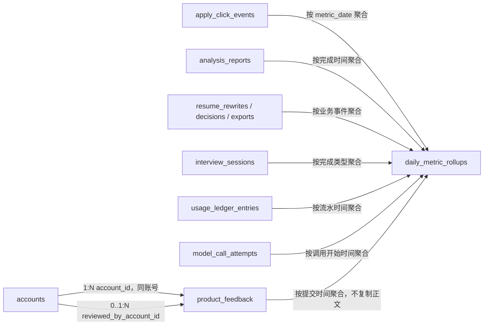

# Purslyx 统计数据库设计

| 项 | 内容 |
| --- | --- |
| 模块 | 统计 |
| 版本 | v0.1 |
| 更新日期 | 2026-09-14 |
| 状态 | 待评审；模型与迁移尚未实现 |
| 范围 | 用户主动产品反馈、明确付费意愿、管理端全站日聚合；个人今日数据从业务事件实时读取 |
| 依赖模块 | 用户、匹配池、简历、面试、任务、用量、日志 |
| 需求/架构依据 | [需求说明 F11、F13、F14 与 AC14、AC21、AC22](../../01-product/specs/需求说明.md)、[技术架构第 6 章](../技术架构.md)、[数据库设计规范](数据库设计规范.md) |

## 1. 设计目标与边界

- 求职账号“今日去投递点击数”直接查询 `apply_click_events`，招聘账号“今日候选人分析数”直接查询可用招聘报告；用户页面不依赖可能延迟的日聚合。
- 管理端按 `Asia/Shanghai` 自然日、固定注册身份与适用功能查看注册、活跃、成功/失败/重试、次数、成本、去投递点击、采用、导出、面试与产品反馈。
- 去投递点击只代表 Purslyx 服务端成功记录并发起跳转，不称已投递，不构造平台回复、面试或 Offer 数据；首版没有外部平台投递回执表。
- 产品反馈只保存用户主动提交的内容、明确付费意愿和可选上下文。按钮点击、生成结果或打开页面不能推断为购买意愿。
- 日聚合可从业务事实重算，记录聚合规则版本与水位；聚合表不复制简历、JD、回答、产品反馈正文或日志详情。

## 2. 实体关系

图中聚合箭头表示统计读取，不是数据库引用或外键。`daily_metric_rollups` 为全局聚合表，不保存用户 ID。

## 3. 表结构

### product_feedback

| 字段名 | 数据类型 | 可空 | 默认值 | 约束/索引 | 说明 |
| --- | --- | --- | --- | --- | --- |
| id | BIGINT | 否 | GENERATED ALWAYS AS IDENTITY | PK | 用户主动反馈内部 ID |
| public_id | UUID | 否 | gen_random_uuid() | UK | 用户/管理端详情标识 |
| account_id | BIGINT | 否 | — | Index | 提交账号 ID |
| registration_role_snapshot | SMALLINT | 否 | — | CK: `registration_role_snapshot IN (1,2)` | 提交时固定身份 |
| feedback_type | SMALLINT | 否 | — | CK: `feedback_type IN (1,2,3,4)` | 体验问题、建议、付费意愿或其他 |
| context_type | SMALLINT | 否 | 1 | CK: `context_type IN (1,2,3,4,5)` | 全局、分析、改写、面试或导出 |
| context_resource_id | BIGINT | 是 | — | Index | 可选受控业务资源内部 ID |
| rating | SMALLINT | 是 | — | CK: `rating BETWEEN 1 AND 5` | 可选 1—5 分体验评分 |
| payment_intent | SMALLINT | 否 | 4 | CK: `payment_intent IN (1,2,3,4)` | 愿意、视价格而定、不愿意或未回答 |
| content | TEXT | 是 | — | — | 用户主动填写正文，不能进入通用日志 |
| status | SMALLINT | 否 | 1 | CK: `status IN (1,2,3)` | 待查看、已查看或已关闭 |
| reviewed_by_account_id | BIGINT | 是 | — | Index | 引用有反馈查看权限的管理员账号 |
| reviewed_at | TIMESTAMPTZ | 是 | — | — | 首次查看时间点 |
| created_at | TIMESTAMPTZ | 否 | now() | Index | 提交时间点 |
| updated_at | TIMESTAMPTZ | 否 | now() | — | 状态更新时间点 |
| deleted_at | TIMESTAMPTZ | 是 | — | Index | 用户删除后正文立即不可访问 |
| content_cleared_at | TIMESTAMPTZ | 是 | — | — | 反馈正文完成清理的时间点 |

### daily_metric_rollups

| 字段名 | 数据类型 | 可空 | 默认值 | 约束/索引 | 说明 |
| --- | --- | --- | --- | --- | --- |
| id | BIGINT | 否 | GENERATED ALWAYS AS IDENTITY | PK | 全站日聚合行 ID |
| metric_date | DATE | 否 | — | UK | `Asia/Shanghai` 业务日期 |
| registration_role | SMALLINT | 否 | 0 | CK: `registration_role IN (0,1,2)` | 全部、求职或招聘维度 |
| feature | SMALLINT | 否 | 0 | CK: `feature IN (0,1,2,3,4)` | 全部、分析、改写、面试或导入 |
| registered_account_count | BIGINT | 否 | 0 | CK: `registered_account_count >= 0` | 当日完成注册账号数 |
| active_account_count | BIGINT | 否 | 0 | CK: `active_account_count >= 0` | 当日发生受认可核心操作的去重账号数 |
| task_succeeded_count | BIGINT | 否 | 0 | CK: `task_succeeded_count >= 0` | 成功任务数 |
| task_failed_count | BIGINT | 否 | 0 | CK: `task_failed_count >= 0` | 最终失败任务数 |
| task_retry_count | BIGINT | 否 | 0 | CK: `task_retry_count >= 0` | 实际重试尝试数 |
| usage_settled_count | BIGINT | 否 | 0 | CK: `usage_settled_count >= 0` | 成功结算的用户功能次数 |
| apply_click_count | BIGINT | 否 | 0 | CK: `apply_click_count >= 0` | 服务端去投递点击数 |
| rewrite_adopted_segment_count | BIGINT | 否 | 0 | CK: `rewrite_adopted_segment_count >= 0` | 最新决策为采用的段落数 |
| resume_export_count | BIGINT | 否 | 0 | CK: `resume_export_count >= 0` | 成功 PDF 导出数 |
| interview_completed_count | BIGINT | 否 | 0 | CK: `interview_completed_count >= 0` | 完整完成面试数 |
| interview_ended_early_count | BIGINT | 否 | 0 | CK: `interview_ended_early_count >= 0` | 提前结束且有汇总的面试数 |
| feedback_count | BIGINT | 否 | 0 | CK: `feedback_count >= 0` | 用户主动产品反馈数 |
| payment_intent_positive_count | BIGINT | 否 | 0 | CK: `payment_intent_positive_count >= 0` | 明确愿意付费反馈数 |
| repeat_7d_observed_count | BIGINT | 否 | 0 | CK: `repeat_7d_observed_count >= 0` | 已观察满 7 天且再次使用账号数 |
| repeat_7d_pending_count | BIGINT | 否 | 0 | CK: `repeat_7d_pending_count >= 0` | 尚未观察满周期的账号数 |
| duration_sample_count | BIGINT | 否 | 0 | CK: `duration_sample_count >= 0` | 耗时样本数 |
| duration_avg_ms | NUMERIC(20,3) | 是 | — | CK: `duration_avg_ms >= 0` | 任务平均耗时 |
| duration_p95_ms | NUMERIC(20,3) | 是 | — | CK: `duration_p95_ms >= 0` | 当日同维度 P95，不能跨行再平均 |
| known_cost | NUMERIC(20,8) | 否 | 0 | CK: `known_cost >= 0` | 已知估算成本合计 |
| unknown_cost_count | BIGINT | 否 | 0 | CK: `unknown_cost_count >= 0` | 成本待核实调用数 |
| currency | CHAR(3) | 否 | 'USD' | — | 成本币种 |
| rollup_rule_version | VARCHAR(32) | 否 | — | UK | 指标口径与来源查询版本 |
| source_watermark | TIMESTAMPTZ | 否 | — | — | 本次统计覆盖的源数据截止时间点 |
| revision | BIGINT | 否 | 1 | CK: `revision >= 1` | 聚合行重算版本 |
| calculated_at | TIMESTAMPTZ | 否 | now() | — | 最近计算完成时间点 |
| created_at | TIMESTAMPTZ | 否 | now() | — | 首次创建时间点 |

## 4. 索引清单

| 表名 | 索引名 | 字段或表达式 | 类型 | 条件与用途 |
| --- | --- | --- | --- | --- |
| product_feedback | pk_product_feedback | `id` | Primary | 主键 |
| product_feedback | uq_product_feedback_public_id | `public_id` | Unique | 详情定位 |
| product_feedback | idx_product_feedback_account_created | `account_id, created_at DESC` | B-tree partial | `deleted_at IS NULL`；用户反馈历史与账号巡检 |
| product_feedback | idx_product_feedback_admin_list | `status, feedback_type, created_at DESC` | B-tree partial | `deleted_at IS NULL`；授权管理列表 |
| product_feedback | idx_product_feedback_context | `account_id, context_type, context_resource_id` | B-tree partial | `context_resource_id IS NOT NULL`；上下文引用校验与巡检 |
| product_feedback | idx_product_feedback_reviewer | `reviewed_by_account_id, reviewed_at DESC` | B-tree partial | `reviewed_by_account_id IS NOT NULL`；管理员引用巡检 |
| product_feedback | idx_product_feedback_deleted | `deleted_at` | B-tree partial | `deleted_at IS NOT NULL`；正文清理 |
| daily_metric_rollups | pk_daily_metric_rollups | `id` | Primary | 主键 |
| daily_metric_rollups | uq_daily_metric_rollups_scope | `metric_date, registration_role, feature, rollup_rule_version` | Unique | 同日期、身份、功能和规则版本唯一 |
| daily_metric_rollups | idx_daily_metric_rollups_scope_date | `registration_role, feature, metric_date DESC` | B-tree | 管理端趋势查询 |
| daily_metric_rollups | idx_daily_metric_rollups_calculated | `calculated_at` | B-tree | 聚合陈旧度监测 |

## 5. 检查约束清单

| 表名 | 约束名 | 表达式 | 说明 |
| --- | --- | --- | --- |
| product_feedback | ck_product_feedback_role | `registration_role_snapshot IN (1,2)` | 固定身份快照合法 |
| product_feedback | ck_product_feedback_type | `feedback_type IN (1,2,3,4)` | 反馈类型合法 |
| product_feedback | ck_product_feedback_context | `context_type IN (1,2,3,4,5)` | 上下文类型合法 |
| product_feedback | ck_product_feedback_context_ref | `(context_type = 1 AND context_resource_id IS NULL) OR (context_type <> 1 AND context_resource_id IS NOT NULL)` | 全局反馈无资源，业务反馈必须有资源 |
| product_feedback | ck_product_feedback_rating | `rating IS NULL OR rating BETWEEN 1 AND 5` | 评分范围合法 |
| product_feedback | ck_product_feedback_payment | `payment_intent IN (1,2,3,4)` | 付费意愿合法 |
| product_feedback | ck_product_feedback_status | `status IN (1,2,3)` | 处理状态合法 |
| product_feedback | ck_product_feedback_review | `(reviewed_at IS NULL AND reviewed_by_account_id IS NULL) OR (reviewed_at IS NOT NULL AND reviewed_by_account_id IS NOT NULL)` | 查看人和时间同时出现 |
| product_feedback | ck_product_feedback_content_cleanup | `content_cleared_at IS NULL OR content IS NULL` | 标记清理完成后反馈正文必须为空 |
| daily_metric_rollups | ck_daily_metrics_role | `registration_role IN (0,1,2)` | 全部/求职/招聘维度合法 |
| daily_metric_rollups | ck_daily_metrics_feature | `feature IN (0,1,2,3,4)` | 功能维度合法 |
| daily_metric_rollups | ck_daily_metrics_counts | `registered_account_count >= 0 AND active_account_count >= 0 AND task_succeeded_count >= 0 AND task_failed_count >= 0 AND task_retry_count >= 0 AND usage_settled_count >= 0 AND apply_click_count >= 0 AND rewrite_adopted_segment_count >= 0 AND resume_export_count >= 0 AND interview_completed_count >= 0 AND interview_ended_early_count >= 0 AND feedback_count >= 0 AND payment_intent_positive_count >= 0 AND repeat_7d_observed_count >= 0 AND repeat_7d_pending_count >= 0 AND duration_sample_count >= 0 AND unknown_cost_count >= 0` | 所有计数非负 |
| daily_metric_rollups | ck_daily_metrics_duration | `(duration_sample_count = 0 AND duration_avg_ms IS NULL AND duration_p95_ms IS NULL) OR (duration_sample_count > 0 AND duration_avg_ms >= 0 AND duration_p95_ms >= 0)` | 耗时样本和值一致 |
| daily_metric_rollups | ck_daily_metrics_cost | `known_cost >= 0` | 已知成本非负 |
| daily_metric_rollups | ck_daily_metrics_revision | `revision >= 1` | 聚合修订版本为正数 |

## 6. 枚举与版本字典

| 表.字段 | 数据库值 | API 名称 | 含义 | 备注 |
| --- | --- | --- | --- | --- |
| product_feedback.feedback_type | 1 | issue | 体验问题 | 用户主动提交 |
| product_feedback.feedback_type | 2 | suggestion | 产品建议 | 用户主动提交 |
| product_feedback.feedback_type | 3 | payment_intent | 付费意愿 | 以明确选择为准 |
| product_feedback.feedback_type | 4 | other | 其他反馈 | 用户主动提交 |
| product_feedback.context_type | 1 | general | 全局反馈 | 无业务资源引用 |
| product_feedback.context_type | 2 | analysis | 分析上下文 | 引用报告资源 |
| product_feedback.context_type | 3 | rewrite | 改写上下文 | 引用改写资源 |
| product_feedback.context_type | 4 | interview | 面试上下文 | 引用会话资源 |
| product_feedback.context_type | 5 | export | 导出上下文 | 引用导出资源 |
| product_feedback.payment_intent | 1 | willing | 明确愿意付费 | 只能来自用户选择 |
| product_feedback.payment_intent | 2 | depends_on_price | 视价格而定 | 不能算明确愿意 |
| product_feedback.payment_intent | 3 | unwilling | 明确不愿意 | 保留真实反馈 |
| product_feedback.payment_intent | 4 | not_answered | 未回答 | 不从行为推断 |
| product_feedback.status | 1 | new | 待查看 | 管理端未处理 |
| product_feedback.status | 2 | reviewed | 已查看 | 记录查看人和时间 |
| product_feedback.status | 3 | closed | 已关闭 | 状态变化写审计 |
| daily_metric_rollups.registration_role | 0 | all | 全部身份 | 全站合计行 |
| daily_metric_rollups.registration_role | 1 | seeker | 求职账号 | 固定注册身份 |
| daily_metric_rollups.registration_role | 2 | recruiter | 招聘账号 | 固定注册身份 |
| daily_metric_rollups.feature | 0 | all | 全部功能 | 全站/身份合计行 |
| daily_metric_rollups.feature | 1 | analysis | 分析 | 两端适用 |
| daily_metric_rollups.feature | 2 | rewrite | 改写 | 求职端适用 |
| daily_metric_rollups.feature | 3 | interview | 面试 | 求职端适用 |
| daily_metric_rollups.feature | 4 | import | 导入 | 免费但可能产生模型成本 |

`rollup_rule_version` 首版为 `daily-metrics-v1`，同时冻结活跃、成功、采用、完整面试、7 日再次使用和耗时的 SQL 口径。规则变更以新版本重算并保留旧版本到报表切换完成，不能静默改写历史。产品反馈没有通用 JSONB；正文按私有内容保护。

## 7. 事务与生命周期

| 操作/触发 | 事务内校验与写入 | 事务外动作/补偿 | 幂等与失败结果 |
| --- | --- | --- | --- |
| 提交产品反馈 | 从会话取得账号和固定身份；有上下文时校验资源归属与未删除；插入反馈 | 可发送内部通知，不含正文 | 客户端请求幂等由 API 请求层处理；失败不伪报已提交 |
| 查看/关闭反馈 | 校验反馈查看权限和正文访问范围；锁定反馈，写查看人/状态并追加管理审计 | 无 | 重复查看返回当前状态 |
| 删除反馈 | 校验提交账号，写删除时间并阻断正文读取 | 异步清理正文并写 `content_cleared_at`，同时清理相关导出文件 | 无正文计数可按保留规则继续存在 |
| 个人今日统计 | 在同一数据库快照中按账号和上海日期查询点击事件或可用招聘报告 | 无 | 返回事实时间范围与口径，不读取日聚合 |
| 生成日聚合 | 取得固定水位，按规则版本从业务源表重算日期/身份/功能各行，原子 upsert 并递增版本 | 定时任务失败告警并重试 | 同规则和水位重算结果一致；不累加旧聚合 |
| 补算迟到事件 | 识别受影响业务日期，从源事实全量重算对应范围 | 清缓存 | 不以增量猜测 P95，避免重复计数 |
| 查询管理概况 | 校验 `admin.stats.read`；只读取已完成聚合和水位 | 页面显示数据截止时间 | 不向普通账号或无权角色返回 |

## 8. 关键设计决策

- 个人今日数字直接查源事件，保证用户点击后立即可见；管理趋势读日聚合，降低跨多张流水表的查询成本。
- 日聚合采用宽表保存确定指标，减少任意 `metric_key/value` 带来的单位和口径混乱。新增指标需要迁移和规则评审。
- P95 必须从当天原始样本重算，不能对小时或旧聚合的 P95 求平均；迟到数据触发整日范围重算。
- 明确区分去投递点击与产品反馈。首版没有平台投递、回复或进度事实，统计页面也不能出现这些名称。
- 反馈正文保留在受限业务表；日聚合只保存数量，管理日志只保存反馈 ID 和状态变化。

## 9. 待讨论项

- “活跃账号”和“7 日再次使用”的首版事件集合需要在埋点实现前冻结到 `daily-metrics-v1`。
- 管理概况默认展示天数、聚合刷新频率和数据延迟提示需结合目标主机负载确定。
- 产品反馈正文、已删除反馈和统计规则旧版本的具体保留期限需在上线隐私与运营配置中确认。
