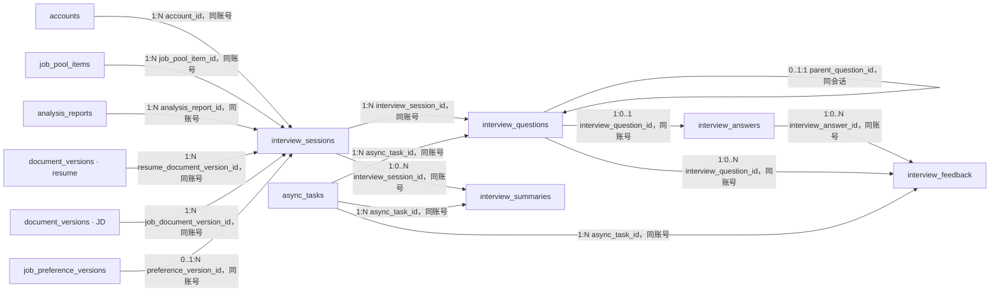

# Purslyx 面试数据库设计

| 项 | 内容 |
| --- | --- |
| 模块 | 面试 |
| 版本 | v0.2 |
| 更新日期 | 2026-09-15 |
| 状态 | 已评审 |
| 范围 | 求职者文字面试会话、3 个主问题、每题一次追问、回答、逐轮反馈、中断恢复与结束汇总 |
| 依赖模块 | 用户、简历、匹配池、任务、用量 |
| 需求/架构依据 | [需求说明 F08 与 AC06](../../01-product/specs/需求说明.md)、[技术架构](../技术架构.md)、[数据库设计规范](数据库设计规范.md) |

## 1. 设计目标与边界

- 首版一场面试固定 3 个主问题，每个主问题最多生成 1 个追问。问题必须关联本次 JD、简历、报告结论或缺口，不能对未回答内容编造反馈。
- 开场任务一次生成并保存 3 个主问题；保存成功后结算 1 场。后续回答、反馈、追问、汇总、中断恢复和任务重试都不再次扣面试次数。
- 会话等待用户回答时不占 Worker 租约。每次需要模型处理的回答创建短任务，状态和检查点由数据库恢复，旧执行代次不能覆盖新结果。
- 会话绑定开始时的简历、JD、求职期望和分析报告版本；用户之后修改资料不会暗中改变已有问题或汇总。
- 提前结束与完整结束分开记录；汇总明确已完成主问题、追问和未回答部分。删除会话后立即阻断问题、回答、反馈、汇总和检查点访问。

## 2. 实体关系

全部连线均为应用层校验的逻辑引用，不创建数据库外键。自引用 `parent_question_id` 只允许同一会话的主问题作为父问题。

## 3. 表结构

### 表目录与中文备注

| 物理表名 | 中文表名（数据库 COMMENT） | 用途备注 |
| --- | --- | --- |
| `interview_sessions` | 面试会话表 | 保存一场多轮面试的冻结输入、进度与状态。 |
| `interview_questions` | 面试问题表 | 保存主问题、追问、显示顺序与生成任务。 |
| `interview_answers` | 面试回答表 | 保存用户对每道问题的一次最终回答。 |
| `interview_feedback` | 单题反馈表 | 保存回答后的结构化反馈及生成任务。 |
| `interview_summaries` | 面试总结表 | 保存完成或提前结束后生成的版本化总结。 |

### interview_sessions

| 字段名 | 数据类型 | 可空 | 默认值 | 约束/索引 | 说明 |
| --- | --- | --- | --- | --- | --- |
| id | BIGINT | 否 | GENERATED ALWAYS AS IDENTITY | PK | 面试会话内部 ID |
| public_id | UUID | 否 | gen_random_uuid() | UK | 会话详情路径标识 |
| account_id | BIGINT | 否 | — | Index | 所属求职账号 ID |
| job_pool_item_id | BIGINT | 否 | — | Index | 引用私有 `job_pool_items.id` |
| analysis_report_id | BIGINT | 否 | — | — | 引用可查看 `analysis_reports.id` |
| resume_document_version_id | BIGINT | 否 | — | — | 开场时冻结的简历版本 |
| job_document_version_id | BIGINT | 否 | — | — | 开场时冻结的 JD 版本 |
| preference_version_id | BIGINT | 是 | — | — | 开场时冻结的求职期望版本 |
| opening_task_id | BIGINT | 否 | — | UK | 引用生成 3 个主问题的 `async_tasks.id` |
| status | SMALLINT | 否 | 1 | CK: `status IN (1,2,3,4,5,6)` | 开场中、等待回答、处理中、完成、提前结束或失败 |
| rule_version | VARCHAR(32) | 否 | — | — | 面试轮次与完成判定规则版本 |
| prompt_version | VARCHAR(32) | 否 | — | — | 开场问题提示词版本 |
| current_main_no | SMALLINT | 是 | — | CK: `current_main_no BETWEEN 1 AND 3` | 当前主问题序号 |
| answered_main_count | SMALLINT | 否 | 0 | CK: `answered_main_count BETWEEN 0 AND 3` | 已提交回答的主问题数 |
| revision | BIGINT | 否 | 1 | CK: `revision >= 1` | 会话状态乐观锁版本 |
| started_at | TIMESTAMPTZ | 是 | — | — | 3 个开场问题保存并结算后的时间点 |
| completed_at | TIMESTAMPTZ | 是 | — | — | 完成或提前结束时间点 |
| created_at | TIMESTAMPTZ | 否 | now() | Index | 创建时间点 |
| updated_at | TIMESTAMPTZ | 否 | now() | — | 最后状态更新时间点 |
| deleted_at | TIMESTAMPTZ | 是 | — | — | 删除后会话全部内容立即不可访问 |

### interview_questions

| 字段名 | 数据类型 | 可空 | 默认值 | 约束/索引 | 说明 |
| --- | --- | --- | --- | --- | --- |
| id | BIGINT | 否 | GENERATED ALWAYS AS IDENTITY | PK | 面试问题内部 ID |
| public_id | UUID | 否 | gen_random_uuid() | UK | 回答接口使用的随机标识 |
| account_id | BIGINT | 否 | — | Index | 所属账号 ID |
| interview_session_id | BIGINT | 否 | — | Index | 引用 `interview_sessions.id` |
| parent_question_id | BIGINT | 是 | — | Index | 追问引用同会话主问题 |
| async_task_id | BIGINT | 否 | — | Index | 引用生成该问题的任务；主问题共享开场任务 |
| question_type | SMALLINT | 否 | — | CK: `question_type IN (1,2)` | 主问题或追问 |
| main_no | SMALLINT | 否 | — | CK: `main_no BETWEEN 1 AND 3` | 所属主问题序号 |
| sequence_no | SMALLINT | 否 | — | CK: `sequence_no BETWEEN 1 AND 6` | 会话内显示顺序 |
| question_text | TEXT | 是 | — | — | 用户可读问题正文；会话删除清理后置空 |
| basis | JSONB | 是 | — | — | `interview-question-basis-v1` 校验后的依据；清理后置空 |
| basis_schema_version | VARCHAR(32) | 否 | — | — | 问题依据 Schema 版本 |
| status | SMALLINT | 否 | 1 | CK: `status IN (1,2,3)` | 待回答、已回答或已跳过 |
| content_cleared_at | TIMESTAMPTZ | 是 | — | — | 问题正文和依据完成清理的时间点 |
| created_at | TIMESTAMPTZ | 否 | now() | — | 问题保存时间点 |

### interview_answers

| 字段名 | 数据类型 | 可空 | 默认值 | 约束/索引 | 说明 |
| --- | --- | --- | --- | --- | --- |
| id | BIGINT | 否 | GENERATED ALWAYS AS IDENTITY | PK | 已提交回答 ID |
| public_id | UUID | 否 | gen_random_uuid() | UK | 页面展示和恢复标识 |
| account_id | BIGINT | 否 | — | Index | 所属账号 ID |
| interview_session_id | BIGINT | 否 | — | Index | 引用 `interview_sessions.id` |
| interview_question_id | BIGINT | 否 | — | UK | 引用 `interview_questions.id`；首版每题一次最终提交 |
| answer_text | TEXT | 是 | — | — | 用户最终提交回答正文；会话删除清理后置空 |
| client_request_key | UUID | 否 | — | UK | 重复提交幂等键 |
| submitted_at | TIMESTAMPTZ | 否 | now() | — | 回答提交时间点 |
| content_cleared_at | TIMESTAMPTZ | 是 | — | — | 回答正文完成清理的时间点 |
| created_at | TIMESTAMPTZ | 否 | now() | — | 记录创建时间点 |

### interview_feedback

| 字段名 | 数据类型 | 可空 | 默认值 | 约束/索引 | 说明 |
| --- | --- | --- | --- | --- | --- |
| id | BIGINT | 否 | GENERATED ALWAYS AS IDENTITY | PK | 单轮反馈 ID |
| public_id | UUID | 否 | gen_random_uuid() | UK | 页面定位标识 |
| account_id | BIGINT | 否 | — | Index | 所属账号 ID |
| interview_session_id | BIGINT | 否 | — | Index | 引用 `interview_sessions.id` |
| interview_question_id | BIGINT | 否 | — | — | 引用本轮 `interview_questions.id` |
| interview_answer_id | BIGINT | 否 | — | — | 引用本轮 `interview_answers.id` |
| async_task_id | BIGINT | 否 | — | UK | 引用本轮反馈任务 |
| status | SMALLINT | 否 | 1 | CK: `status IN (1,2,3)` | 生成中、可查看或失败 |
| feedback_content | JSONB | 是 | — | — | `interview-feedback-v4` 校验后的五维评价、原文依据、STAR 诊断与改进方向 |
| schema_version | VARCHAR(32) | 否 | — | — | 反馈 Schema 版本 |
| prompt_version | VARCHAR(32) | 否 | — | — | 反馈提示词版本 |
| completed_at | TIMESTAMPTZ | 是 | — | — | 反馈可读或失败时间点 |
| content_cleared_at | TIMESTAMPTZ | 是 | — | — | 反馈正文完成清理的时间点 |
| created_at | TIMESTAMPTZ | 否 | now() | — | 创建时间点 |

### interview_summaries

| 字段名 | 数据类型 | 可空 | 默认值 | 约束/索引 | 说明 |
| --- | --- | --- | --- | --- | --- |
| id | BIGINT | 否 | GENERATED ALWAYS AS IDENTITY | PK | 面试汇总版本 ID |
| public_id | UUID | 否 | gen_random_uuid() | UK | 汇总详情标识 |
| account_id | BIGINT | 否 | — | — | 所属账号 ID |
| interview_session_id | BIGINT | 否 | — | Index | 引用 `interview_sessions.id` |
| async_task_id | BIGINT | 否 | — | UK | 引用汇总任务 |
| version_no | BIGINT | 否 | — | UK, CK: `version_no >= 1` | 同会话汇总递增版本号 |
| status | SMALLINT | 否 | 1 | CK: `status IN (1,2,3)` | 生成中、可查看或失败 |
| completion_type | SMALLINT | 否 | — | CK: `completion_type IN (1,2)` | 完整完成或提前结束 |
| answered_main_count | SMALLINT | 否 | — | CK: `answered_main_count BETWEEN 0 AND 3` | 汇总时已回答主问题数 |
| answered_followup_count | SMALLINT | 否 | — | CK: `answered_followup_count BETWEEN 0 AND 3` | 汇总时已回答追问数 |
| summary_content | JSONB | 是 | — | — | `interview-summary-v2` 校验后的优势、遗漏、五维练习指数和未完成项 |
| schema_version | VARCHAR(32) | 否 | — | — | 汇总 Schema 版本 |
| prompt_version | VARCHAR(32) | 否 | — | — | 汇总提示词版本 |
| completed_at | TIMESTAMPTZ | 是 | — | — | 汇总可读或失败时间点 |
| content_cleared_at | TIMESTAMPTZ | 是 | — | — | 汇总正文完成清理的时间点 |
| created_at | TIMESTAMPTZ | 否 | now() | — | 创建时间点 |

## 4. 索引清单

| 表名 | 索引名 | 字段或表达式 | 类型 | 条件与用途 |
| --- | --- | --- | --- | --- |
| interview_sessions | pk_interview_sessions | `id` | Primary | 主键 |
| interview_sessions | uq_interview_sessions_public_id | `public_id` | Unique | 会话详情定位 |
| interview_sessions | uq_interview_sessions_opening_task | `opening_task_id` | Unique | 一次开场任务只创建一场并覆盖任务引用 |
| interview_sessions | idx_interview_sessions_account_status | `account_id, status, updated_at DESC` | B-tree partial | `deleted_at IS NULL`；会话列表与恢复 |
| interview_sessions | idx_interview_sessions_job | `account_id, job_pool_item_id, created_at DESC` | B-tree partial | `deleted_at IS NULL`；岗位详情面试列表 |
| interview_questions | pk_interview_questions | `id` | Primary | 主键 |
| interview_questions | uq_interview_questions_public_id | `public_id` | Unique | 回答接口定位 |
| interview_questions | uq_interview_questions_main | `interview_session_id, main_no` | Unique partial | `question_type = 1`；每场每个主问题序号唯一 |
| interview_questions | uq_interview_questions_followup | `parent_question_id` | Unique partial | `question_type = 2`；每个主问题最多一次追问 |
| interview_questions | uq_interview_questions_sequence | `interview_session_id, sequence_no` | Unique | 会话显示顺序唯一并覆盖父引用 |
| interview_questions | idx_interview_questions_task | `account_id, async_task_id` | B-tree | 生成任务回写问题 |
| interview_answers | pk_interview_answers | `id` | Primary | 主键 |
| interview_answers | uq_interview_answers_public_id | `public_id` | Unique | 页面定位 |
| interview_answers | uq_interview_answers_question | `interview_question_id` | Unique | 每题一次最终提交并覆盖问题引用 |
| interview_answers | uq_interview_answers_request | `account_id, client_request_key` | Unique | 回答提交幂等并覆盖账号引用 |
| interview_answers | idx_interview_answers_session | `account_id, interview_session_id, submitted_at` | B-tree | 会话详情按顺序读取回答 |
| interview_feedback | pk_interview_feedback | `id` | Primary | 主键 |
| interview_feedback | uq_interview_feedback_public_id | `public_id` | Unique | 页面定位 |
| interview_feedback | uq_interview_feedback_task | `async_task_id` | Unique | 一任务一反馈并覆盖任务引用 |
| interview_feedback | idx_interview_feedback_session | `account_id, interview_session_id, created_at` | B-tree | 会话详情按顺序读取单题反馈 |
| interview_summaries | pk_interview_summaries | `id` | Primary | 主键 |
| interview_summaries | uq_interview_summaries_public_id | `public_id` | Unique | 汇总定位 |
| interview_summaries | uq_interview_summaries_task | `async_task_id` | Unique | 一任务一汇总并覆盖任务引用 |
| interview_summaries | uq_interview_summaries_number | `interview_session_id, version_no` | Unique | 汇总版本唯一并覆盖会话引用 |

## 5. 检查约束清单

| 表名 | 约束名 | 表达式 | 说明 |
| --- | --- | --- | --- |
| interview_sessions | ck_interview_sessions_status | `status IN (1,2,3,4,5,6)` | 会话状态合法 |
| interview_sessions | ck_interview_sessions_current_main | `current_main_no IS NULL OR current_main_no BETWEEN 1 AND 3` | 当前主问题范围合法 |
| interview_sessions | ck_interview_sessions_answered | `answered_main_count BETWEEN 0 AND 3` | 已回答主问题数量合法 |
| interview_sessions | ck_interview_sessions_revision | `revision >= 1` | 乐观锁版本为正数 |
| interview_sessions | ck_interview_sessions_started | `(status = 1 AND started_at IS NULL) OR (status <> 1 AND started_at IS NOT NULL)` | 离开开场状态必须已有开场时间 |
| interview_sessions | ck_interview_sessions_completed | `(status IN (4,5) AND completed_at IS NOT NULL) OR (status NOT IN (4,5) AND completed_at IS NULL)` | 结束状态与时间一致 |
| interview_questions | ck_interview_questions_type | `question_type IN (1,2)` | 主问题或追问 |
| interview_questions | ck_interview_questions_main_no | `main_no BETWEEN 1 AND 3` | 主问题编号合法 |
| interview_questions | ck_interview_questions_sequence | `sequence_no BETWEEN 1 AND 6` | 最多 3 主问题和 3 追问 |
| interview_questions | ck_interview_questions_parent | `(question_type = 1 AND parent_question_id IS NULL) OR (question_type = 2 AND parent_question_id IS NOT NULL)` | 追问必须有父主问题 |
| interview_questions | ck_interview_questions_status | `status IN (1,2,3)` | 问题状态合法 |
| interview_questions | ck_interview_questions_content | `(question_text IS NULL) = (basis IS NULL) AND (question_text IS NULL) = (content_cleared_at IS NOT NULL)` | 问题正文与依据同时存在或同时清理 |
| interview_answers | ck_interview_answers_content | `(answer_text IS NULL) = (content_cleared_at IS NOT NULL)` | 回答正文清理状态一致 |
| interview_feedback | ck_interview_feedback_status | `status IN (1,2,3)` | 反馈状态合法 |
| interview_feedback | ck_interview_feedback_content | `(content_cleared_at IS NOT NULL AND feedback_content IS NULL) OR (content_cleared_at IS NULL AND ((status = 2 AND feedback_content IS NOT NULL AND completed_at IS NOT NULL) OR status <> 2))` | 未清理的可查看反馈必须完整 |
| interview_summaries | ck_interview_summaries_number | `version_no >= 1` | 汇总版本号为正数 |
| interview_summaries | ck_interview_summaries_status | `status IN (1,2,3)` | 汇总状态合法 |
| interview_summaries | ck_interview_summaries_completion | `completion_type IN (1,2)` | 完整或提前结束 |
| interview_summaries | ck_interview_summaries_counts | `answered_main_count BETWEEN 0 AND 3 AND answered_followup_count BETWEEN 0 AND 3` | 回答数量合法 |
| interview_summaries | ck_interview_summaries_content | `(content_cleared_at IS NOT NULL AND summary_content IS NULL) OR (content_cleared_at IS NULL AND ((status = 2 AND summary_content IS NOT NULL AND completed_at IS NOT NULL) OR status <> 2))` | 未清理的可查看汇总必须完整 |

## 6. 枚举与版本字典

| 表.字段 | 数据库值 | API 名称 | 含义 | 备注 |
| --- | --- | --- | --- | --- |
| interview_sessions.status | 1 | opening | 正在生成 3 个开场问题 | 尚未结算场次 |
| interview_sessions.status | 2 | awaiting_answer | 等待用户回答 | 不占 Worker |
| interview_sessions.status | 3 | processing | 处理回答、追问或汇总 | 仅短任务占 Worker |
| interview_sessions.status | 4 | completed | 完成 3 个主问题并取得汇总 | 计入完整完成率 |
| interview_sessions.status | 5 | ended_early | 提前结束并取得汇总 | 与完整完成分开统计 |
| interview_sessions.status | 6 | opening_failed | 开场失败 | 释放预留场次 |
| interview_questions.question_type | 1 | main | 主问题 | 每场恰好 3 个 |
| interview_questions.question_type | 2 | followup | 追问 | 每个主问题最多 1 个 |
| interview_questions.status | 1 | awaiting_answer | 待回答 | 可以继续会话 |
| interview_questions.status | 2 | answered | 已回答 | 有唯一最终回答 |
| interview_questions.status | 3 | skipped | 已跳过 | 不得编造反馈 |
| interview_feedback.status | 1 | generating | 反馈生成中 | 短任务运行 |
| interview_feedback.status | 2 | available | 反馈可查看 | 必须有完整结构化内容 |
| interview_feedback.status | 3 | failed | 反馈失败 | 可恢复原任务 |
| interview_summaries.status | 1 | generating | 汇总生成中 | 短任务运行 |
| interview_summaries.status | 2 | available | 汇总可查看 | 必须明确未完成项 |
| interview_summaries.status | 3 | failed | 汇总失败 | 可恢复原任务 |
| interview_summaries.completion_type | 1 | full | 完整完成 | 3 个主问题均回答 |
| interview_summaries.completion_type | 2 | early | 提前结束 | 只总结已有回答 |

问题依据、反馈与汇总分别使用问题依据版本、`interview-feedback-v4` 和 `interview-summary-v2`。`interview-rubric-v1` 固定五个等权维度及 `strong=100`、`partial=50`、`missing=0` 的换算；一场仍固定 3 个主问题、每题最多一次追问。提示词升级只用于新生成记录，旧记录不回填；任务与模型调用版本从任务模块追溯。

## 7. 事务与生命周期

| 操作/触发 | 事务内校验与写入 | 事务外动作/补偿 | 幂等与失败结果 |
| --- | --- | --- | --- |
| 发起面试 | 校验求职身份、岗位、报告和输入版本归属且未删除；锁定面试余额，预留 1 场，创建会话、开场任务和 outbox | Worker 生成 3 个主问题 | 同幂等键返回原会话；尚未开场失败则释放预留 |
| 开场成功 | 锁定任务、会话、来源父对象和预留；校验当前代次，一次写入 3 个主问题并将会话置等待回答，结算 1 场 | 页面通知可重试 | 三个主问题必须原子可见；同任务只结算一次 |
| 提交回答 | 锁定会话与当前问题，校验状态、顺序和 `revision`；插入唯一回答，标问题已回答，创建反馈任务/outbox并置处理中 | Worker 生成反馈并决定是否生成一次追问 | 请求键唯一；重复提交返回原回答，不能重复计次 |
| 保存反馈或追问 | 校验任务代次、会话未删除、问题与回答同会话；保存反馈；需要时保存唯一追问，否则推进下一主问题 | 页面轮询/通知 | 父问题部分唯一阻止第二次追问；旧执行丢弃 |
| 恢复会话 | 读取会话、已保存问题/回答/反馈与任务状态，不创建新场次 | 租约过期任务由任务模块补投 | 刷新或换设备返回同一进度 |
| 正常完成 | 第 3 个主问题处理后创建汇总任务；汇总可读时将会话标完成 | Worker 生成基于实际回答的汇总 | 只有 3 个主问题回答后可标完整完成 |
| 提前结束 | 锁定会话，将未回答问题标跳过并创建提前结束汇总任务 | Worker 仅总结已有回答并列未完成项 | 重复结束返回当前状态；不退还已开场场次 |
| 中途任务失败 | 会话回到可恢复状态并保留原任务、回答与检查点 | 用户重试原任务或调度器补投 | 恢复不再次扣场次；修改输入另建新会话 |
| 删除会话 | 锁定会话和活动任务，写删除时间、取消未完成任务 | 清理问题、依据、回答、反馈、汇总、任务产物和检查点，失败重试并写各内容清理时间 | 删除立即不可读；迟到结果不保存、不结算 |

## 8. 关键设计决策

- 开场一次保存 3 个主问题，使“面试已开始”的计次条件可由数据库明确判断；单题中间验收不会被误算为完整首版。
- 回答为一次最终提交，页面可在提交前本地编辑。若以后支持重新回答，应新增回答版本规则，不直接覆盖首版记录。
- 追问用 `parent_question_id` 的部分唯一索引限制为每个主问题最多一条；同会话与 `main_no` 还须在事务内校验。
- 逐轮反馈和最终汇总分表，失败重试不会破坏已经可读的轮次。汇总版本允许对原任务恢复后补齐，但不改变旧版本。
- 等待回答由会话状态表达，不使用长任务或长数据库事务占用 Worker。

- 问题和总结使用会话父键的唯一索引读取，不再重复建立账号前缀索引；单题反馈中的问题／回答引用只在已定位会话内校验。简历、JD、期望或报告删除时由父资源状态立即阻断面试访问，后续清理由主键分段扫描。会话列表、岗位入口、任务回写和按会话读取回答／反馈保留必要索引。

## 9. 待讨论项

- 面试回答单次允许的字符数、等待未完成会话的保留期限和页面自动保存策略需在实现前确定。
- “需要追问”的模型结构化判定阈值与无追问时的用户提示需随反馈 Schema 一起评审。
- 若内测需要允许用户主动放弃开场后立即误操作的场次，是否人工补发次数应走用量管理流程，不在本模块自动退还。
