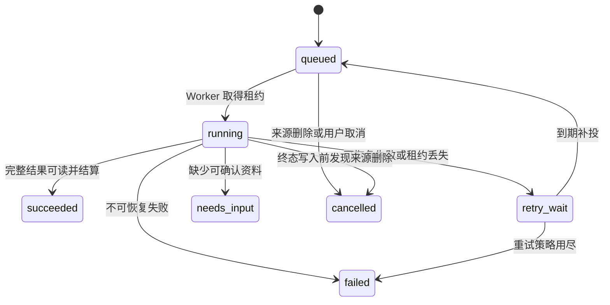

# Purslyx 任务模块设计

| 项 | 内容 |
| --- | --- |
| 模块 | 任务 |
| 版本 | v0.1 |
| 更新日期 | 2026-09-14 |
| 状态 | 待评审；接口、模型和迁移尚未实现 |
| 数据设计 | [任务数据库设计](../database/任务数据库设计.md) |
| 上级设计 | [技术模块设计索引](技术模块设计索引.md) |

## 1. 模块目标与边界

任务模块为导入、分析、改写、导出、面试、清理和日志导出提供统一的异步执行事实：固定输入、幂等创建、事务 outbox、队列发布、Worker 租约、执行代次、尝试、模型调用记录、步骤产物和 LangGraph 检查点引用。

PostgreSQL 中的任务状态是业务执行是否完成的依据；Redis／Celery 只负责消息交付，LangGraph 只负责工作流步骤。任务模块不解释分析或面试结果，不决定某类功能何时算完整交付，也不直接改变业务结果。业务模块在自己的成功事务中调用任务和用量端口完成终态与结算。

## 2. 目录与组件

| 组件 | 职责 |
| --- | --- |
| `TaskService` | 创建免费／计次任务、读取状态、取消和手动重试 |
| `TaskQueryService` | 返回当前步骤、结果引用、错误和可恢复动作 |
| `TaskRepository` | 任务、输入、尝试、产物、调用和检查点引用的查询与条件更新 |
| `OutboxRepository` | 待发布事件认领、发布租约、成功确认和退避时间 |
| `OutboxDispatcher` | PostgreSQL 到 Celery 的单例调度循环 |
| `WorkerRunner` | 按 task_id 认领租约、恢复步骤、续租并调用业务 Worker |
| `CheckpointGateway` | LangGraph 检查点正文存取；业务表只保存最小引用 |
| `ModelGateway` | 统一供应商调用、超时与用量解析，不含业务提示词 |
| `TaskEventWriter` | 追加任务运行元数据，供日志和统计只读使用 |

主责表为 `async_tasks`、`task_input_refs`、`task_outbox`、`task_attempts`、`model_call_attempts`、`task_artifacts`、`workflow_checkpoint_refs`。

## 3. 对外接口

| 方法与路径 | Service 用例 | 返回 |
| --- | --- | --- |
| `GET /api/v1/tasks/{id}` | `get_task` | 状态、当前步骤、固定输入版本摘要、业务结果引用、错误码、是否可重试和恢复入口 |
| `POST /api/v1/tasks/{id}/retry` | `retry_task` | 原任务的新执行代次或原有进行中执行；不接受替换输入 |

异步业务接口由各业务模块提供，成功受理统一返回 HTTP 202，至少包含 `task_id`、语义状态、输入版本和功能次数预留摘要。`GET /tasks/{id}` 只读当前账号任务；业务结果仍从对应模块接口读取。

手动重试必须携带 `Idempotency-Key`。若用户修改了简历、JD、期望或回答，应由业务模块创建新任务，不得借重试端点替换原任务输入。

## 4. Service 与用例

**创建任务。** 业务 Service 先验证账号、固定身份、父资源和输入版本，再调用任务创建端口。计次任务同时调用用量预留；免费任务不写功能次数预留。任务、输入引用、业务占位、预留和 outbox 必须在同一个数据库事务提交。

**认领执行。** Dispatcher 只发布 task_id。Worker 收到至少一次消息后，以条件更新认领任务、递增执行代次并建立租约；重复消息或已有有效租约时无操作。业务 Worker 从 `task_input_refs` 读取冻结版本，不能重新解析客户端请求或读取资源的最新指针。

**步骤与模型调用。** 每次外部调用先写尝试并调用用量模块预留美元预算和全站并发槽。有效输出通过业务 Schema 后保存步骤产物和检查点引用。若进程在供应商返回后、持久化前崩溃，调用状态标为未知；恢复可能再次调用模型，但用户功能次数仍最多结算一次。

**完成与恢复。** 业务 Worker 先验证来源仍可访问、租约和代次仍有效，然后在同一事务写完整业务结果、任务成功和功能次数结算。资料不足进入 `needs_input` 并释放本次功能预留；可恢复基础设施失败进入 `retry_wait`；确定不可恢复错误进入 `failed` 并释放预留。

## 5. Repository 与数据访问

- 任务列表和详情同时限定 `account_id`，动态业务结果引用通过白名单解析，不能返回任意表或内部 ID。
- `task_input_refs` 的 `resource_type` 与版本要求由注册表定义；写入时调用对应模块验证账号、用途、未删除状态和版本不可变性。
- Dispatcher 用 `FOR UPDATE SKIP LOCKED` 小批量认领到期 outbox；对外发布成功后再短事务确认，发布失败更新下一次时间。
- Worker 所有写入带 `task_id + execution_generation + lease_owner` 条件；影响行数为零即停止，旧代次不得继续写产物、检查点或终态。
- 模型调用和尝试为追加事实，不因业务内容删除而抹掉无正文成本元数据；正文访问通过 `content_access_revoked_at` 阻断。
- 检查点正文不作为业务结果接口。恢复时先验证映射、账号、任务代次和来源可见性。

## 6. 状态、事务与锁顺序

终态为 `succeeded`、`failed`、`cancelled`；`needs_input` 不占 Worker 或全站并发槽。用户补充资料会产生新版本，因此由业务模块创建引用新输入的新任务，旧任务保留为可追溯的待补充记录；只有输入引用完全未变时才允许恢复原任务。任务成功只能由业务完整性检查所在事务写入，Dispatcher、Celery 回调和单个 LangGraph 节点都无权直接标记成功。

锁顺序为账号 → 业务父资源 → 功能余额／预算桶 → 任务 → 业务结果 → outbox。认领只锁任务和尝试；完成事务不得先锁余额再回头锁账号。租约到期通过条件更新创建新代次，不能直接覆盖仍有效 Worker 的租约。

## 7. 异步任务与模块协作

| 调用方 | 任务类型 | 业务结果主责 | 功能次数 |
| --- | --- | --- | --- |
| 简历 | 资料解析、改写、PDF、清理 | 简历 | 仅改写计次；模型调用均计成本 |
| 匹配池 | 分析、草稿清理 | 匹配池 | 分析计次 |
| 面试 | 开场、反馈、追问、汇总 | 面试 | 开场完整后结算一场，后续不重复计次 |
| 日志 | 日志导出、完整性巡检 | 日志 | 免费，限频 |
| 统计 | 日聚合 | 统计 | 免费 |

默认 AI 队列并行上限 5，PDF 导出并发 1；每账号最多一个运行中 AI 任务和三个待处理任务，全站待处理建议上限 100。具体值是可配置基线，拒绝新任务时必须保留业务输入。

每个模型步骤默认最多自动重试 1 次，关闭 SDK、LangGraph 与 Celery 叠加的隐式重试。遵守供应商 `Retry-After`；认证、格式或能力不支持直接进入可修正失败。通知失败不能回滚已经可读的业务结果。

## 8. 权限、错误与安全

| 业务码 | HTTP | 场景与恢复 |
| --- | --- | --- |
| `TASK_NOT_RETRYABLE` | 409 | 任务已成功、已取消或错误不可重试 |
| `TASK_INPUT_CHANGED` | 409 | 重试摘要与原输入不同，要求创建新任务 |
| `TASK_ALREADY_RUNNING` | 202 | 返回原任务和当前进度，不新建执行 |
| `TASK_QUEUE_LIMIT_REACHED` | 429 | 保留输入，稍后再发起 |
| `TASK_LEASE_LOST` | 内部 | 当前 Worker 停止写入，由新代次恢复 |
| `TASK_SOURCE_UNAVAILABLE` | 404 | API 查询来源不可用；Worker 将运行中任务转为取消且不保存迟到结果 |
| `MODEL_TEMPORARILY_UNAVAILABLE` | 503 | 按统一重试策略处理 |
| `MODEL_OUTPUT_INVALID` | 503 | Schema 或引用校验失败，任务按可恢复策略处理且不发布空结果 |

任务和模型日志不保存完整提示输入、简历、JD、回答、文件编码或密钥。用户只能看到稳定错误码和操作建议，堆栈进入受限应用日志且须脱敏。

## 9. 测试与待确认项

必须覆盖重复业务提交、同键不同摘要、Redis 重启后 outbox 补投、Celery 重复消息、并发认领、Worker 崩溃与租约到期、旧代次迟到、供应商结果未知、检查点恢复、来源删除、次数只结算一次、预算槽释放和免费任务不动余额。

测试使用 PostgreSQL 18 和真实事务隔离语义；队列与模型可用可控替身，另用小样本真实调用验证用量字段和错误分类。编码前需冻结任务类型注册表、输入引用类型、租约／心跳／退避参数、业务错误目录和 LangGraph 检查点清理协议。
