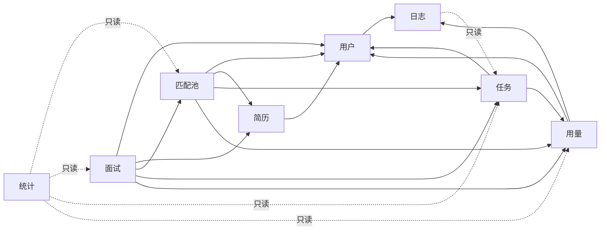

# Purslyx 技术模块设计索引

| 项 | 内容 |
| --- | --- |
| 版本 | v0.1 |
| 更新日期 | 2026-09-14 |
| 状态 | 待评审；作为服务端、Worker 和浏览器侧实现依据，不代表代码已经完成 |
| 技术基线 | Python 3.12、FastAPI、SQLAlchemy 2、psycopg 3、Alembic、PostgreSQL 18、Redis、Celery、LangGraph |
| 产品基线 | [首版模块与页面清单](../../01-product/specs/首版模块与页面清单.md) |
| 架构基线 | [技术架构](../技术架构.md) |
| 数据基线 | [模块数据库设计索引](../database/数据库设计索引.md) |

技术实现继续使用产品已确定的八个短模块：**用户、简历、匹配池、面试、任务、用量、统计、日志**。每个业务事实只有一个主责模块；其他模块通过公开的应用服务或只读查询接口使用它，不能直接修改主责模块的数据。

## 模块职责

| 模块 | 主责 | 不负责 | 技术文档 |
| --- | --- | --- | --- |
| 用户 | 账号、认证、固定注册身份、Web／浏览器会话、后台角色与权限 | 业务资料、使用次数结算、业务统计 | [用户模块设计](用户模块设计.md) |
| 简历 | 私有资料、确认版本、岗位期望、事实、改写、岗位版、PDF | 求职岗位池、通用任务调度、余额 | [简历模块设计](简历模块设计.md) |
| 匹配池 | 浏览器岗位草稿、求职私有岗位、分析报告、去投递跳转 | 招聘候选人池、自动投递、平台进度 | [匹配池模块设计](匹配池模块设计.md) |
| 面试 | 文字面试会话、题目、回答、反馈、汇总 | 真实招聘流程、自动录用判断 | [面试模块设计](面试模块设计.md) |
| 任务 | 异步任务、冻结输入、outbox、租约、尝试、模型调用与检查点引用 | 业务结果解释、功能次数规则 | [任务模块设计](任务模块设计.md) |
| 用量 | 功能次数、发放／预留／结算、模型价格、每日预算与并发槽 | 支付、套餐、业务结果 | [用量模块设计](用量模块设计.md) |
| 统计 | 个人事实统计、产品反馈、全站日聚合与成本口径 | 业务状态写入、平台投递回执 | [统计模块设计](统计模块设计.md) |
| 日志 | 管理操作、安全事件、任务日志查询、日志导出、引用巡检 | 私有业务正文、业务事实修复 | [日志模块设计](日志模块设计.md) |

## 依赖与调用方向



箭头指向被依赖模块。统计和日志只能读取经过脱敏、限定范围的事实；不得反向改写业务状态。跨模块写入必须由主责模块的 Service 参与同一 Unit of Work，禁止一个模块越过 Service 直接调用另一个模块的 Repository。

## 服务端组织

建议目录在编码开始时按下列结构建立；当前目录只是设计约定。

```text
src/server/app/
├── api/                    # FastAPI 装配、依赖注入、统一异常与请求上下文
├── core/                   # 配置、数据库、事务、认证中间件、时钟和 ID
├── modules/
│   ├── users/
│   ├── resumes/
│   ├── job_pool/
│   ├── interviews/
│   ├── tasks/
│   ├── usage/
│   ├── stats/
│   └── logs/
├── workers/                # Celery 入口，只解析 task_id 后调用模块 Worker Service
└── integrations/           # 模型、SMTP、文件、Chromium、Redis 适配器
```

每个模块内部统一使用 `router.py`、`schemas.py`、`service.py`、`repository.py`、`models.py`、`errors.py`；确有多组用例时再拆成同名子包。`models.py` 只声明本模块主责表。跨模块引用通过端口协议和公开 Service，不在 ORM 中隐式级联写入；无数据库外键的关系必须显式写 `primaryjoin`，写入完整性仍由 Service 保证。

## 共同执行规则

1. Router 只负责认证依赖、请求解析、HTTP 映射和响应序列化。业务判断进入 Service；Repository 只封装查询、锁和持久化。
2. 客户端只使用 `public_id`。Repository 在查询中同时限定认证账号、资源用途和 `deleted_at IS NULL`；越权资源统一映射为 404。
3. 状态变更集中在 Service，以允许的前置状态进行条件更新。状态值、JSONB Schema、规则和提示词均使用显式版本，不用自由字符串代替受控状态。
4. 默认锁顺序为 `accounts` → 业务父资源 → `usage_balances`／`site_budget_buckets` → `async_tasks` → 业务结果 → `admin_audit_events`／outbox。流程有更具体锁顺序时以模块文档为准。
5. 数据库事务只包含校验与持久化。模型调用、SMTP、文件读写、Chromium 和 Celery 发布均在提交后执行，以任务状态、outbox 和可重试清理补偿。
6. 计次异步用例在同一事务完成归属校验、功能次数预留、业务占位、任务、输入引用和 outbox。Worker 交付完整可读结果时才结算；失败或资料不足时释放。
7. 写接口使用 CSRF；收费操作、面试回答、任务重试、后台授权和次数发放还需 `Idempotency-Key`。同键同请求返回原结果，同键不同摘要返回 409。
8. 错误响应包含稳定业务码、`request_id`、是否可重试和用户可执行动作。参数错误为 422，认证失效为 401，无权限管理操作为 403，资源不可见为 404，并发／幂等冲突为 409，令牌失效可用 410，次数／频率／预算限制为 429。
9. 删除先计算影响集合；确认事务内立即撤销访问并取消未完成任务，事务后清理正文、文件和检查点。迟到 Worker 结果不得恢复访问或结算。
10. 日志只保存关联标识、状态、耗时和允许的元数据，不写简历、JD、回答、反馈正文、密码、Cookie、令牌或密钥。

## 状态所有权

| 状态 | 唯一写入方 | 其他模块如何使用 |
| --- | --- | --- |
| 账号、会话、后台授权 | 用户 Service | 每次请求重新读取有效身份与权限 |
| 资料、期望、改写、岗位版、导出 | 简历 Service／Worker | 通过版本快照和公开读取端口引用 |
| 岗位草稿、私有岗位、分析、跳转 | 匹配池 Service／Worker | 面试和统计按所属账号读取有效结果 |
| 面试会话与轮次 | 面试 Service／Worker | 统计读取已完成或提前结束事实 |
| 任务、尝试、检查点映射 | 任务 Service／Worker | 业务模块保存自己的结果，任务模块保存执行事实 |
| 功能次数与预算 | 用量 Service | 任务模块调用预留、结算、释放端口 |
| 反馈与日聚合 | 统计 Service／Worker | 管理端只读 |
| 审计、安全、导出与巡检 | 日志 Service／Worker | 业务事务调用追加式审计端口 |

## 实施顺序与完成定义

1. 用户和日志最小能力：认证、固定身份、会话、权限种子、安全事件和管理审计。
2. 简历基础：文件、导入草稿、确认版本、多条岗位期望和删除阻断。
3. 用量与任务：试用发放、预留／结算、预算、outbox、租约、重试和检查点。
4. 招聘单人分析与求职匹配池：共用评分内核，分别由简历与匹配池持有结果入口。
5. 求职改写、岗位版与 PDF；完成同版本预览和下载。
6. 面试：开场、逐轮恢复、提前结束和汇总。
7. 统计、完整日志导出及每日完整性巡检。
8. 联验 BOSS／猎聘脚本、手机关键流程、目标 ARM 部署和恢复。

模块实现完成须同时满足：接口契约可由 OpenAPI 检查；状态流转测试通过；跨账号与固定身份测试通过；事务失败不会留下孤立预留或不可恢复任务；异步重复交付不重复结算；删除后所有读取路径立即失效；数据库引用巡检无新增异常。具体表、索引、枚举和 `CHECK` 以各模块数据库设计为准。

## 待实现前统一确认

- 把接口草案细化为字段级 OpenAPI，并确定分页游标、错误码目录和 JSONB Schema 文件位置。
- 用目标模型实测导入、分析、改写和面试输出，再冻结首版提示词及 Schema 版本。
- 确定会话、浏览器授权、临时草稿、导出文件和日志的上线保留时长。
- 以脱敏样例和 PostgreSQL 18 迁移开始实现；当前文档不表示 ORM、迁移、API 或 Worker 已存在。
