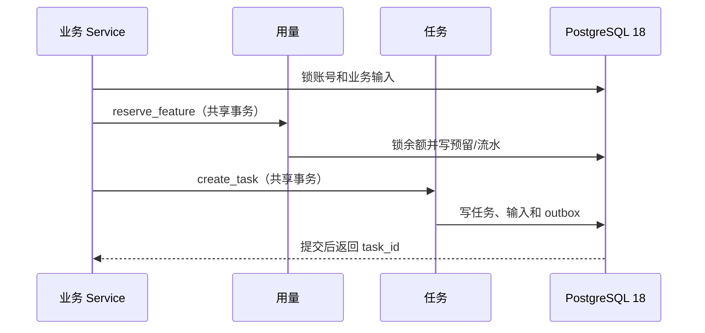

# Purslyx 用量模块设计

| 项 | 内容 |
| --- | --- |
| 模块 | 用量 |
| 版本 | v0.1 |
| 更新日期 | 2026-09-14 |
| 状态 | 待评审；接口、模型和迁移尚未实现 |
| 数据设计 | [用量数据库设计](../database/用量数据库设计.md) |
| 上级设计 | [技术模块设计索引](技术模块设计索引.md) |

## 1. 模块目标与边界

用量模块负责两套相互独立的控制：用户可用的功能次数，以及全站实际模型调用的美元预算与并发槽。求职账号适用分析、改写、面试；招聘账号只适用分析。邮箱验证后按固定身份发放一次试用次数，账号之间不共享。

用户可用量固定为 `granted_total - reserved_total - settled_total`。业务执行前预留，完整结果可读后结算，未交付则释放。模型失败仍可能产生成本，因此供应商预算的结算与用户功能次数分开。首版不实现支付、套餐购买、转赠、负数扣减或管理员直接覆盖余额。

## 2. 目录与组件

| 组件 | 职责 |
| --- | --- |
| `UsageQueryService` | 返回本账号适用功能、发放、预留、结算和剩余次数 |
| `TrialGrantService` | 邮箱首次验证后的身份适用试用发放 |
| `UsageReservationService` | 预留、结算、释放和幂等检查 |
| `AdminGrantService` | 管理端正数追加、理由、前后值和审计 |
| `BudgetService` | 上海自然日预算桶、成本上界预留和并发槽 |
| `PricingService` | 选择生效的模型价格版本并用 Decimal 计算成本 |
| `UsageRepository` | 余额行锁、追加式流水、发放与预留查询 |
| `BudgetRepository` | 价格版本、预算桶和调用预算预留查询 |

主责表为 `usage_balances`、`usage_grants`、`usage_reservations`、`usage_ledger_entries`、`model_price_versions`、`site_budget_buckets`、`budget_reservations`。

## 3. 对外接口

| 使用者 | 方法与路径 | Service 用例 | 关键要求 |
| --- | --- | --- | --- |
| 已登录 | `GET /api/v1/usage` | `get_my_usage` | 只返回当前身份适用功能与流水摘要 |
| 管理端 | `GET /api/v1/admin/usage-grants` | `list_grants` | 需要 `admin.usage.grant`，受限日期与分页 |
| 管理端 | `POST /api/v1/admin/users/{id}/usage-grants` | `grant_usage` | 正数追加、必填原因和幂等键；注册身份只读 |

任务与业务模块使用内部应用端口：`grant_trial`、`reserve_feature`、`settle_feature`、`release_feature`、`reserve_budget`、`settle_budget`、`hold_unknown_budget`。这些端口共享调用方事务，不通过 HTTP 拼接跨模块原子操作。

## 4. Service 与用例

| 用例 | 关键校验 | 成功写入 |
| --- | --- | --- |
| 发放试用 | 账号已验证、身份固定、试用批次未发过、功能适用 | 发放、余额增量和流水 |
| 后台追加 | 操作者权限、目标账号、功能适用、数量为正、理由、幂等摘要 | 发放、余额、流水和管理审计 |
| 功能预留 | 业务任务与账号一致、功能适用、可用次数至少 1 | 预留、余额 `reserved_total` 和流水 |
| 功能结算 | 完整业务结果存在、任务成功条件满足、预留有效 | 预留结算、余额预留减少／已结算增加和流水 |
| 功能释放 | 未交付且预留仍有效 | 预留释放、余额预留减少和流水 |
| 预算预留 | 生效价格已知、成本上界可算、当日美元与并发槽足够 | 预算预留、桶占用和调用关联 |
| 已知成本结算 | 供应商用量字段可解释、原价格版本存在 | 实际成本、释放差额和并发槽 |
| 未知成本持有 | 无法确认是否执行或缺失用量 | 未知占用保留，释放并发槽并待复核 |

功能次数的成功结算点由结果主责模块判断：分析报告完整可读、改写完整可读、面试三道开场主问题完整保存。导入、事实、期望、编辑、岗位保存、浏览器获取、PDF 和历史查看不预留功能次数。

## 5. Repository 与数据访问

- 每个账号和功能只有一条余额行；所有增减都先锁余额，再追加流水，不能单独更新任一侧。
- 发放、预留、结算和释放都有永久幂等键或唯一业务键。软删除业务内容不能使这些键可复用。
- 余额接口从余额行计算并复核非负值，不从客户端事件推算。普通用户看不到模型美元预算或其他账号流水。
- 价格使用有效时间范围选择，记录来源和核验日期。计算用 `Decimal`，推理 token 作为输出 token 子集，不重复相加。
- 预算日期由调用开始时间按 `Asia/Shanghai` 计算，不依赖数据库会话时区。跨日未知占用继续影响新调用可用预算，但统计仍归原开始日。
- 用量模块不读取业务正文；只通过任务 ID、结果类型和主责模块返回的完整性证明校验结算。

## 6. 状态、事务与锁顺序

功能预留只允许 `reserved → settled` 或 `reserved → released`，两种终态互斥。后台和试用发放为追加事实，不提供反向覆盖。预算预留允许结算为已知成本、确定未执行后释放，或转为未知占用等待人工复核。

后台追加锁顺序为操作者账号 → 目标账号 → 余额 → 发放／流水 → 审计。业务执行锁顺序为账号 → 业务父资源 → 余额 → 任务 → 结果。预算调用只锁当前预算桶和对应预留，不能与长时间模型调用保持一个事务。

## 7. 异步任务与模块协作

用户模块在验证邮箱事务中调用试用发放。任务创建时调用功能预留；分析、改写、面试结果主责模块在成功事务调用结算或释放。任务 Worker 每次模型调用前调用预算预留，调用返回后立即结算已知用量；网络结果不明时转未知持有。

默认试用值为求职账号分析 20 次、改写 20 次、面试 5 场，招聘账号分析 20 次。全站预算为每个上海自然日 30 美元，AI 并发上限 5。它们是受控配置和种子，启动时写入可追踪版本；前端展示服务端返回值，不能把默认值写成余额事实。

预算或并发不足只拒绝新的模型调用／任务推进，不阻止手动编辑、保存岗位、已有结果读取和 PDF 下载。等待预算的任务保留输入和明确恢复动作。

## 8. 权限、错误与安全

| 业务码 | HTTP | 场景与恢复 |
| --- | --- | --- |
| `USAGE_FEATURE_NOT_ALLOWED` | 403／422 | 固定身份不适用该功能 |
| `USAGE_INSUFFICIENT` | 429 | 次数不足；保留输入，不创建暗中调用 |
| `USAGE_ALREADY_RESERVED` | 202 | 返回原任务和预留 |
| `USAGE_IDEMPOTENCY_CONFLICT` | 409 | 同键不同目标、功能、数量或理由 |
| `USAGE_GRANT_INVALID` | 422 | 非正数、空理由或功能不适用 |
| `BUDGET_LIMIT_REACHED` | 429 | 当日已知与保守占用不足以容纳新调用 |
| `BUDGET_CONCURRENCY_LIMIT` | 429 | 全站模型槽已满，可稍后恢复 |
| `MODEL_PRICE_UNKNOWN` | 503 | 缺少可验证价格上界，禁止调用 |

管理端发放每次重新检查 `admin.usage.grant`，写请求检查 CSRF 和幂等键。普通用户响应不包含价格配置、全站预算、其他账号余额或管理员信息。日志只记录数量、功能、目标和原因，不包含业务正文。

## 9. 测试与待确认项

必须覆盖首次验证重复提交、不同身份的功能集合、余额只剩 1 次时并发预留、重复结算／释放、结算后不能释放、失败恢复再次预留但最终只成功结算一次、管理员重复发放、自加权限不足、功能不适用、当日边界、Decimal 价格、推理 token 不重复计费、已知／未知成本和并发槽回收。

使用 PostgreSQL 18 做行锁和唯一约束并发测试，并以流水重放验证余额。编码前需冻结默认值种子版本、预算配置来源、价格表更新与复核流程、未知成本人工处理流程，以及误发次数的审核更正方案；首版不应临时加入负数发放入口。
