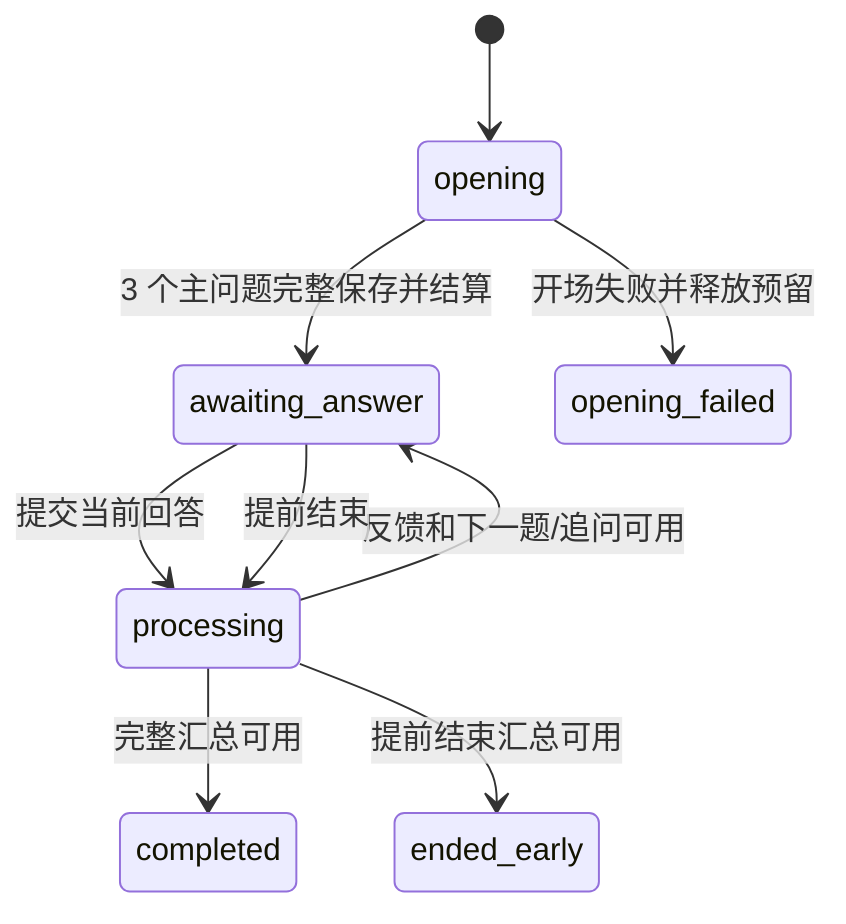

# Purslyx 面试模块设计

| 项 | 内容 |
| --- | --- |
| 模块 | 面试 |
| 版本 | v0.1 |
| 更新日期 | 2026-09-14 |
| 状态 | 待评审；接口、模型和迁移尚未实现 |
| 数据设计 | [面试数据库设计](../database/面试数据库设计.md) |
| 上级设计 | [技术模块设计索引](技术模块设计索引.md) |

## 1. 模块目标与边界

面试模块为求职账号提供围绕一个已确认岗位的文字练习：一次开场生成 3 个主问题，每题最多 1 个追问，逐轮反馈，可提前结束并生成汇总，也可在断线、重新登录或 Worker 重启后恢复。

面试是练习工具，不代表招聘方评价、平台面试进度或录用决定。首版只允许求职身份发起；招聘报告中的待核实问题仍属于分析报告内容，不自动建立面试会话。已开场会话后续回答、追问、汇总和恢复不再次扣场次。

## 2. 目录与组件

| 组件 | 职责 |
| --- | --- |
| `InterviewService` | 创建、列表、详情、恢复、提前结束和删除 |
| `InterviewAnswerService` | 校验当前轮次、保存最终回答并创建反馈任务 |
| `InterviewFlow` | LangGraph 节点和 3 主问题／每题最多 1 追问的规则 |
| `QuestionValidator` | 问题依据、顺序、父问题和重复追问校验 |
| `InterviewWorkerService` | 保存开场问题、反馈、追问与汇总，并推进会话 |
| `InterviewRepository` | 会话、问题、回答、反馈和汇总的账号限定访问与行锁 |

主责表为 `interview_sessions`、`interview_questions`、`interview_answers`、`interview_feedback`、`interview_summaries`。

## 3. 对外接口

| 方法与路径 | Service 用例 | 关键要求 |
| --- | --- | --- |
| `POST /api/v1/interviews` | `start_interview` | 求职身份；选择岗位、报告和简历版本；确认消耗 1 场 |
| `GET /api/v1/interviews` | `list_interviews` | 本账号有效会话与可恢复状态 |
| `GET /api/v1/interviews/{id}` | `get_interview` | 返回题目、回答、反馈、当前动作和汇总 |
| `POST /api/v1/interviews/{id}/answers` | `submit_answer` | 轮次 ID＋幂等键＋会话 revision；重复提交返回原回答 |
| `POST /api/v1/interviews/{id}/finish` | `finish_early` | 标记未答项并生成基于实际回答的提前结束汇总 |
| 通用删除影响与删除接口 | 预览、删除 | 删除立即不可读并取消活动任务 |

回答提交前可在前端本地编辑；服务端首版保存一次最终提交，不提供覆盖旧回答的接口。若未来支持重答，必须增加回答版本，不能直接更新历史。

## 4. Service 与用例

**发起。** 校验求职身份、私有岗位、可用分析报告、简历／JD 输入版本和删除状态。预留 1 场面试，创建会话、开场任务、输入引用和 outbox。Worker 只有在 3 个主问题及其依据一次性完整写入后才将会话置为等待回答并结算场次。

**回答。** Service 只接受当前可回答问题，校验会话 revision、轮次 ID、顺序和回答长度；插入唯一回答、标记问题已回答、创建反馈任务并将会话短暂置为处理中。重复网络请求返回原回答和任务。

**反馈与追问。** Worker 基于当前问题、对应回答和冻结的报告证据生成结构化反馈。规则允许时为该主问题生成唯一追问；追问回答后不得再追问。无需追问时推进下一主问题。每轮失败保留已完成内容和原任务。

**完成。** 第 3 个主问题处理结束后生成完整汇总。提前结束会将未回答题目标为跳过，只总结已有回答并列明未完成项。完整完成与提前结束分别保存和统计。

## 5. Repository 与数据访问

- 会话详情按账号一次读取有序问题，再批量读取回答、反馈和最新汇总，避免逐题 N+1 查询。
- 每场必须恰好 3 个主问题；`main_no` 唯一。追问以 `parent_question_id` 的部分唯一索引限制每个主问题最多一条，Service 还要校验同会话和顺序。
- 回答以会话＋轮次 ID 或问题的唯一约束去重。反馈和汇总的可读状态要求正文、Schema 版本和完成时间同时存在。
- 来源岗位、报告和资料版本由其主责模块校验。本模块只保存冻结引用，不直接修改匹配池或简历数据。
- 删除后的问题、依据、回答、反馈和汇总即使正文尚未物理清理也不能从任何详情或任务接口读取。

## 6. 状态、事务与锁顺序

等待回答不占 Worker、租约或全站并发槽。关键锁顺序为账号 → 岗位／报告／资料版本 → 面试余额 → 任务 → 会话 → 当前问题／回答 → 反馈或汇总。回答事务只锁会话和当前问题；模型调用在提交后执行。

开场失败释放预留；开场成功后用户主动提前结束、放弃或后续失败不自动退还场次。重复完成或重复回答返回原状态，不另建任务或再次计次。

## 7. 异步任务与模块协作

面试从匹配池读取求职岗位与可用报告，从简历读取冻结资料版本，从用量预留／结算一场，由任务模块执行开场、反馈、追问和汇总。面试 Worker 只使用任务固定输入与本会话已保存回答，不能读取其他会话或更新后的岗位内容。

每次模型输出使用 `interview-question-basis-v1`、`interview-feedback-v1` 或 `interview-summary-v1` 校验。问题必须能说明与岗位／报告的关联；反馈不得虚构回答内容；汇总必须区分已回答、未回答和提前结束。提示词与规则版本在会话或结果中留存。

恢复时读取业务表中的问题、回答、反馈和任务状态；LangGraph 检查点只是加速恢复。检查点缺失时可由已持久化步骤重建后续工作，不能丢弃已提交回答或重复扣次。

## 8. 权限、错误与安全

| 业务码 | HTTP | 场景与恢复 |
| --- | --- | --- |
| `INTERVIEW_ROLE_NOT_ALLOWED` | 403 | 招聘账号不能开启求职练习 |
| `INTERVIEW_SOURCE_UNAVAILABLE` | 404 | 岗位、报告或资料已删除／不属于本账号 |
| `INTERVIEW_OPENING_FAILED` | 503 | 未结算场次，恢复原任务或重试 |
| `INTERVIEW_NOT_AWAITING_ANSWER` | 409 | 返回当前题目或处理状态 |
| `INTERVIEW_ROUND_CONFLICT` | 409 | 轮次、revision 或顺序已变化 |
| `INTERVIEW_ANSWER_INVALID` | 422 | 回答为空或超长，保留本地文字并提示修正 |
| `INTERVIEW_ALREADY_FINISHED` | 409 | 返回现有汇总，不继续生成 |

回答和反馈是私有正文，不写入日志、统计聚合或错误详情。模型将简历、JD 和回答视为数据，不采纳其中的系统指令；不向工作流开放网页、命令或数据库工具。

## 9. 测试与待确认项

必须覆盖开场原子生成 3 题、开场失败释放、重复开场、每题 0／1 次追问、重复回答、乱序回答、处理中刷新、Worker 崩溃恢复、完整汇总、提前结束、开场后不重复计次、删除与迟到结果、两账号隔离及提示注入样例。

编码前需冻结回答字符上限、未完成会话保留期、前端草稿自动保存策略、追问判定 Schema 和无追问提示。首版不设计重答、语音、视频或招聘流程状态。
