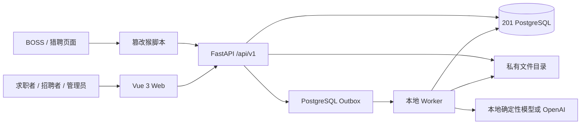

# Purslyx 技术架构

版本：v1.1 · 更新日期：2026-09-15 · 状态：已实现并通过 201 环境验收。

产品范围以[需求说明](../01-product/specs/需求说明.md)和[首版模块与页面清单](../01-product/specs/首版模块与页面清单.md)为准；字段级契约见 [API 设计索引](api/API设计索引.md)与[数据库设计索引](database/数据库设计索引.md)。

## 1. 当前结构

| 层 | 当前实现 | 责任 |
| --- | --- | --- |
| Web | Vue 3、TypeScript、Vite、Vue Router、Pinia、Element Plus | 公共首页、认证、求职、招聘和授权管理页面 |
| API | Python 3.12、FastAPI、Pydantic | 认证、资源隔离、业务校验、幂等、删除影响确认和文件下载 |
| 数据 | SQLAlchemy 2、psycopg 3、Alembic、PostgreSQL | 业务事实、不可变版本、任务、用量、预算、权限和审计 |
| Worker | PostgreSQL outbox、租约和执行代次 | 解析、分析、改写、PDF、面试、总结和日志导出 |
| 文件 | 应用私有目录、相对存储键、SHA-256 | 原始资料、PDF 和日志导出；下载前再次鉴权 |
| 浏览器侧 | 单文件篡改猴脚本 | 登录握手、当前 JD 自动识别、草稿去重与上传 |

FastAPI 直接托管 `src/web/dist`。`src/web/src` 是唯一正式前端源码；生产资源必须由 `npm ci` 和 `npm run build` 生成，不保留第二套 HTML 工作台。

## 2. 身份与权限

注册身份固定为 `seeker` 或 `recruiter`，不能在管理端修改。所有业务资源带账号归属，跨账号读取统一返回 404。

管理能力由独立后台角色授予，当前权限覆盖站点统计、用户读取与状态管理、角色管理、次数发放、操作日志、安全日志、任务日志和日志导出。前端菜单只改善体验，服务端每个管理接口仍执行权限校验。

写请求使用 Bearer 会话、CSRF 和必要的 `Idempotency-Key`。资源编辑使用 `revision`，删除使用 `deletion-impact` 快照和 `If-Match`，关联关系在用户确认后发生变化时返回 409。

## 3. 资料与业务版本

简历、岗位 JD 和候选人资料先形成可编辑草稿，人工确认后追加不可变版本。分析只接受当前账号内类型正确的已确认版本，并冻结简历、岗位和可选岗位期望版本。

求职端每个岗位独立入匹配池并保留分析历史。招聘端分析严格绑定一位候选人的简历，只允许选择该候选人名下的明确期望；没有披露期望时保持未知。

分析报告把能力评分与岗位条件分开。重要结论带来源引用；未知信息不推断为符合。事实补充生成独立版本，改写按段展示原文、建议、理由和依据，采用决定不会覆盖原始简历。

岗位版简历在原简历之外追加版本。PDF 使用同一内容和排版快照生成，文件只通过鉴权接口下载。

## 4. 面试流程

面试开场一次生成并保存 3 道主问题，成功后结算 1 场。回答先持久化，再创建反馈任务；每道主问题最多生成一次追问。完整作答或提前结束都会生成总结，提前结束总结是独立 `interview_summary` 任务。

反馈或总结失败时，已保存回答不回退。任务中心只允许对可恢复失败执行原输入重试，不重复扣面试场次。

## 5. 任务、用量与成本

业务任务状态为 `queued`、`running`、`retry_wait`、`needs_input`、`succeeded`、`failed` 或 `cancelled`。成功结果只保存 `resource_type`、`resource_id` 和 API `path` 等资源引用，不复制简历、JD 或回答正文。

本地默认可内联执行；`worker` 模式下 HTTP 进程只提交任务和 outbox，由独立 Worker 认领。每次认领创建执行代次和租约。租约过期可恢复；旧代次迟到时在写回事务中再次校验，不能覆盖新代次或复活已删除资源。

分析、改写和面试开场先预留功能次数，完整结果可读取后结算，失败释放。面试后续反馈、追问和总结不重复计次。模型调用另记 provider、model、token、成本和结果，不保存业务正文。

## 6. 删除与存储

资料、匹配池岗位、报告、改写、岗位版简历、事实和面试均有账号隔离的删除接口。删除事务会：

1. 校验用户确认的影响版本；
2. 取消引用资源的排队、运行或等待重试任务；
3. 撤销派生正文访问并释放未结算次数；
4. 提交数据库删除状态；
5. 提交后删除精确解析出的私有文件。

存储记录只保存相对键。路径解析必须停留在配置的数据目录中，文件名经过下载安全处理，容量检查和原子替换在发布文件前完成。

## 7. 运行边界

本地开发唯一数据库来源是被 Git 忽略的《本地开发环境.md》中 `10.10.10.201` 的 PostgreSQL。应用、迁移和 Worker 都拒绝 SQLite；生产容器通过 `PURSLYX_ALLOWED_DATABASE_HOSTS` 显式允许宿主机 PostgreSQL（默认容器地址为 `host.docker.internal`）。默认产品端口为 8001，Debian 单机发布使用 OpenResty + Docker `purslyx-api1` / `purslyx-api2` 双槽位。

当前已实现本地确定性模型和可选 OpenAI 适配器、本地私有文件存储及 PostgreSQL Worker。未实现真实支付、自动投递、平台投递状态监控、公开人才市场、对象存储和异机灾备；界面与指标不得暗示这些能力已经存在。

本地启动、迁移与验收命令维护在[201 环境部署约定](deployment/201环境部署.md)；生产部署维护在[Debian 单机部署](deployment/Debian单机部署.md)。
