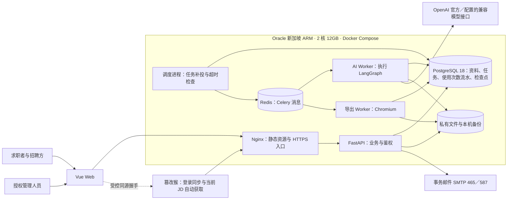
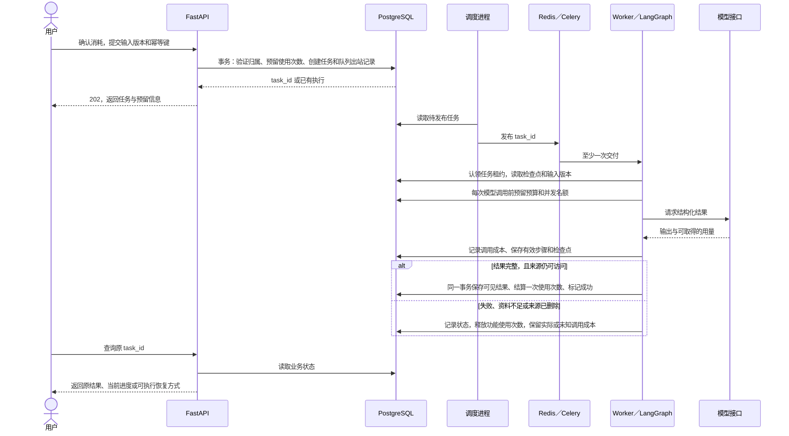

# Purslyx 技术架构

版本：v0.8 · 更新日期：2026-09-14 · 状态：**已评审**。

基线：[需求说明 v0.8](../01-product/specs/需求说明.md) · [首版模块与页面清单 v0.8](../01-product/specs/首版模块与页面清单.md) · [数据库设计规范 v0.7](database/数据库设计规范.md) · [原始需求记录](../01-product/specs/需求记录.md) · [A 视觉规范](../01-product/visual/视觉方案.md) · [项目起点与复用说明](../03-presentations/项目起点与复用说明.md)。本文已完成首轮评审，作为待实现的技术基线；性能、接口连通性及恢复能力尚未通过部署验证。

## 1. 设计基线与选型

Purslyx 面向持续商业化经营，首版服务注册身份固定的求职账号与招聘账号。七天交付以需求中的 P0/P1 全部验收为准：BOSS 与猎聘当前岗位入私有匹配池并逐条自动打分、从匹配池跳转原 JD 的去投递入口、完整多轮面试均为必交；P0/P1 只表示实施顺序。真实支付、公开人才市场、跨岗位推荐、自动投递和平台进度监控继续保留在后续范围。

文中使用三种状态：**已确定**表示本轮选型决策；**建议默认**表示已纳入首版基线、可依据实测结果校准的参数或细则；**待实测**表示必须通过环境或样例验证，不能据此宣称已经可用。

| 部分 | 已确定方案 | 职责与边界 |
| --- | --- | --- |
| Web | Vue 3＋TypeScript＋Vite＋Element Plus | 求职、招聘固定身份工作台、私有匹配池、统计页及授权管理端，统一 A 视觉 |
| 服务端 | Python＋FastAPI，模块化单体 | 用户、简历、匹配池、面试、任务、用量与统计的业务入口 |
| AI 工作流 | LangGraph | 导入、分析、改写、面试的步骤组织与检查点恢复 |
| 后台任务 | Redis＋Celery | 任务排队、调度和执行；业务状态以 PostgreSQL 为准 |
| 持久化 | PostgreSQL 18 | 资料版本、任务、使用次数流水、模型调用、反馈及 LangGraph 检查点 |
| 模型 | 官方 `gpt-5.6-luna`，`reasoning.effort=max` | 官方优先，保留第三方 OpenAI 格式接口适配能力 |
| 文件导入 | GPT 直接读取 PDF、DOC、DOCX 并整理 | 使用官方 Responses 文件输入；原文件保留，用户确认后使用 |
| 简历与 PDF | 分区编辑＋成品预览；Playwright／Chromium 导出 | 一个流式模板，共用 HTML、CSS、字体与内容版本 |
| 部署 | Oracle 新加坡 ARM，**2 核 12GB**，Docker Compose | 单机部署基线，100 名试用者、最多 5 个 AI 任务并行是待验证目标 |
| 文件存储 | 服务器私有磁盘 | 后端鉴权读取，文件不通过公开静态目录暴露 |
| 邮件 | SMTP 465／587 | 465 使用隐式 TLS，587 使用 STARTTLS，按供应商配置启用 |
| 管理端 | 用户、用量、统计与日志页面 | 授权人员管理现有账号，在独立页面维护后台角色与权限，按适用功能追加使用次数，查看全站概况，并按权限查询管理操作、登录安全和任务运行日志 |

已确定数据库实现工具：SQLAlchemy 2＋psycopg 3，Alembic 管理 PostgreSQL 18 结构变更。建议默认 Python 3.12；前端使用 Vue Router、Pinia，分区富文本编辑使用 Tiptap，排序使用 SortableJS。入口使用 Nginx 托管 Web 静态文件并代理同源 `/api/v1`。实际发布时锁定依赖及 ARM 镜像版本，记录 Chromium 与字体版本。

源码仍按现有目录规范组织：Web 放 `src/web/`，匹配池的登录状态同步和当前岗位自动获取放 `src/userscript/`；去投递按钮、跳转事件和原 JD 链接校验由 Web 与服务端实现。后续服务端拟放 `src/server/`，内部按用户、简历、匹配池、面试、任务、用量、统计和日志分模块。部署配置放 `infra/`，运行与维护脚本放 `scripts/`，脱敏样例放 `examples/`。这些是后续实现位置，不表示当前已有相应代码。

## 2. 总体架构与组件职责



**Celery 负责何时执行，LangGraph 负责执行到哪一步，PostgreSQL 负责业务是否完成和是否扣减使用次数。** Celery 返回值、Redis 缓存和工作流检查点都不能单独决定“已扣费”或“报告已交付”。

建议默认分为 AI 队列和导出队列：AI 执行并行上限 5，包含导入、分析、改写和面试；Chromium 导出并发 1。等待面试回答时保存检查点并释放 Worker，用户提交下一轮回答后再调度。导出和 AI 使用独立进程，避免长 PDF 占用全部任务槽位。

LangGraph 的 `thread_id` 由服务端根据任务或面试会话生成，并在业务表登记所属账号。流程状态存入 PostgreSQL 检查点；业务表保存输入版本、已完成步骤和可交付结果引用。检查点只保存恢复所需的最少内容，尽量引用资料版本，删除时同时清理其中可能包含的正文。

## 3. 资料处理、AI 工作流与评分

### 导入与原文依据

**上传 → GPT 提取整理 → 用户检查确认 → 保存资料版本。** 用户只上传一次，确认后的内容供后续功能复用。文件解析采用官方 [Responses 文件输入](https://developers.openai.com/api/docs/guides/file-inputs)，首版不引入额外的云端文档解析服务。

| 阶段 | 输入与处理 | 保存和确认规则 |
| --- | --- | --- |
| 原始资料 | 文本、文字型 PDF、DOC、DOCX；JD 粘贴或浏览器自动获取的待确认草稿 | 原文件／原始文本单独保存，记录账号、注册身份、来源和文件摘要；浏览器草稿须经本人确认才成为 JD 版本 |
| AI 提取 | 文件通过服务端编码为 `input_file`；文本作为文本输入 | 返回模块、段落、JD 字段和待确认项，状态为 `unconfirmed`；解析阶段禁止改写经历 |
| 用户确认 | 检查模块、内容、岗位类别及岗位条件，允许纠正 | 生成不可变确认版本，服务端分配段落 ID；用户修正与模型提取分别留来源 |
| 后续引用 | 模型只能引用本次允许使用的确认资料或用户补充 | 保存版本 ID、段落 ID、引用文字和来源类型；原文件可供本人下载核对 |

GPT 提取文本不是已经核实的原文，用户确认也不代表经历经过外部真实性调查。报告显示“确认资料第 N 段”及其来源；仅在页码能够核验时显示原文件页码，不将模型猜测的页码或坐标包装成精确定位。对引用执行段落存在性和引用文字校验，允许受控的空白规范化，不能用另一次生成的摘要冒充原文。

导入不扣分析、改写或面试使用次数，但实际模型调用进入成本台账、请求频率及每日预算。建议默认每账号每分钟最多 2 次 AI 导入、每天最多 20 次；命中限制时可手动粘贴并整理模块，纯手动操作仍然免费。文件摘要只用于同账号内复用已完成提取，避免重复上传重复耗费；采用最新确认版本需由用户选择。

首版承诺的格式范围仍按 F02：扫描件、图片、加密、空白和不可读内容提示转换或粘贴文本。模型具有视觉能力不自动扩展首版 OCR 范围。建议上传限制为 10MB，PDF 最多 20 页；Word 提取后校验正文长度，超限先提示整理，不静默截断。输入上限及复杂双栏简历效果均需通过样例验证。

官方 PDF 输入同时处理文字和页面图片；DOC／DOCX 按文档文本处理，不能假设嵌入图片内容也被读取。首版 PDF `detail=auto`，记录实际输入用量后评估成本。使用内联文件避免额外建立长期 Files API 文件；响应设置 `store=false`，应用所需的历史由自身数据库管理。供应商侧日志与保留规则须按上线时的服务条款核实，不能把该参数理解为供应商完全不留存。

### 模型适配与工作流

适配配置包括供应商、`base_url`、API 类型、模型 ID、思考参数映射、结构化输出能力、文件支持、用量解析方式及带版本的价格表。密钥仅在服务端配置。官方使用 Responses；第三方可配置 Responses 或 Chat Completions，逐项验证能力，不能只改 URL 就宣称完全兼容。不支持文件的接口只承接已确认文本的功能，文件导入仍使用官方接口；不静默更换模型或降低 `max`。

| 工作流 | LangGraph 内的主要步骤 | 交付边界 |
| --- | --- | --- |
| 导入 | 文件／文本输入 → 结构化提取 → 字段与结构校验 → 待确认草稿 | 只提取已有内容，字段缺失保留未知 |
| 分析 | 冻结输入版本 → JD 要求拆分 → 证据对照 → 代码评分与条件比较 → 建议／补充问题 → 引用校验 | 两端共用能力结果；招聘端增加待核实事项和面试问题 |
| 改写 | 选定段落＋JD＋已确认补充 → 建议生成 → 事实与引用检查 | 原文、建议、理由分别保存，用户选择采用后更新岗位版 |
| 面试 | 生成 3 个主问题 → 等待回答 → 针对性反馈／最多一次追问 → 下一题 → 汇总 | 会话保存题目、回答、追问次数、已完成与未答部分，可提前结束 |

每个节点输出使用 Pydantic／JSON Schema 约束；引用越界、缺少必填内容、拒绝回答、输出截断或格式错误，都不当作完整成功。自动修复也算一次模型尝试，受统一重试与预算控制。上传资料及 JD 一律作为待分析数据，不作为系统指令；首版工作流不向模型开放任意网页访问、命令执行或数据库工具。

面试以独立会话为恢复单位，回答记录使用固定轮次 ID；重复提交同一轮不生成两份回答。首版须支持 3 个主问题、每题最多一次追问及汇总，记录启用规则版本；一题反馈只是实施中的中间状态，不算首版完成。已开场的会话后续失败不再扣除面试次数，但恢复时仍需满足全站调用预算。

### 岗位分类量表与计算规则

**已确定：按岗位类别采用固定量表，输出已证实匹配分＋证据覆盖率；以下权重和证据系数为评审草案。** 导入时建议岗位类别，由用户确认为研发、产品、运营或通用，随 JD 版本保存。求职端和招聘端对同类岗位使用相同量表，首版不开放用户自定义权重。

| 类别 | 维度 1 | 维度 2 | 维度 3 | 维度 4 |
| --- | --- | --- | --- | --- |
| 研发 | 技术能力 40% | 工程交付 30% | 问题解决与质量 20% | 业务理解 10% |
| 产品 | 需求洞察 30% | 产品方案与交付 35% | 数据分析与验证 25% | 业务理解 10% |
| 运营 | 策略与执行 35% | 内容／渠道／用户运营能力 30% | 数据复盘 25% | 业务理解 10% |
| 通用 | 核心能力 40% | 职责交付 30% | 问题解决与协作 20% | 业务理解 10% |

先将 JD 的实际要求拆成去重后的可评估条目，每条保留 JD 引用并且只归入一个主维度。同维度条目等权；不得通过重复拆句提高某项权重。项目、课程、校园活动、兼职和工作经历均可作为证据，评价深度以 JD 要求为参照，不因应届生身份直接扣分。

| 条目状态 | 判定依据 | 匹配系数 `s` | 覆盖标记 `c` |
| --- | --- | --- | --- |
| 直接支持 | 经历明确支持该要求和要求的承担程度 | 1 | 1 |
| 部分支持 | 只有部分要求得到支持，或有可解释的迁移依据 | 0.5 | 1 |
| 明确差距 | 已提供的信息明确显示与要求有差距，必须列出依据 | 0 | 1 |
| 待确认 | 当前资料没有足够依据，不能断言具备或不具备 | 0 | 0 |

这里的 0 表示该条目尚未贡献“已证实匹配分”，不表示候选人能力为零。覆盖率表示资料中有足够信息进行评价的比例，包含有明确依据的差距；它不是外部核实率或模型置信度。

计算约定如下，规则版本初始建议为 `ability-v0.1`：

```text
I = JD 中存在可评估条目的维度集合
n_i = 维度 i 的去重条目数
w_i = 对应量表的基础权重
W_i = w_i / Σ(k∈I) w_k
D_i = 100 × Σ(j=1..n_i) s_ij / n_i
C_i = 100 × Σ(j=1..n_i) c_ij / n_i
总分 S = Σ(i∈I) W_i × D_i
覆盖率 C = Σ(i∈I) W_i × C_i
```

JD 未提出对应要求的维度标为“不适用”，按上式归一其余维度，并显示基础与实际权重；候选人没写的条目属于“待确认”，不能从分母移除。保存未舍入计算值，界面最终保留一位小数。无可评估条目或覆盖率为 0 时，返回需要补充的信息，`score=null`，任务进入 `needs_input` 并释放功能使用次数。建议默认覆盖率低于 50% 时显著提示资料不足，整体建议优先要求补充，不给出确定的高匹配推荐。

例如研发量表四维均适用，每维各 2 条要求，其匹配系数分别为 `[1, 0.5]`、`[1, 0]`、`[0.5, 0]`、`[1, 1]`；第二维的 0 为待确认、第三维的 0 为明确差距。维度分为 75、50、25、100，总分为 **60.0**，覆盖率为 **85.0%**。若第四维在 JD 中不适用，其余有效权重为 4/9、3/9、2/9，总分为 **55.6**，覆盖率为 **83.3%**。

评分只使用确认后的能力经历与 JD 能力要求；姓名、年龄、性别、联系方式、求职地点和薪资期望不进入能力评分输入。相同账号内，相同规范化能力内容、JD 要求、岗位类别及模型／提示词／量表版本复用已校验的能力评估，避免只改期望时重新随机判分；引用仍绑定对应确认版本。两类固定身份账号使用同一量表与规则，但不跨账号复用私有资料。模型证据判断本身需要案例校准，固定公式不等于判断天然稳定。

**条件比较单独计算。** 保存期望岗位、多个城市、办公方式、薪资下限／上限／币种／周期／税制／明确发薪月数。值状态（已填写、未知、不限／面议）与约束强度（必须符合、可协商）分字段保存；已填写但未选择强度时默认可协商，未填写仍为未知。默认表单口径为人民币税前月薪，提交时展示；导入未写明的口径保持未知。招聘端使用候选人明确提供的期望及来源，不读取招聘者自己的求职偏好。

岗位名称结合职责、职级判断方向，模型输出解释和依据；已确认的地点／方式和薪资可比性、区间比较由代码执行。同口径期望 20–30K：15–25K 为可能达到、需确认，10–18K 为低于期望，35–40K 不因超过期望上限而判不匹配。换算须有明确固定发薪月数，不补猜 12 薪、奖金、汇率或税率。远程地域限制未知时仍需确认。

整体建议由代码先确定约束状态，再生成解释：必须符合项发生已知冲突时固定突出“当前不优先，先确认或调整条件”；可协商冲突列沟通重点；未知项不能显示全部符合。条件结果不并入能力分，不生成录用概率。修改期望免费，旧报告保留原快照并标记尚未应用新条件，用户明确发起重新分析后按一次分析计量。

## 4. 数据、接口与权限约定

### 主要数据对象

关系与状态字段使用普通列及约束，模型结构化结果使用经过版本化 Schema 校验的 JSONB；使用次数、任务状态和关联权限不只藏在 JSON 中。账号在注册时写入不可由客户端修改的求职或招聘身份，所有业务对象关联所属账号；不同账号各有独立余额，管理权限另列。默认不建数据库外键；每个逻辑引用字段显式建索引，Service/Worker 在同一事务校验目标存在、账号归属及删除状态，上线后每天只读巡检孤儿与跨账号引用并告警，不自动修复。细则见[数据库设计规范](database/数据库设计规范.md)，各模块表结构和事务见[模块数据库设计索引](database/数据库设计索引.md)。

| 对象 | 主要内容与关联 |
| --- | --- |
| 账号与会话 | 邮箱、固定注册身份、密码摘要、验证状态、服务端会话、独立后台角色与权限、一次性邮件令牌摘要 |
| 后台授权与操作日志 | 角色、权限键、账号授权关系、操作者、变更前后值与时间；注册身份不在角色授权中修改，日志不保存私有资料正文 |
| 原文件与资料版本 | 所属账号、类型、私有文件路径、摘要、原始文本、提取草稿、确认版本及稳定段落 ID |
| JD 与求职期望 | JD 来源、岗位类别和披露条件；求职账号的多条独立岗位期望及版本、默认指针和每次使用的一条快照；候选人期望独立记录来源 |
| 私有匹配池 | 求职账号、已确认 JD 版本与来源、关联简历／期望版本、逐条分析任务和报告、待分析原因；不复制另一账号的岗位正文 |
| 去投递跳转事件 | 求职账号、私有岗位、平台、原 JD 链接引用、一次性点击令牌与服务端记录点击的时间；同一令牌幂等，供个人及管理统计，不推断平台投递结果 |
| 岗位版简历 | 源简历、目标 JD、模块内容与顺序、排版参数、模板版本、内容版本、采用的改写及事实来源 |
| 分析与补充／改写 | 输入版本组合、规则和提示词版本、证据、维度计算、条件对照、建议、用户补充、采用状态 |
| 面试会话与轮次 | 资料快照、启用版本、开场任务、主问题／追问序号、回答、反馈、完成状态与检查点关联 |
| 任务与队列出站记录 | 幂等键、所属账号、功能、输入快照、状态、执行代次、租约、尝试记录、结果引用及待发布消息；与用户点击去投递不是同一数据 |
| 使用次数与预算流水 | 求职账号适用分析、改写、面试，招聘账号只适用分析；预留／结算／释放事件及逐次调用的美元预算占用与结算，不保存简历正文 |
| 管理发放记录 | 目标账号、适用功能、正数发放次数、原因、操作者、幂等键、时间及变更前后可用次数；与试用发放和消费共用可审计流水 |
| 模型调用与反馈 | 供应商／模型、任务与步骤、注册身份／功能、用量、耗时、价格版本、失败与重试关系、使用事件及明确反馈 |

`EvidenceRef` 至少包含资料 ID、版本 ID、段落 ID、引用文字及来源类型；`AnalysisResult` 包含量表与提示词版本、条目状态、维度及总分、覆盖率、条件对照和整体建议。任务固定输入版本；修改资料产生新版本，不能让正在运行的任务悄悄读取最新内容。

### 接口约定

以下是首版接口草案，统一前缀 `/api/v1`。文档中的 `{id}` 均为服务端生成的标识，随机 ID 不代替权限检查。

| 资源／动作 | 方法与路径 | 关键契约 |
| --- | --- | --- |
| 账号与邮件 | `POST /auth/register`、`/login`、`/logout`、`/verify-email`、`/resend-verification`、`/forgot-password`、`/reset-password`；`GET /me` | 注册时选择并固定求职或招聘身份；一次性验证、会话恢复；返回自身身份及权限，不提供身份切换接口 |
| 导入与确认 | `POST /documents`；`POST /documents/{id}/parse`；`POST /documents/{id}/versions`；`GET /documents/{id}` | 上传／粘贴先保存资料；解析返回任务；提交确认版本前校验类型和来源 |
| 资料列表与文件 | `GET /documents`；`GET /documents/{id}/file` | 列表分页，原始文件下载鉴权 |
| 资料与历史删除 | `GET /{resource}/{id}/deletion-impact`；`DELETE /{resource}/{id}` | 资源限定为 documents、resumes、analyses、rewrites、interviews、facts 和私有匹配池条目；先查看关联影响，确认删除时影响集合若已变化则返回 409 重新展示，关联平台事件立即不可读 |
| 期望与岗位条件 | `GET/POST /preferences`；`GET/PUT/DELETE /preferences/{id}`；`POST /documents/{id}/versions` | 一个求职账号可保存多条岗位期望并设置默认指针；每条完整保存岗位方向、地点、办公方式、薪资和强度，分析时显式选定一个版本并生成快照；JD 条件和候选人期望随其资料版本保存 |
| 分析 | `POST /analyses`；`GET /analyses`、`/analyses/{id}` | 提交简历、JD、期望的版本；使用注册身份授权功能，同一执行幂等，结果带来源快照 |
| 私有匹配池 | `POST /job-pool/items`；`GET /job-pool/items`、`/job-pool/items/{id}`；`POST /job-pool/items/{id}/analyze` | 仅求职账号；确认岗位时若已同意一次分析消耗、输入完整且剩余次数足够，原子预留并创建逐条任务；否则保留待分析，后续显式确认后再分析 |
| 去投递跳转 | `POST /job-pool/items/{id}/go-to-apply` | 仅求职账号；验证 CSRF、一次性点击令牌、岗位归属与已保存的 BOSS／猎聘 HTTPS 原 JD 链接；记录一次跳转后返回 303 到原岗位，同令牌重试不重复计数，链接或记录失败不跳转 |
| 补充与改写 | `POST /facts`；`POST /rewrites`；`GET /rewrites/{id}` | 事实补充免费；改写显式选择段落和已确认补充，返回原文、建议及依据 |
| 简历版本与导出 | `POST /resumes`；`GET /resumes`、`/resumes/{id}`；`POST /resumes/{id}/versions`；`POST /exports`；`GET /exports/{id}/file` | 保存内容与版式版本；预览与导出使用同一导出任务和成品，免费但限频 |
| 面试 | `POST /interviews`；`GET /interviews`、`/interviews/{id}`；`POST /interviews/{id}/answers`、`/finish` | 开场计一场；回答带轮次 ID，结束／恢复保留同一会话 |
| 任务 | `GET /tasks/{id}`；`POST /tasks/{id}/retry` | 返回状态、当前步骤、结果或错误及恢复方式；重试只恢复原输入执行 |
| 用量与反馈 | `GET /usage`；`POST /events`、`/feedback` | 用户只读自己的用量；客户端事件去重并验证关联资源，不能伪造后端成功事件 |
| 个人与管理统计 | `GET /stats/me`；`GET /admin/metrics`、`/admin/costs`、`/admin/feedback` | 个人只读自身按日去投递点击数与适用功能剩余次数；管理权限可查注册用户、功能使用、成本、点击数和产品反馈并限制时间范围，不提供候选人正文浏览 |
| 管理端用户与角色 | `GET /admin/users`、`/admin/users/{id}`；`GET/POST /admin/roles`、`PUT /admin/roles/{id}`；`PUT /admin/users/{id}/roles` | 按后台权限检索用户、维护角色权限组合与账号角色；目标注册身份只读；角色调整校验操作者权限并记录前后值；内置超级管理员角色不可编辑，不能修改自己的角色或移除最后一位超级管理员 |
| 管理端次数发放 | `GET /admin/usage-grants`；`POST /admin/users/{id}/usage-grants` | 只给目标身份适用功能追加正数次数，填写原因并携带幂等键；锁定目标余额、写发放流水和操作日志同事务提交，重复请求不重复发放 |
| 管理端日志 | `GET /admin/logs/operations`、`/security`、`/tasks`；`GET /admin/logs/{type}/{id}`；`POST /admin/log-exports` | 每类日志独立鉴权并限制时间范围；按账号、目标、结果与关联 ID 筛选，详情只返回允许的元数据和前后值摘要；导出异步生成、再次鉴权并写操作日志，不返回私有业务正文或凭据 |

异步请求成功受理返回 HTTP 202，包含 `task_id`、`status`、输入版本及本次使用次数预留信息；前端默认每 2 秒查询一次，后台页面降低频率，重新登录后从历史恢复。业务状态使用 `queued`、`running`、`retry_wait`、`needs_input`、`succeeded`、`failed`、`cancelled`；面试的“等待回答”属于会话状态，不占用一个持续运行的任务。

收费单位操作、面试回答和任务重试携带 `Idempotency-Key`，服务端按账号＋动作＋键建立唯一约束，同时比对请求摘要。同键同请求返回原执行，同键不同输入返回 409；新输入或主动新生成使用新键。并发编辑携带基础版本，冲突返回 409 并保留本地内容。参数错误用 422，使用次数不足、频率和预算限制用 429 加业务错误码；未登录用 401，对不属于当前账号的资源统一返回 404。错误携带 `request_id`、可重试标记和操作建议，不泄露凭据或其他账号信息。

### 认证、资料隔离与删除

Web 和 API 同源。建议使用高强度随机服务端会话，Cookie 设置 `HttpOnly`、`Secure`、`SameSite=Lax`，状态变更接口校验 Origin 与 CSRF 令牌。密码使用 Argon2id 摘要，登录后更换会话；退出立即撤销。邮件验证、重置令牌只存摘要、限时且一次性使用；重置成功撤销旧会话。建议默认会话 7 天、验证链接 24 小时、重置链接 30 分钟，登录与邮件请求均限频。

邮箱验证成功的事务内，以账号＋试用批次的唯一记录按注册身份发放一次对应的试用次数；重复验证及删除资料均不能重新领取。注册身份首版不可变；需要另一身份时使用另一邮箱另建账号，旧账号的资料和余额不能转移或共享。所有模型调用，包括免费 AI 导入，都要求已验证邮箱；未验证时可保留手动输入并完成验证后继续。求职／招聘注册身份与后台角色分开；受控维护命令初始化首位超级管理员，注册请求不能自行获得后台权限。超级管理员可维护后台角色的权限组合及账号角色，其他管理员只执行被授予的查看用户、发放使用次数或查看站点概况等操作。每次变更重新鉴权，内置超级管理员角色不可编辑，操作者不能修改自己的角色或移除最后一位超级管理员；角色变更、发放次数都写含操作者及前后值的审计日志。

后台权限键首版至少包含 `users.read`、`roles.manage`、`usage.grant`、`stats.read`；角色只是一组权限键，服务端每个管理接口和每次写入均检查当前有效授权，不信任前端菜单或请求体中的角色。角色定义、账号授予和次数发放使用 CSRF 与操作幂等键，记录目标、操作者、理由、前后值和时间；变更与审计日志同事务提交。发放只允许目标注册身份适用的功能，数量为正，锁定余额后追加发放事件，不直接覆盖余额。管理端不能以后台角色修改用户的求职／招聘注册身份。

API、Worker、文件下载及统计查询均从认证身份确定账号和固定身份，禁止信任客户端传入的 `owner_id` 或角色。对任务引用的简历、JD、期望、匹配池岗位、段落、面试和 LangGraph 会话逐项验证归属及身份用途。招聘候选人资料与求职账号自己的简历分类保存；所有私有文件、导出及报告响应禁止公共缓存。

删除前提供关联影响预览，确认后在事务中标记资料及受影响报告不可访问、取消未完成任务；再清理原文件、衍生 PDF、提取文本、资料快照、模型正文缓存及相关检查点。文件临时清理失败由维护任务重试并告警，逻辑访问立即失效；本轮不承诺物理清理时限。Worker 发布结果前再次检查来源的删除标记和执行代次，删除后的迟到结果只做清理。保留无正文的使用次数和成本审计记录，删除不重置余额。首版只定义资料与历史删除，账号注销另行设计。

本机备份中的历史副本按保留周期过期，不能通过普通产品接口访问。恢复数据库时须重放可用的删除记录并核验权限，恢复环境先保持离线；缺少恢复点之后的删除记录时，不能直接重新公开备份中的资料。供应商侧保留和用户已经下载的副本另行说明，不承诺应用删除能够撤回所有外部副本。

## 5. 任务恢复、使用次数与成本

### 一次任务的执行与结算



使用次数按账号及适用功能记录：求职账号的内测初值为**分析 20 次／改写 20 次／面试 5 场**，招聘账号为**分析 20 次**，不显示不可使用的功能余额。不同账号不共享使用次数。账面可用量等于发放量减已结算量减当前预留量；事务内锁定余额记录或使用带条件的原子更新，不能出现负数。每轮预留有独立编号，预留／释放按该编号保证幂等，最终结算按账号＋功能＋业务任务保证唯一；失败重试可重新预留、再次失败可释放新预留，同一任务最多产生一次最终成功结算。

分析／改写在完整结果持久化并可通过接口读取时结算；用户没有及时收到网络响应不影响已完成结果，刷新后返回原结果。匹配池每确认一条岗位时，若用户已确认本次分析消耗、输入完整且剩余次数足够，保存岗位与预留 1 次分析机会、创建任务同事务提交；缺输入或剩余次数不足时只保存待分析条目，不暗中扣减。面试在 3 个开场问题成功保存时结算一场，后续轮次、汇总和恢复不再次预留用户面试使用次数。免费编辑、保存岗位、查看历史、补充事实、期望修改、浏览器获取岗位及 PDF 导出均不动功能余额。

任务创建与队列出站记录一起提交，避免“扣住使用次数但没有排队记录”。调度进程发布后记录队列发布时间，并定期检查长时间未认领及租约到期的任务；Redis 重启后可根据数据库补发。Celery 采用至少一次交付，Worker 通过任务状态、租约和执行代次认领；业务包装层在步骤产物、检查点和结算写入时均验证有效代次，恢复仅读取有效执行的进度，旧执行不能覆盖新执行的结果。

外部模型调用前记录步骤尝试，成功步骤保存产物后供恢复使用；工作流恢复优先复用已有产物。若模型已经返回、但在本地保存前进程崩溃，不能保证模型只调用一次：该尝试标为结果／用量待核实，用户功能使用次数仍按业务任务只结算一次，所有实际尝试都归集成本。禁止把租约到期直接当成“供应商未执行”。

建议默认每个模型步骤最多自动重试 1 次，针对可恢复的限流、服务错误或结构化修复统一调度，遵守 `Retry-After` 与退避；关闭 SDK 和 LangGraph 的额外自动重试，避免多层叠加。认证、文件格式或能力不支持等错误直接提示修正。手动重试受相同频率与预算约束，并继续记录新尝试；修改输入后重新生成则创建新任务及输入快照。`needs_input` 的任务不继续暗中调用模型。

### 全站预算与用量控制

**已确定全站每天 30 美元，按 `Asia/Shanghai` 的自然日划分。** 功能使用次数控制用户可使用次数，美元预算控制全站模型支出；导入、面试后续轮次、失败、重试和格式修复都进入美元预算。

每次模型调用前，以模型和价格版本计算输入成本上界＋`max_output_tokens` 的输出成本上界，在 PostgreSQL 中原子预留预算与全站并发名额。文本可按明确的计数方式估算上界；文件视觉输入无法可靠预估时，使用配置的模型输入上限及最高适用价格作保守预留。缺少可用价格或计费上界的供应商不开放调用，避免未知价格被当成免费。

成功得到用量后按实际可取得数据结算并释放差额；网络中断、调用是否执行不明或缺失用量时，保留保守预算占用，成本显示未知，待复核后调整。跨日仍未结束或未核实的占用继续参与新日的可用预算判断，实际调用统计归属原开始日，不重复计入已知成本。应用预算用于控制调用，最终费用仍须与供应商账单核对。

建议默认模型输出上限每次 32,000 token，包含推理与可见输出；测试发现输出截断时先调整提示词、输入量或评审配置，不无限提高上限重试。每账号最多一个运行中的 AI 任务、最多三个待处理任务；全站 AI 并行上限 5，排队总数建议限制 100。重复幂等查询不新增排队，面试等待回答不占运行名额。限流或预算拒绝必须保留输入，手动处理和已有 PDF 下载继续可用。

官方 [GPT‑5.6 Luna 模型页](https://developers.openai.com/api/docs/models/gpt-5.6-luna)在本次核验时列出标准输入 0.20 美元／百万 token、缓存输入 0.02 美元、输出 1.20 美元，支持 `max`。该页还列有长上下文和缓存写入的不同计费条件，价格配置须覆盖实际采用的模式；[推理 token 计入输出费用](https://developers.openai.com/api/docs/guides/reasoning#controlling-costs)，不能只按最终可见文字估算。价格来源和核验日期一起保存，第三方采用其自身价格表。

每条调用记录包含账号、角色、功能（含导入）、任务、工作流步骤、尝试编号、供应商、模型、思考设置、输入／缓存／输出／推理用量、耗时、状态、价格依据和估算成本。推理用量是输出用量的组成部分，不能再次累加收费；失败与修复调用均计入成本。日志使用关联 ID，不记录完整简历、密码、Cookie、文件编码或密钥。

## 6. 简历、匹配池与统计页面

**分区编辑与成品预览：**教育、经历、项目等模块以受限的结构化内容保存，支持顺序、字体、字号、间距和加粗。原始简历与岗位版分开；事实补充保存本人确认来源，逐段改写同时展示原文、建议、理由和实际使用的事实依据。未采用的改写保持建议状态，采用后再编辑该段落应撤回旧的“已采用”标记。求职账号可保存多条岗位期望，每条是岗位方向、地点、办公方式、薪资和条件强度的独立组合；一次匹配显式选择一条并冻结快照，查询和代码不得跨期望记录拼接字段。期望条件不自动写入导出的简历。

求职端分析报告的产品入口固定在私有匹配池岗位详情，页面在匹配概览、完整报告、JD 原文与输入版本之间切换；“简历”菜单不再提供求职分析报告标签。报告可跳到对应岗位的事实补充和岗位版编辑，返回时仍回到原匹配池岗位。招聘端没有匹配池，单人分析报告继续随本次候选人资料展示。

服务端以确认的简历版本＋排版参数＋模板版本＋字体版本为成品键，使用同一 HTML／CSS 模板由 Chromium 生成 A4 PDF。前端旁边的正式成品预览使用这份 PDF，可用 PDF.js 展示，下载也返回同一文件；编辑区可即时反馈文字变化，但新成品生成前明确显示预览对应的旧版本。预览更新采用防抖和同版本复用，快速连续编辑仅生成最终需要的版本。

建议字体限定为镜像内固定版本的中文无衬线与衬线字体，等待字体加载完成后打印。长模块允许跨页；标题尽量跟随正文，不能把任意长经历设置为整块不可分页。禁止静默隐藏溢出文字，异常时提示修改样式或内容。渲染模板只接受允许的文字与样式，HTML 转义、禁用用户脚本和任意外网资源；Chromium 使用非特权进程并限制 CPU、内存及执行时间。PDF 导出失败可重试，不扣 AI 使用次数。

**匹配池浏览器输入：**BOSS（P0）与猎聘（P1）均为七天首版必交，各自维护 URL 规则、详情页识别器和字段选择器。脚本只在用户打开受支持的 JD 详情页时运行：等待关键区域出现和 DOM 短暂稳定，防抖后对同一规范化 URL 与内容指纹自动提取一次岗位标题、公司、来源链接、正文及已披露的地点、方式和薪资原文，并上传待确认草稿。面板依次显示登录同步、识别页面、获取字段、上传草稿和完成状态；字段缺失明确标记，验证码、页面不支持和结构变化交给用户处理，重试及手动粘贴始终可达。脚本不后台发现或批量抓取岗位。

Purslyx Web 登录成功后，通过限定为产品域名、固定消息结构和一次性随机数的握手，向脚本签发短期、受限、可撤销的浏览器会话；脚本用一次性授权码换取会话令牌，不能读取或复制用户密码、平台凭据，也不能取得 Web 的 HttpOnly 会话 Cookie。跨窗口消息必须校验来源、目标窗口、随机数和过期时间；浏览器会话只允许创建、读取本人待确认草稿及撤销自身会话，不能访问简历、报告、用量或管理端接口。服务端只保存令牌摘要。脚本在 BOSS／猎聘页面使用受限跨域请求上传草稿，不在 URL、网页 DOM、控制台或通用日志放应用令牌与 JD 正文。

未登录时，脚本将当前岗位作为短期本机草稿保存，并提示打开 Purslyx 登录；同一脚本在产品域名完成握手后自动恢复上传。相同账号、平台、规范化 URL 摘要与内容指纹采用幂等写入，重复打开或 DOM 重绘不生成多份草稿。确认或过期后清除本机副本，未使用的服务端草稿建议 24 小时过期。用户必须在 Purslyx 检查草稿并确认，草稿才转为私有匹配池岗位；若同时确认分析消耗且已有可用简历、期望和使用次数，服务端才创建分析任务和预留一次分析机会。自动获取与草稿上传本身不预留或消耗使用次数。多条岗位分别入池、分别打分，不做自动发现或跨岗排序建议。网页 DOM、单页应用路由变化与不同脚本管理器兼容性列入两站实测。

**去投递跳转：**匹配池岗位详情的“去投递”使用已保存的原 JD 链接，用户点击后向服务端提交一次性点击令牌。服务端确认求职身份、账号归属、CSRF、HTTPS 协议和 BOSS／猎聘域名白名单，不接受客户端另传目标网址；记录一次事件后以 303 打开原岗位详情，建议新标签页以便回到匹配池。同令牌重试返回同一目标而不新增计数；链接失效、域名不支持或记录失败时给出明确错误并不发起跳转。浏览器是否收到跳转响应、平台页面是否最终加载、用户是否提交申请均不在首版可验证范围，指标始终称“去投递点击数”，不称“已投递数”。浏览器脚本只负责获取当前岗位，不监控投递进度或平台回复。

**统计与管理日志：**求职账号查看本人今日去投递点击数，招聘账号查看本账号候选人分析数；用户主动提交的产品反馈单列。管理端站点概况按 Asia/Shanghai 日期、注册身份和功能查看注册用户与身份分布、使用量、成功／失败／重试、使用次数消耗、去投递点击、产品反馈、平均及 P95 耗时、已知成本和未知成本条数。点击数按服务端记录点击的时间归日，不冒充平台实际投递或收到回复。

管理端另设用户管理、角色权限、次数管理和日志管理。日志查询按权限分为管理操作、登录安全和任务运行，可按日期、账号、目标、结果和关联 ID 筛选；管理操作保存权限与次数变更前后值，安全日志保存登录结果、限频和会话撤销的必要元数据，任务日志保存状态、耗时、重试和模型调用关联，不复制简历、JD、回答或凭据正文。日志详情和导出再次鉴权，导出动作本身写审计记录；具体保留与归档期限由上线配置明确。阈值和价格由受控配置维护，首位超级管理员由维护命令建立，后续角色授权、次数发放及日志导出在管理端留痕。

效果口径沿用需求：求职端首次分析后完成采用改写和导出，招聘端首次分析后查看依据或核实问题；7 天再次使用标记未观察满周期样本；采用率以至少一段明确采用为准，生成不等于采用；面试按规则版本统计完成 3 个主问题并得到汇总的会话，提前结束单列。付费意愿来自明确反馈，不把点击按钮等同购买意愿。

每次有效结果成本按同一观察期的角色、功能归集全部已知尝试成本，再除以成功交付数；没有成功结果则不计算均值。未知成本单列，均值标为“已知成本口径”。导入成本独立展示并计入全站总额，同时按核心流程关联展示含导入的总成本，避免低估获客试用支出；同一导入在总成本中仅计一次。

页面继续使用品牌蓝 `#1264E8`、机会黄 `#FFD438`、成功绿 `#39CEA0`、提醒橙 `#FF8A3D`。信息不足使用 `#FFF7F2` 浅底、橙色竖线和 `#964016` 标题，配文字说明；排队、待确认、失败、已完成与已采用状态分别显示。

## 7. 部署、备份与验证前提

Compose 在现有 Oracle 新加坡 ARM 主机运行，基线为 **2 核 12GB**。入口、API、AI Worker、导出 Worker、单例调度进程、PostgreSQL 和 Redis 分服务管理；数据库、原文件、成品、检查点及备份挂载持久化目录，容器重建不应丢资料。数据库和 Redis 仅容器内网可达，对外开放应用 HTTPS 与受限维护入口。

5 个 AI 任务主要等待外部模型，但并不等于 2 核能稳定完成所有混合负载。导出先串行，导入文件编码、模型结果处理和数据库事务仍需监测 CPU／内存。记录服务器控制台的实际处理器口径，区分 OCI 的 OCPU、vCPU 与应用配置的进程数；正式压测以实际机器为准。

镜像须原生支持 `linux/arm64`，在同类 ARM 环境构建并验证，不靠 x86 模拟作为上线依据。Playwright 官方 [Python 安装说明](https://playwright.dev/python/docs/intro#system-requirements)列有 Debian／Ubuntu arm64 支持；具体所选镜像、Chromium 沙箱和中文字体仍须实际导出样例验证。开发、测试和部署使用 PostgreSQL 18；发布时锁定具体 18.x 镜像版本及摘要，验证目标 ARM 镜像。开发、部署依赖与数据库迁移使用锁定版本，发布先备份再迁移；破坏性变更需另列迁移与回退方案。

SMTP 配置记录供应商、服务器、端口、TLS 模式、发信地址和连接超时，凭据放服务端环境配置。Oracle 公网 TCP 25 的默认限制不影响本方案使用 465／587 提交邮件；实际出站规则、供应商权限及送达结果仍须从该主机验证。供应商和发信域名尚未填写，不描述为已开通；参考 [Oracle SMTP 配置说明](https://docs.oracle.com/en-us/iaas/Content/Email/Tasks/configuresmtpconnection.htm)。

**备份现状：暂无异机备份。** 建议默认每天执行一次本机备份，保留最近 7 天，覆盖 PostgreSQL（含检查点）、原文件、成品和恢复所需的版本清单。备份期间短暂停止业务写入与任务发布，等待关键写入完成后取得一致快照；备份使用受限目录和加密，密钥另行保管。恢复到独立目录／数据库完成演练，检查文件对应关系、使用次数流水、删除记录和会话访问。

本机备份可帮助恢复部分误操作，不能应对服务器和磁盘整体丢失，当前不承诺灾难恢复能力。异机目的地、恢复点与恢复时间目标留作评审跟踪项。恢复旧备份时要核对备份后已发生的模型调用及使用次数结算，不能将旧余额直接开放继续使用。

最小监测包括健康／就绪检查、任务排队时长、Worker 心跳、失败率、模型延迟、预算占用、邮件失败、磁盘容量和备份结果。健康检查不触发真实模型调用。发布验收区分模拟服务测试与真实供应商小样本联调，容量验证先用模拟模型测试队列和数据库，再进行受预算约束的真实调用测试。

## 8. 验收对应与自评

以下均为实现后的验证要求，当前完成的是文档设计。每项验收需记录样例、启用版本、结果和失败说明，不以“架构支持”替代测试通过。

| 需求验收 | 对应模块 | 核心验证场景 |
| --- | --- | --- |
| AC01 | 简历、匹配池与导出 | 求职者确认资料与一条岗位入池，确认使用次数后自动逐条分析，再补充事实、采用改写和导出 PDF，保留原始版本 |
| AC02 | 招聘账号、评分与来源 | 单 JD／单候选人可追溯依据，缺失期望待核实，不自动作出录用决定 |
| AC03 | 分类量表、证据与代码计算 | 四类量表、直接／部分／差距／未知、不适用维度；两类固定身份账号使用相同规则，年龄、性别、期望变化不改变相同能力输入的分数 |
| AC04 | 补充记录、改写与采用状态 | 无依据的数字或经历不能进入建议事实；改动已采用段落后状态正确 |
| AC05 | 同源排版与成品文件 | 长段落、跨页模块、中英文、顺序及字号间距变化不截字重叠；预览下载同一版本，手机与桌面阅读一致 |
| AC06 | 面试工作流与检查点 | 首版完成 3 主问题、每题最多 1 次追问、逐轮反馈与汇总；提前结束、重启恢复及不重复扣场次均通过 |
| AC07 | 两站自动获取与私有匹配池 | BOSS P0、猎聘 P1 打开受支持的 JD 详情页后自动同步登录状态、稳定 DOM、去重获取当前岗位、上传待确认草稿并提示完成；自动获取不计次，确认入池与一次分析消耗后才逐条打分。未登录本机草稿、登录后续传、页面变化、不支持、过期草稿与手动粘贴均有路径 |
| AC08 | 文件输入、结构校验与恢复 | PDF、DOC、DOCX、文本及双栏样例；扫描件、空白、加密、模型拒绝／截断不产生空成功报告或分析扣减 |
| AC09 | 固定身份、邮件与试用发放 | 注册时选定身份且首版不可切换，另一身份另邮箱注册；验证后按适用功能仅发一次，重新登录恢复资料，密码重置撤销旧会话 |
| AC10 | 账号归属、删除与文件访问 | 两账号尝试访问对方原文件、报告、导出、余额、任务和检查点；删除期间任务完成也不能复活内容 |
| AC11 | 适用使用次数与结算事务 | 求职账号 20 次分析、20 次改写、5 场面试；招聘账号 20 次分析，账号间不共享，完整结果只结算一次 |
| AC12 | 幂等、租约、补投与重试 | 余额仅剩 1 次时并发两个请求；重复点击、响应丢失、Redis 重启、Worker 崩溃、检查点恢复及已开场面试续答 |
| AC13 | 免费操作、频率及预算控制 | 免费保存岗位、编辑／导出不消耗 AI 使用次数，入池自动分析须先确认一次消耗；AI 导入仍计成本，预算耗尽与并发限制保留输入 |
| AC14 | 调用台账与统计 | 按固定身份／功能复核成功、失败、重试、未知成本、去投递点击、采用、面试、再次使用与明确产品意愿；跳转不称已投递，普通账号不能访问管理接口 |
| AC15 | A 视觉与状态 | 检查两类固定身份工作台、导入页和脚本的语义色、文字提示、待确认与已采用状态 |
| AC16 | 需求基线与文档链接 | F01—F14 和 AC01—AC22 均有归属；原始四组 22 条及补充决定的追溯仍以需求说明为准，P0/P1 同为首版必交、P2 留后续 |
| AC17 | 期望版本与信息来源 | 多岗位、多城市、办公方式、薪资口径与强度；未知不等于不限，招聘端不套用自己的期望 |
| AC18 | 薪资比较器 | 20–30K 对照 15–25K、10–18K、35–40K；面议、倒置区间、币种／税制不一致、明确或缺失发薪月数 |
| AC19 | 岗位方向、地点与整体建议 | 同名不同职责、近义名称、多城市、远程地域未知及杭州／上海硬冲突，不能被高能力分掩盖 |
| AC20 | 输入快照与重新分析 | 修改条件免费，旧报告标记未应用，显式新分析使用新条件并只计一次分析 |
| AC21 | 去投递跳转与计数 | 两站岗位详情的“去投递”仅指向已保存的原 JD；一次性令牌防重复，服务端校验并记录点击才计数，链接或记录失败不计；今日统计可追溯，不声称外部页面加载、平台已投递或收到回复 |
| AC22 | 管理端权限、发放与日志 | 普通账号无法进入管理页面或调用管理接口；授权人员可检索用户，在独立页面维护后台角色权限，为适用功能追加次数并查看全站概况；按权限查询管理操作、登录安全和任务运行日志及详情，日志导出留痕且无业务正文。注册身份不可修改，不能自行提权、越权授予角色、移除最后一位超级管理员或重复发放 |

补充部署验证：在目标 ARM 主机运行真实 DOC／DOCX／PDF 导入及中文导出；准备约 100 个测试账号，以模拟模型覆盖最多 5 个 AI 任务并行、一个导出任务及网页查询混合负载，记录 CPU、峰值内存、磁盘、队列等待和 P50／P95 耗时，再用小规模真实请求核验供应商限制与实际成本。100 名试用者不等于 100 个并发模型调用，未压测前不作吞吐或响应时间承诺。

| 评审跟踪项 | 当前判断 | 通过所需证据 |
| --- | --- | --- |
| 分类量表和 50% 覆盖率提示阈值 | 建议默认，待小组校准 | 研发、产品、运营各含应届与有经验者，另加通用及缺失信息样例，核对解释与计算 |
| 直接文件提取 | 官方接口文档支持格式，效果待实测 | 双栏、表格、旧 DOC、中文及长文件的完整度；文件上限和确认步骤可用 |
| 模型成本与兼容接口 | 官方主路径已选，账号能力未联调 | `max`、结构化输出、文件能力、缓存／推理用量及未知成本处理的实际响应 |
| 2 核 12GB 的混合负载 | 容量目标待验证 | ARM 镜像、Chromium、5 个 AI 任务及串行导出的资源记录 |
| 邮件与公开入口 | 协议已选，域名和 SMTP 供应商待配置 | HTTPS、实际 SMTP 465／587 出站、验证／重置邮件送达与限频 |
| 两站原岗位跳转 | 原 JD 链接有效性待实测 | BOSS、猎聘各准备可打开、失效和错误域名样例，验证链接白名单、同一次点击去重、跳转失败不计与今日口径 |
| 故障恢复与备份 | 设计已写明，暂无异机保障 | 任务重投／崩溃恢复演练，本机备份恢复报告；异机目的地另行落实 |

**自评：**这份方案足够作为首轮技术评审基线，功能、数据来源、使用次数和条件匹配已经能对应到验收。首版复杂度主要集中在 Celery 与 LangGraph 的恢复衔接、分类量表校准以及 PDF 排版；去投递入口只需校验原岗位链接并记录跳转，不依赖平台回执或回复页面。直接使用 GPT 文件输入减少了解析服务依赖，但提取准确率、`max` 的耗时与实际成本必须用样例验证。两站原岗位链接与跳转失败场景尚未实测，当前也暂无异机备份，因此尚不能据此宣称已具备稳定商用和灾难恢复能力。

本轮应核对：本地链接、表格列数和代码围栏有效，F01—F14 与 AC01—AC22 对应完整，四类权重各合计 100%，两组评分／覆盖率算例复算一致；架构图与任务时序图可解析、可读。文档检查不能替代目标 ARM 主机、模型接口、两站原 JD 链接或产品功能验收。
